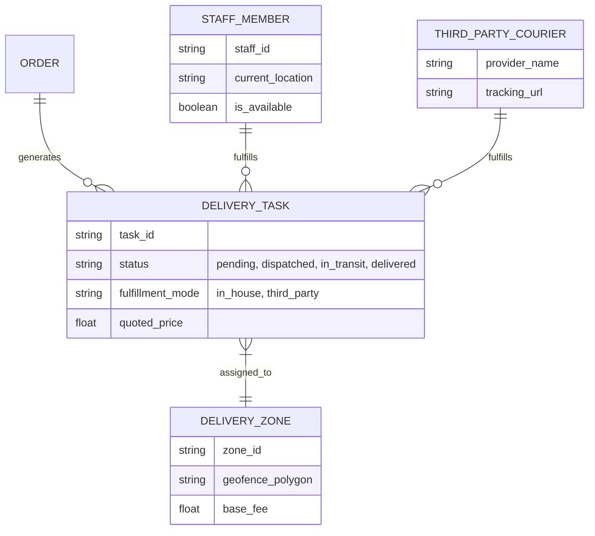
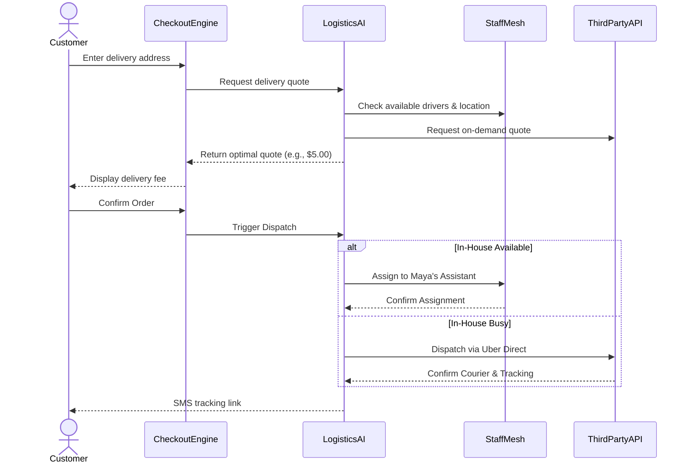

# [Architecture] Universal Autonomous Multi-Modal Local Delivery Mesh

## Title
Implement Universal Autonomous Multi-Modal Local Delivery Mesh

## Problem Statement
Small business owners like Maya (baker) and Fatima (food cart) increasingly need to offer local delivery to compete with large chains. However, setting up a delivery infrastructure is complex. They typically face two bad options:
1. Build their own delivery fleet, which means tracking drivers via disjointed apps, manually calculating delivery zones, and guessing ETA.
2. Sign up for 3rd-party platforms (Uber Eats, DoorDash), which take a massive 30% margin and own the customer relationship.

Maya needs to offer local delivery for her custom cakes. Sometimes she can have her assistant deliver (when not busy), but other times she needs a reliable on-demand courier, all without leaving the OneHumanCorp app or manually dispatching drivers. She needs an autonomous system that calculates costs, quotes the customer at checkout, and routes the delivery seamlessly to the cheapest/fastest available mode (in-house staff or 3rd-party API) without technical setup.

## Research Report
### Competitive Analysis
| Platform | Delivery Capabilities | Strengths | Weaknesses (The OHC Opportunity) |
|---|---|---|---|
| **Shopify** | Local Delivery | Built-in routing for in-house staff | Requires merchant to manually plan routes. Heavy manual intervention. No fallback to 3rd-party if staff is busy. |
| **Square** | On-Demand Delivery | Integrates with DoorDash/Uber | High setup friction. Hard to mix in-house fleet with 3rd-party overflow. Complex UI for non-technical users. |
| **Wix** | Local Delivery Apps | Third-party app ecosystem | Fragmented experience. Merchants must manage multiple dashboards. |
| **OHC (Target)** | **Autonomous Multi-Modal Mesh** | **Zero-config, real-time AI dispatch, hybrid in-house/3rd-party routing** | **Must ensure seamless driver tracking in the mobile UI and abstract complex logistics terminology.** |

The core gap in the market is a **hybrid delivery engine** that intelligently routes orders to either an internal staff member (via the OHC Staff Mesh) or a 3rd-party delivery network (e.g., Uber Direct, DoorDash Drive API) based on real-time parameters (staff availability, delivery cost, distance) with absolutely zero manual dispatching by the business owner.

## Design Doc

### Architecture Diagram

### Sequence Diagram: Autonomous Dispatch

### Mobile UX Flow (375px First)
1. **Business Owner Setup:**
   - A single toggle on the OHC app dashboard: "Enable Local Delivery."
   - The AI asks: "Do you have your own drivers?" Maya selects "Yes, my assistant."
   - The AI automatically generates a delivery radius (e.g., 5 miles) based on local density.
2. **Staff Driver Experience:**
   - Staff member receives an SMS link to open their OHC Driver Card (no app download).
   - Shows a large, high-contrast map with a "Start Route" button and turn-by-turn navigation via native OS maps.
   - Large "Mark Delivered" swipe action (accessible with one hand while holding a cake).
3. **Customer Experience:**
   - Checkout automatically shows "Local Delivery" if within the radius.
   - Receives an SMS with a live map tracking the driver (whether staff or 3rd-party).

### AI Agent Integration Points
- **Operations Department (Logistics AI):** Automatically calculates quotes in milliseconds during checkout by comparing internal staff costs vs. 3rd-party API rates. Monitors delivery status and alerts the business owner only if an exception occurs (e.g., driver stuck).
- **Customer Service Department:** Intercepts customer texts (e.g., "Where is my cake?"). The agent queries the `DELIVERY_TASK` state and replies contextually: "Your cake is 3 minutes away with our driver, John!"

### Key Design Decisions
- **Hybrid Routing Default:** We do not force the merchant to choose between in-house or 3rd-party exclusively. The system optimizes dynamically.
- **No Driver App Install:** In-house staff access their route and mark deliveries complete via a secure web app linked via SMS, eliminating friction for temporary or gig workers.
- **Abstracted Pricing:** The merchant never sees complex API rate cards. They see a simple slider to subsidize delivery costs (e.g., "Charge customer $5, I'll pay the rest").

## Implementation Prompt
**Objective:** Build the core logic for the Universal Autonomous Multi-Modal Local Delivery Mesh.

**User Journey:**
- Maya enables local delivery in 1 tap.
- A local customer checks out, enters their address, and sees a delivery fee.
- When the order is ready, the system automatically routes the delivery to Maya's available staff member via SMS. If no staff is available, it silently dispatches a 3rd-party courier (e.g., Uber Direct mockup).
- The customer receives an SMS with a tracking link.

**Acceptance Criteria:**
1. Create a service that can ingest an order destination and instantly return a delivery quote by mocking internal availability and an external provider cost.
2. Implement the state machine for a `DeliveryTask` (Pending -> Dispatched -> In Transit -> Delivered).
3. Provide an endpoint/function to simulate triggering the optimal dispatch route based on cost/availability rules.
4. Ensure the system design supports multi-tenant data isolation (Maya's driver tracking data cannot bleed into Carlos's account).

*Note to Implementer: Do not worry about building the actual UI. Focus on the core domain logic, AI decision service, and entity structures. Design the exact database schema and API signatures as you see fit to satisfy the criteria.*

## Priority
P1

## Estimated Scope
Large
