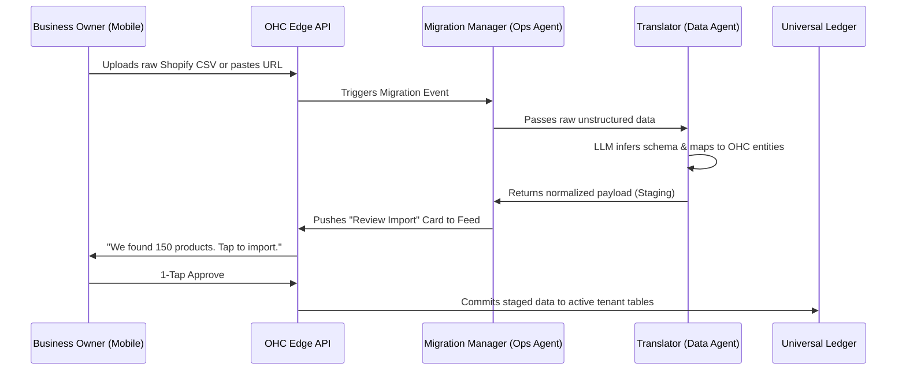

# Issue Brief: Autonomous Multi-Platform Migration Engine

## Title
[Architecture] Autonomous Multi-Platform Migration & Ingestion Engine

## Problem Statement
Small business owners (like Priya who has an existing Square POS or Maya with a Shopify store) face a massive "Cold Start" problem when switching to OneHumanCorp (OHC). They are hesitant to adopt the platform because they do not want to manually re-enter hundreds of products, customer histories, past orders, and service descriptions. This "Vendor Lock-in" creates severe friction and prevents platform adoption. They need a system where they can simply point to their old store and have everything instantly transferred without technical configuration.

## Research Report
- **Competitor Landscape**: Platforms like Shopify and Wix offer basic CSV importers or paid migration apps (e.g., Matrixify). These require the user to understand database schemas, manually map columns, resolve data format errors, and typically only work cleanly on desktop devices.
- **User Needs**: Users require an invisible, zero-touch ingestion engine. They should be able to provide a competitor URL, upload a raw exported CSV, or provide an API key, and have the system autonomously map, clean, and import the data.
- **AI Differentiation**: Instead of forcing the user to map fields manually, OHC leverages an LLM-driven "Migration Manager" agent that dynamically infers the schema of the source data, translates it to the OHC Universal Ledger schema, and normalizes messy data (like unstructured product descriptions or varying date formats).

## Design Doc

### High-Level Architecture
- **Trigger**: User inputs a source (Competitor URL, raw CSV upload, or API credentials) via the mobile dashboard.
- **Agent Coordination**:
  - **The Migration Manager (Operations Agent)**: Receives the raw input. If it's a URL, it securely scrapes public product data. If it's a CSV, it parses the file.
  - **The Translator (Data Agent)**: Uses an LLM to dynamically map the source schema to OHC's internal entities (`Product`, `Customer`, `Order`, `Inventory`). It handles data normalization (e.g., converting currencies, standardizing variants).
- **Execution**: The mapped data is written to isolated staging tables. The Migration Manager presents a plain-language summary to the user for a 1-tap approval before committing the data to the live Universal Ledger.

### Architecture Diagram

### Mobile UX Flow (375px First)
1. **Input Screen**: A simple, clean card: "Moving from another platform? Paste your store link or upload your file here."
2. **Processing State**: A pleasant, glassmorphism shimmer effect with the text "Our AI is reading your old store data..."
3. **Review Card**: A notification appears in the Activity Feed: "Ready to launch! We found 150 products and 300 customers from your old store."
4. **Action**: A prominent primary button "Import Everything". A secondary button "Review Details" (which shows a simplified, touch-friendly list of items). No complex field-mapping UI is exposed.

### Key Architectural Invariants
- **Multi-Tenant Isolation**: All raw and staged data must be strictly scoped to the `tenant_id` using Zero Trust principles. Data from one tenant's upload must never cross-pollinate with another's.
- **Data Integrity**: The import must be transactional. If the user approves and the commit fails midway, the system must rollback to ensure no partial or corrupted states exist in the active ledger.
- **Security**: If scraping a URL, the agent must respect robots.txt and rate limits to prevent malicious usage originating from OHC infrastructure.

## Implementation Prompt
**To Implementer Agent:**
Implement the "Autonomous Multi-Platform Migration Engine". Create the backend ingestion pipeline capable of accepting raw CSV files or competitor URLs. Develop the "Translator" agent logic to dynamically map unstructured or foreign schemas to the OHC internal data model (`Product`, `Customer`, `Order`). The system must store the mapped data in a temporary, tenant-isolated staging state and surface a summary to the mobile Activity Feed. Ensure the final commit process to the Universal Ledger is fully transactional and requires only a single user approval action. Do not prescribe specific database tables or API route signatures; focus on the robust orchestration of the AI agents and the transactional integrity of the data migration.

## Priority
P0

## Estimated Scope
Large