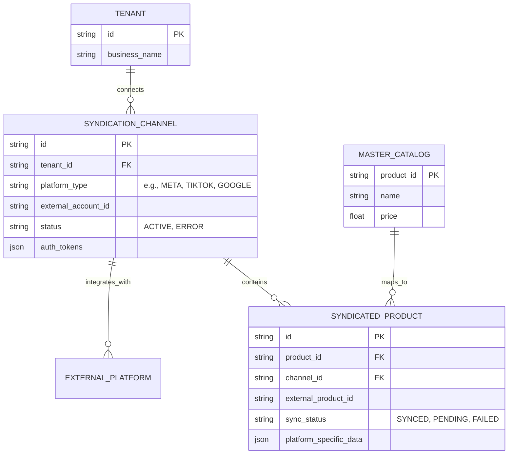

# [Architecture] Autonomous Multi-Platform Product Syndication Engine

## Title
Autonomous Multi-Platform Product Syndication Engine

## Problem Statement
Small business owners like Priya (Boutique owner) need to sell everywhere—Instagram, TikTok, Google Shopping, and in-person. Managing inventory across multiple fragmented platforms manually is impossible for a solopreneur and leads to stockouts, canceled orders, and ruined reputation. Existing platforms like Shopify treat these as bolt-on "Sales Channels" that require complex setup, manual product category mapping, and constant monitoring. OHC requires an invisible engine that allows a user to connect a social account with 1-tap, after which AI agents autonomously format, optimize, and syndicate the catalog across the web, keeping inventory perfectly synced in real-time.

## Research Report
### Competitive Analysis
- **Shopify**: Robust ecosystem but fragmented user experience. Each sales channel is a separate app with a different UI.
- **Wix/Squarespace**: Limited native multi-channel syndication; heavily reliant on third-party integrations that fail the "Grandmother Test."
- **OHC Target**: Zero-config syndication. The AI Marketing Agent handles taxonomy mapping invisibly.

### Market Insights
- Multi-channel sellers generate 190% more revenue than single-channel sellers.
- 70% of small businesses cite "inventory management across channels" as their biggest operational hurdle.

## Design Doc

### Key Design Decisions
1. **Event-Driven Architecture**: The Syndication Engine listens to the NATS Hybrid Event Mesh for `InventoryChanged` and `ProductUpdated` events.
2. **AI-Powered Taxonomy Mapping**: The AI Marketing Agent acts as a translation layer. When Priya adds a "Red Summer Dress," the agent automatically determines the correct Google Product Category and TikTok category ID, formatting the payload correctly for each platform.
3. **Optimistic Syncing & Retry Queues**: Platform APIs are often flaky. The engine uses a robust background job queue (e.g., PostgreSQL SKIP LOCKED) with exponential backoff to guarantee eventual consistency.
4. **Unified Order Ingestion**: Orders originating from TikTok or Instagram are ingested, normalized into the OHC `ORDER` format, and pushed to the Operations Agent, decrementing the global `INVENTORY_LEDGER`.

### Architecture Diagram (ER)

### Mobile-First UX Flow (375px)
1. **Discovery**: A card on the Marketing Dashboard suggests: "Reach 10,000 local shoppers. Connect Instagram Shop."
2. **1-Tap Auth**: Priya taps the button, completes standard OAuth for Meta.
3. **Invisible Magic**: She is returned to the OHC app. A shimmering translucent glass card says: "Agent is optimizing and syncing your catalog... 45/120 products synced."
4. **Completion**: Push notification: "Your Instagram Shop is live and inventory is linked!"

## Implementation Prompt
**To the Implementer:**
Build the backend foundation for the Autonomous Multi-Platform Product Syndication Engine.
1. Implement the data models (`SyndicationChannel`, `SyndicatedProduct`) in PostgreSQL with strict tenant isolation.
2. Create an event listener service subscribing to `InventoryChanged` and `ProductUpdated` NATS events.
3. Implement an abstract `PlatformAdapter` trait/interface in Rust, allowing future integration of specific APIs (Meta, TikTok).
4. Implement the async background worker queue to handle outbound API calls and retry logic.
Ensure the design supports the AI Agent injecting optimized taxonomy data before the payload is sent to the external platform.

## Priority
P1

## Estimated Scope
Large
