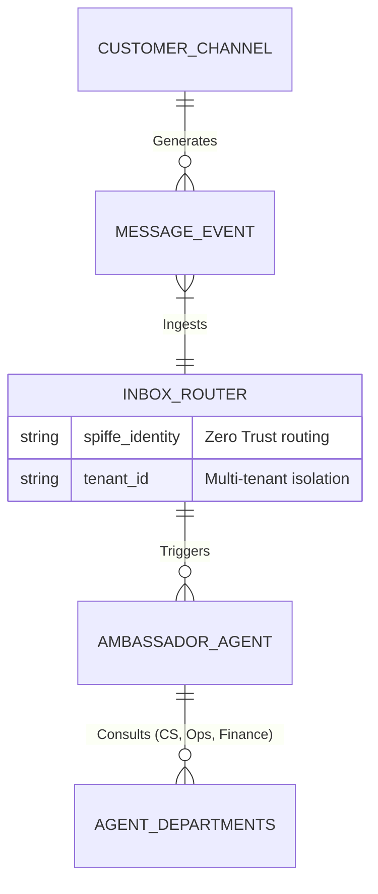

# [architecture] Autonomous Omni-Channel Quote to Cash Engine

## Problem Statement
Small business owners like Carlos (the handyman fielding SMS quote requests) suffer from severe operational fatigue. They spend hours every day toggling between different platforms just to handle quotes and payments. They miss messages, which means lost revenue. The current experience is disjointed, unmanageable on a single mobile screen, and relies entirely on their manual intervention. They need a single, magical inbox that not only aggregates all messages but handles the routine replies automatically, invisibly, and safely while they focus on their craft.

## Research Report
*   **Shopify Inbox:** Highly manual. It aggregates Shopify chat and Instagram/Facebook DMs but requires the merchant to type out replies or click pre-saved "quick replies." The "Sidekick" AI features are geared toward merchant analytics, not proactive customer conversation resolution.
*   **Wix Inbox:** Offers basic auto-responders (e.g., "We received your message") but lacks any semantic understanding or capability to negotiate quotes, check inventory, or book calendar slots.
*   **Squarespace / GoDaddy:** Focused on generic web contact forms. No real-time omnichannel integration or intelligent autonomy.
*   **OneHumanCorp (OHC) Differentiation - "Invisible Autonomy":** Instead of a static "chatbot," OHC deploys the **Ambassador Agent**—an invisible, always-on AI representative that hooks into the merchant's unified inbox. It understands the business context (menu, calendar, pricing), engages customers naturally across any channel, and escalates to the human only when necessary (e.g., a highly custom complex order).

## Design Doc

### Architecture Diagram

### Mobile UX Flow (375px first)
1.  **Unified Inbox Screen:** A clean, glassmorphic list of conversations (SMS, WhatsApp, IG, Email) with unread indicators.
2.  **Conversation Detail:** A familiar chat interface showing both customer messages and AI replies (clearly labeled as AI).
3.  **Quote Generation Modal:** A bottom sheet allowing the owner to review and edit AI-generated quotes before sending.
4.  **Payment Link:** A prominent button within the chat to share a one-click Stripe payment link.

### AI Agent Integration Points
*   **Ambassador Agent (CS):** Triage messages, identify intent (quote request vs. status update).
*   **Salesperson Agent:** Generate accurate quotes based on inventory/service catalog and pricing rules.
*   **Accountant Agent (Finance):** Create and track invoices/payment links via Stripe.

### Key Design Decisions
*   **Unified Data Model:** Store all messages in a single table with channel metadata, simplifying the inbox UI and agent context.
*   **Human-in-the-Loop by Default:** Require owner approval for high-value quotes initially, building trust before enabling full autonomy.
*   **Zero-Trust Routing:** Enforce strict multi-tenant isolation at the routing layer using SPIFFE identities.

## Implementation Prompt
Implement the unified omnichannel inbox UI and backend routing logic. Ensure the Ambassador agent can ingest messages from at least two distinct channels (e.g., SMS and Email) and surface them in a unified mobile-first view (375px). Implement the ability for the agent to draft a quote based on a customer request and present it for owner approval. Include comprehensive Playwright E2E tests validating the end-to-end flow from message ingestion to quote generation and approval.

## Priority
P0

## Estimated Scope
Large
