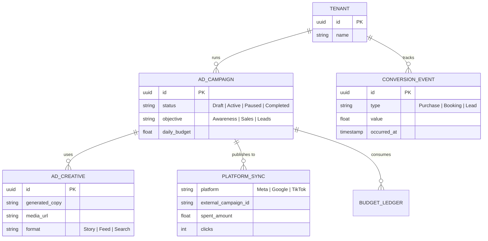
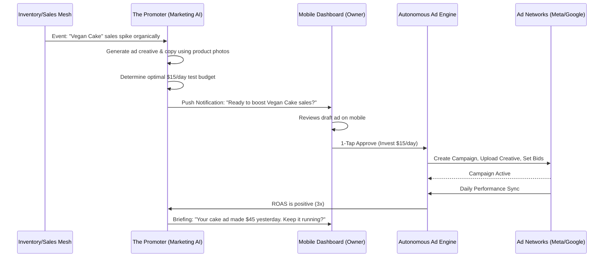

# Issue Brief: Autonomous Omnichannel Ad Buyer & Growth Engine

## Title
[Architecture] Autonomous Omnichannel Ad Buyer & Growth Engine

## Problem Statement
Small business owners like Priya (boutique owner) and Maya (baker) struggle with customer acquisition via paid channels. The process of setting up Meta Ads, Google Ads, installing tracking pixels, determining budgets, and testing creatives is incredibly complex, requiring domain knowledge and continuous monitoring. Many owners waste money on poorly optimized "boosted" posts or abandon paid ads entirely due to the steep learning curve of tools like Facebook Ads Manager. They need a system that autonomously generates ad creatives, manages targeting, tracks conversions, and optimizes spend across all channels—without asking them to understand terms like "CPA," "ROAS," or "Lookalike Audiences."

## Research Report
- **Competitive Audit**:
  - **Shopify / Wix**: Offer basic integrations with Facebook and Google, but users still have to navigate the ad platforms' confusing interfaces to manage campaigns. Shopify's "Shop Campaigns" focuses mostly on their own Shop app.
  - **Madgicx / AdEspresso**: Powerful but targeted at agency professionals and marketers, not a baker running a shop from her phone.
  - **OHC Advantage**: OHC integrates the Marketing AI Agent directly into the core platform, with full access to the inventory, sales data, and customer 360 profile. The agent can see which product is selling well organically and proactively suggest a $20 ad campaign to amplify it, with 1-tap approval.
- **Key Findings**:
  - 62% of small businesses say Facebook ads miss their target, mostly due to poor setup and lack of ongoing optimization.
  - The drop-off rate for pixel installation and conversion tracking setup is huge for non-technical users.
  - Owners want an "invest $50, get $150 back" button, rather than a dashboard of metrics.

## Design Doc

### Architecture Diagram

### AI Agent Coordination Sequence

### Mobile UX Flow (375px First)
1. **The Proactive Suggestion**: Instead of the user initiating an ad, "The Promoter" (Marketing Agent) pushes a notification: "Your new Summer Collection is getting views. Let's run an ad to get more sales."
2. **The 1-Tap Ad Card**: The user taps the notification and sees a translucent glass card showing a preview of the generated ad (Instagram Story format) with a clear slider for budget (e.g., "$10/day", "$20/day").
3. **Zero Jargon Approval**: No confusing metrics. The button simply says "Start Ad". All pixel tracking and API handshakes are handled invisibly by OHC.
4. **The Daily Briefing**: Active ads don't have confusing charts. The user gets a daily plain-language update: "You spent $10 yesterday and got 2 new bookings. Good return!"

### Key Architectural Invariants
1. **Invisible Pixel Generation**: The platform automatically generates server-side Conversion API (CAPI) events for Meta/Google tied to the `tenant_id` whenever a purchase or booking occurs, bypassing the need for client-side pixel installation.
2. **Strict Multi-Tenant Isolation**: Ad accounts, budgets, and generated creatives are strongly isolated via PostgreSQL RLS on `tenant_id`.
3. **Spend Safeties**: The system enforces hard daily and lifetime budget caps within the `BUDGET_LEDGER` to guarantee no accidental overspend.

## Implementation Prompt
**Goal**: Build the "Autonomous Omnichannel Ad Buyer & Growth Engine" to eliminate the complexity of paid customer acquisition for non-technical small business owners.

**Core User Journey (CUJ)**:
1. **The Proactive Pitch**: Priya adds a new line of summer dresses. The system notes organic interest and "The Promoter" agent drafts a Meta Ad campaign using her product photos and AI-generated copy.
2. **The 1-Tap Launch**: Priya reviews the generated ad preview on her phone, selects a $10/day budget from a simple slider, and taps "Approve". The engine automatically configures the Meta campaign, sets up targeting, and activates it.
3. **The ROI Briefing**: After 48 hours, Priya receives a plain-text briefing: "Your ad spent $20 and generated $150 in sales. The Promoter recommends increasing the budget to $15/day."

**Acceptance Criteria**:
- **Campaign Ledger**: Implement the data model for `AdCampaigns` and `PlatformSync` that tracks spend and status across Meta/Google.
- **Proactive Generation**: Ensure the Marketing Agent can autonomously read inventory/sales events and draft ad creatives and copy.
- **Server-Side Tracking**: Implement a secure mechanism to automatically broadcast `ConversionEvents` to external ad platforms without user-configured pixels.
- **Zero-Jargon UI**: Ad approval screens must use simple language, displaying generated previews and a simple budget slider, adhering to the 375px mobile-first glassmorphism design.
- **Safety Rails**: Ensure hard limits on ad spend are enforced at the engine level.

## Priority
P1

## Estimated Scope
Large
