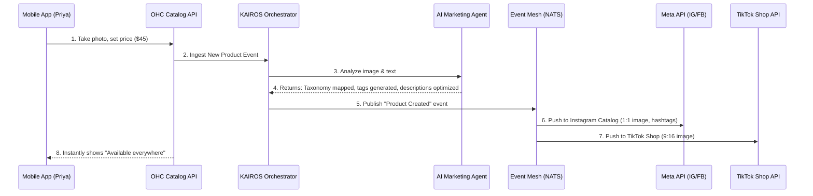

# Autonomous Omnichannel Catalog Syndication Mesh

## Problem Statement

Priya (Boutique owner) and Maya (Baker) sell their products not just in a physical store or on a website, but across Instagram, TikTok, and Google Shopping. Currently, whenever Priya adds a new summer dress or Maya adds a new seasonal cake, they have to manually upload the photos, descriptions, and prices to each separate platform. Worse, if a dress sells out in-store, Priya has to rush to her phone to mark it sold out on Instagram and TikTok before someone buys an item she no longer has.

For a non-technical business owner, managing product listings across multiple sales channels is a tedious, error-prone nightmare that requires understanding platform-specific image requirements, product categories (taxonomies), and complex API sync rules. They just want to take a photo on their phone, set a price, and have it magically appear everywhere, with inventory perfectly synced.

## Research Report

**Market Friction:**
*   **Shopify:** Offers multi-channel sales (Facebook, Instagram, Google), but the setup requires navigating a maze of app installations, verifying domain ownership, and manually mapping Shopify product categories to Facebook/Google taxonomies. It often breaks without clear error messages.
*   **Wix / Squarespace:** Similar to Shopify, relies on external integrations that require technical configuration. Sync is often delayed, leading to overselling.
*   **GoDaddy:** Basic integrations, but extremely rigid and lacks the ability to automatically optimize descriptions or crop images per platform.

**The OHC Opportunity:**
OHC can leapfrog the competition by making omnichannel syndication entirely invisible. Instead of asking Priya to "Map Product Categories to Google Taxonomy", the KAIROS Orchestrator's Operations and Marketing Agents can analyze the product photo and description, automatically categorize it, resize/crop the image for TikTok/Instagram/Google, and push the listing via background queues. If a sale happens anywhere, the Mesh guarantees near-instant inventory decrement across all channels.

## Design Doc

### Key Design Decisions

1.  **AI-Driven Automatic Taxonomy Mapping:** We completely remove the UI for category mapping. The AI Marketing Agent infers the global taxonomy (e.g., `Apparel & Accessories > Clothing > Dresses`) from the product image and plain-text description.
2.  **Asset Transformation on the Edge:** Images are automatically cropped and optimized for the specific requirements of each channel (e.g., 9:16 for TikTok, 1:1 for Instagram) by background workers.
3.  **Event-Driven Inventory Mesh:** A high-performance, guaranteed-delivery event queue (NATS JetStream) acts as the source of truth for inventory changes, propagating updates to all connected channels within seconds.
4.  **Optimistic UI with Background Sync:** When Maya adds a product, the app instantly shows it as "Live". The KAIROS Orchestrator handles the actual API calls to Meta/Google in the background, only surfacing an alert if an unresolvable error (like a completely rejected product) occurs.

### AI Agent Integration Points
*   **Marketing Agent:** Generates platform-specific product descriptions (e.g., hashtag-heavy for Instagram, SEO-optimized for Google) and maps the taxonomy.
*   **Operations Agent:** Manages the inventory decrements and increments, ensuring the event mesh updates all channels.
*   **Customer Success Agent:** Monitors for platform rejections (e.g., Meta rejecting a product) and translates the cryptic API error into a plain-English notification for the user ("Instagram didn't accept this photo because it's too blurry. Want me to enhance it?").

### Architecture Diagram

### Mobile UX Flow (375px)
1.  **Product Creation (One Screen):** A single 375px screen. Big camera button at the top. Two input fields: "What is it?" and "Price". A toggle section at the bottom: "Sell on Instagram", "Sell on TikTok" (both defaulting to ON).
2.  **The "Magic" State:** Once the user hits "Save", a skeleton loading card appears briefly with a subtle shimmer effect (macOS glass material). Text reads: "AI is setting up your listings..."
3.  **Success State:** The card solidifies. Small icons for IG, TikTok, and OHC Store light up green next to the product.

## Implementation Prompt

**To the Engineering Swarm:**

Implement the Autonomous Omnichannel Catalog Syndication Mesh.

**User Journey (CUJ):**
As Priya (a non-technical boutique owner), I want to add a new dress to my inventory simply by taking a picture and typing the price, so that it instantly appears on my OHC store, Instagram, and TikTok without me having to configure settings or manually map product categories.

**Acceptance Criteria:**
1.  Create the backend data model for a unified `Product` entity that supports a 1-to-many relationship with channel-specific `Listing` entities.
2.  Implement an event-driven flow where saving a `Product` triggers the KAIROS Orchestrator.
3.  Integrate the AI Marketing Agent to automatically infer product categories (taxonomies) from text/images, completely hiding this complexity from the user.
4.  Implement the UI on a 375px viewport matching the "One Screen" flow described above, utilizing macOS glass design tokens and ensuring it passes the Grandmother Test.
5.  Ensure that inventory changes (e.g., a sale on the OHC store) immediately publish an event to the mesh that decrements the available count on the connected Meta and TikTok listings.

**Constraints:**
*   Do NOT build a UI for taxonomy mapping or manual channel configuration. It must be zero-config.
*   Ensure multi-tenant data isolation.

## Priority
P0

## Estimated Scope
Large