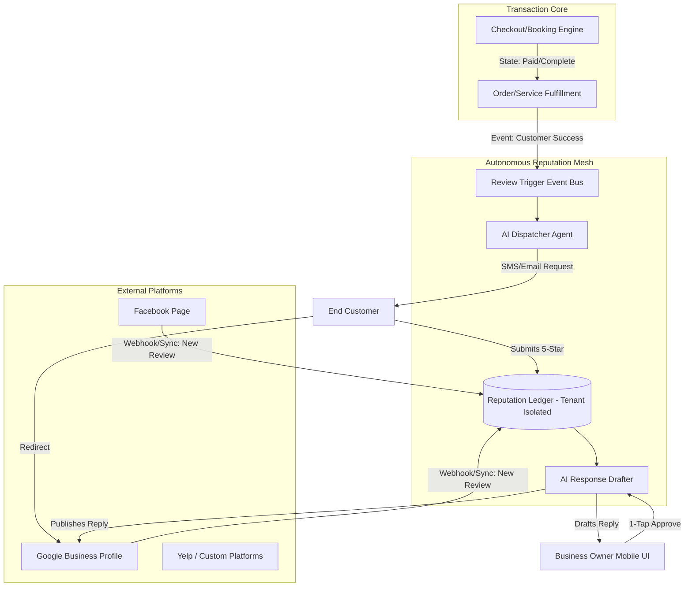

# [Architecture] Autonomous Omnichannel Reputation Mesh

## 1. Title
**Autonomous Omnichannel Reputation Mesh: Zero-Effort Review Generation and Management**

## 2. Problem Statement
For OneHumanCorp (OHC)’s core personas—like **Carlos (handyman, 42)** and **Leo (music tutor, 22)**—reputation is everything. Their businesses run on word-of-mouth, but actively soliciting, monitoring, and replying to reviews across Google Maps, Yelp, Facebook, and specialized directories is an exhausting, fragmented process.
Small business owners often feel they are at the mercy of the occasional unhappy customer because they lack the time and automated tooling to consistently capture positive reviews from happy customers. They do not have the technical knowledge to integrate multi-platform API webhooks or set up email-based "review funnels". The lack of a unified reputation system causes an "Invisible Discovery" gap, suppressing their local search ranking (SEO) and hurting revenue.

## 3. Research Report
### Competitive Landscape
*   **Shopify:** Relies entirely on 3rd-party apps (e.g., Yotpo, Loox, Judge.me) which create "Cost Creep" ($20-$100+/mo) and complex dashboard fatigue.
*   **Wix & Squarespace:** Basic embedded review widgets, but lack proactive, omnichannel review solicitation and AI-assisted reply drafting.
*   **Specialized CRMs (Podium, Birdeye):** Very effective at local reputation management, but highly disconnected from the core commerce engine and prohibitively expensive for solopreneurs.

### Market Data
*   **93%** of consumers say online reviews impact their purchasing decisions.
*   Small businesses with >100 reviews generate **54% more revenue** than those with fewer than 100.
*   "Communication Lag" and "Marketing Dread" are top 10 SMB pain points. Owners know they need to ask for reviews but consistently forget to do so after closing a sale or finishing a service.

### The Opportunity
By unifying the transactional layer (payments, bookings) with a zero-configuration Autonomous Reputation Mesh, OHC can instantly trigger review requests exactly when customer satisfaction is highest, aggregate those reviews, and use AI to draft personalized responses, completely eliminating the mental overhead for the owner.

## 4. Design Doc

### Architecture Diagram

### Key Design Decisions
1.  **Event-Driven Triggers:** The reputation mesh must securely hook into the core `Transaction Ledger` and `Booking Engine`. A review request is fired automatically based on business logic (e.g., 2 hours after a food pickup, 1 day after a handyman appointment).
2.  **Omnichannel Sync:** The mesh aggregates incoming reviews from connected platforms (Google, Facebook) into a single, unified data model (`Reputation Ledger`).
3.  **Proactive Triage:** The AI Response Drafter immediately categorizes incoming reviews (Positive, Negative, Neutral) and drafts a context-aware response, notifying the owner for a 1-tap approval.
4.  **Zero Trust & Multi-Tenant:** All review data and connected OAuth tokens (for Google/Facebook) must be strictly isolated per `tenant_id` to prevent cross-contamination.

### UI Wireframes & Mobile UX Flow (375px First)

**Screen 1: The "New Review" Notification Card (Translucent Glass)**
*   **Layout:** A macOS-style frosted glass notification overlaying the main dashboard.
*   **Content:** "⭐️⭐️⭐️⭐️⭐️ from Sarah: 'Carlos fixed my sink perfectly!'"
*   **Action:** A large, primary action button: [Review AI Reply Draft].

**Screen 2: The 1-Tap Reply Modal**
*   **Layout:** Bottom-sheet modal sliding up.
*   **Content:** The AI-generated draft response: *"Hi Sarah! Thank you so much for the 5 stars. It was a pleasure fixing the sink for you. Let me know if you need anything else! - Carlos"*
*   **Actions:**
    *   Primary: [Approve & Post] (Green button)
    *   Secondary: [Edit Draft] or [Regenerate]

**Screen 3: Unified Reputation Dashboard Card**
*   **Layout:** A UniFi-style modular dashboard card.
*   **Content:** A simple donut chart showing overall rating (e.g., 4.8) across all platforms. A counter showing "3 Pending Replies".

## 5. Implementation Prompt
**Objective:** Implement the `Reputation Ledger` data model, the backend event listener that triggers review solicitations post-transaction, and the 1-tap AI reply generation API.

**User Journey (CUJ):**
1.  Carlos completes a handyman job and marks the invoice as "Paid" in his app.
2.  The system waits 24 hours (configurable default) and sends an automated, polite SMS to the customer asking for a review.
3.  The customer leaves a 5-star Google review.
4.  The OHC system ingests the review, and the AI Support Agent drafts a personalized reply.
5.  Carlos opens his OHC app, sees a single notification, taps "Approve", and the reply is posted to Google.

**Acceptance Criteria:**
- Define a scalable, tenant-isolated data entity for storing cross-platform reviews.
- Create the event subscriber that listens to fulfillment/payment events.
- Implement the agent protocol for drafting review responses using the context of the specific transaction and review text.
- Ensure all APIs are designed for a mobile-first client (fast, lean payloads).
- Do not prescribe the specific Postgres/SQLite schema or Rust structs—design the entity boundaries and interfaces.

## 6. Priority
**P1** (High - Direct impact on acquisition and SEO)

## 7. Estimated Scope
**Large** (Requires integration with external APIs, background jobs, and AI context handling)