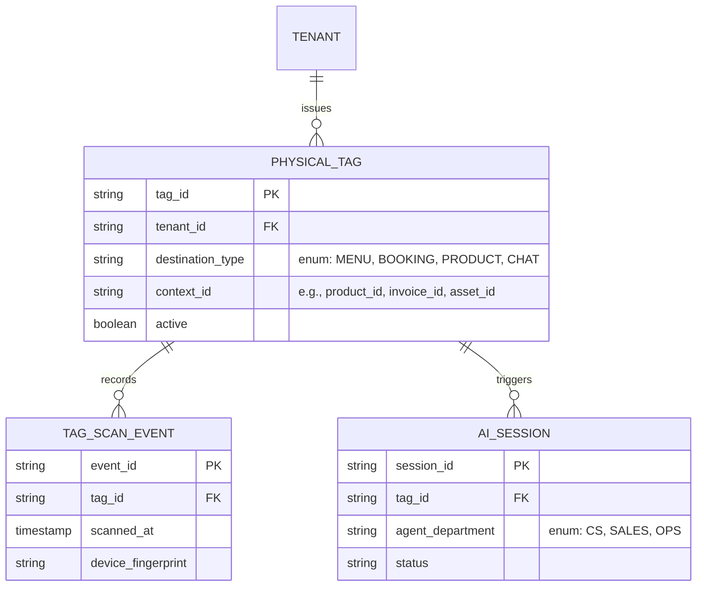
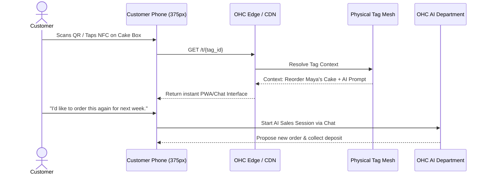

# [Architecture] Autonomous Physical-World Interaction & NFC/QR Mesh

## Title
**Autonomous Physical-World Interaction & NFC/QR Mesh**

## Problem Statement
Small business owners operating in the physical world (food carts, repair services, local bakers) suffer from a massive disconnect between their physical products/services and their digital business operations. When a customer walks away with a cake, an installed appliance, or a plate of food, the business loses the connection to that customer.

From a non-technical owner's perspective:
- **Maya (baker):** Wants customers to easily scan a sticker on her cake boxes to instantly tip her, leave a review, or reorder, without them needing to find her Instagram or website.
- **Carlos (handyman):** Leaves repaired appliances behind. He wants to stick a durable NFC tag or QR sticker on the side of a repaired AC unit so that in 6 months, the homeowner can tap it to instantly book a maintenance visit, view the repair history, or chat with Carlos's AI receptionist.
- **Fatima (food cart):** Deals with long lines. She wants to stick dynamic QR codes on tables or hand them out on cards so people in line can scan, order, and pay without waiting to talk to her, while she just focuses on cooking and hears a "ding" on her phone.

Existing solutions (like Square or Shopify POS) are point-of-sale focused but do not bridge the post-sale lifecycle or line-busting gracefully without requiring the merchant to build a complex online store, connect inventory apps, or buy expensive proprietary hardware. They don't provide "zero-config" smart endpoints that seamlessly link back to AI agents.

## Research Report
**Market Landscape & Competitive Analysis:**
- **Square:** Offers QR code ordering for restaurants, but it is deeply tied to their specific POS hardware and catalog structure. It lacks post-purchase engagement flows (e.g., sticking a tag on a repaired appliance).
- **Shopify:** QR codes can link to products, but Shopify does not treat physical endpoints (NFC/QR) as first-class, dynamic entities that can spawn contextual AI agent sessions (e.g., "scan this to chat about your warranty").
- **Linktree / Link-in-bio:** Often used as a crutch for physical businesses (QR to Linktree), but lacks deep integration with booking, ordering, or AI support.

**The OHC Opportunity:**
OHC can treat "Physical Tags" (NFC stickers, printed QR codes) as dynamic, contextual endpoints linked to the multi-tenant SaaS. A tag is not just a URL; it is an entry point into a specialized AI agent workflow (reorder, tipping, warranty chat, line-busting preorder).

## Design Doc

### Architecture Diagram

### Mobile UX & UI Wireframes (375px First)

**Merchant Experience (Zero-Config Generation):**
1. Carlos opens OHC app and goes to a past repair invoice or a specific service.
2. Taps "Create Smart Tag".
3. The UI presents a beautiful, translucent glass card with options: "QR Code" or "Write to NFC Tag".
4. If QR, it instantly generates a printable, branded sticker template (passing the "grandmother test" — just hit print).
5. If NFC, a bottom sheet slides up: "Hold your phone near an NFC sticker to link it." Carlos taps his phone to a blank sticker. It's instantly linked to that customer's repair history.

**Customer Experience (Post-Scan):**
1. Customer scans the code/taps the tag.
2. An instant web interface (no app download) opens on their 375px screen.
3. The interface greets them contextually: "Hi! This is Carlos's Handyman Service. Looking at your AC Unit repaired on Oct 12. How can I help?"
4. A chat interface allows them to book maintenance directly with the AI, which checks Carlos's calendar.

### AI Agent Integration Points
- **Operations Department:** Monitors tag scan analytics. Can alert Maya if her QR codes at a farmer's market are getting lots of scans but no conversions, suggesting a menu change.
- **Customer Success (CS) Department:** Handles post-scan chats (e.g., "how do I store this cake?").
- **Sales/Booking Department:** Takes pre-orders from the line (Fatima) or schedules maintenance (Carlos). Maintains context from the tag (e.g., knows exactly which appliance or cake is being referenced).

### Key Design Decisions
1. **Tags as Contextual Pointers, Not Hardcoded URLs:** A tag ID resolves server-side to its destination. This allows Carlos to update what a tag does *after* he leaves it at a customer's house, without changing the physical sticker.
2. **Frictionless Customer Entry:** The destination must be an edge-cached PWA or Chat Interface. No app downloads required for the customer.
3. **Hardware Agnostic:** Works with cheap, generic NFC tags off Amazon or standard thermal/inkjet printed QR codes. No proprietary OHC hardware required.

## Implementation Prompt

**User-Facing Outcome:**
We need to allow merchants to generate and link "Smart Tags" (QR codes or NFC writes) directly from their mobile app. These tags should link physical items (a table, a cake box, a repaired appliance) to a specific digital context (a product, an invoice, a booking page, or an AI chat session).

**Core User Journey (CUJ):**
1. As a merchant (Carlos), I open the app, select a completed invoice for an AC repair, and tap "Create Tag".
2. I choose "NFC" and tap my phone to a blank NFC sticker. The app confirms "Tag Linked to AC Repair Invoice #102". I stick the tag on the AC unit.
3. As a customer, 6 months later, I tap my phone to the NFC sticker.
4. I am instantly taken to a mobile web page that says "Carlos Handyman Services - AC Unit Repair History" and offers a button to "Book Maintenance" or "Ask a Question". Tapping "Ask a Question" opens an AI chat that already knows about the AC unit.

**Acceptance Criteria:**
- Create the data entities for `PhysicalTag` and `TagScanEvent` in the multi-tenant architecture.
- Implement an API endpoint that resolves a short URL (e.g., `ohc.page/t/123`) to its dynamic contextual destination.
- Ensure the destination can bootstrap an AI chat session with injected context about the tagged item.
- Do not prescribe the specific UI frameworks or database migrations, but ensure the system handles high scan volumes securely without leaking tenant data.

## Priority
P1

## Estimated Scope
Large
