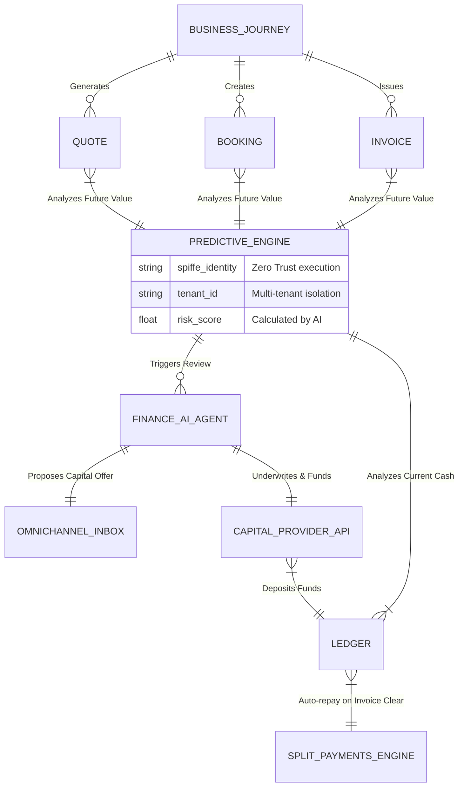

# [Architecture] Autonomous Predictive Cash Flow & Capital Engine

## 1. Title
**Autonomous Predictive Cash Flow & Capital Engine: Invisible Capital Access for SMBs**

## 2. Problem Statement
For our core personas—specifically **Carlos (handyman, 42)** and **Maya (baker, 28)**—cash flow is the primary existential threat to their business. Carlos often needs to buy $500 in materials (lumber, hardware) *before* he starts a job, but he won't get paid the remaining balance until the job is completed next week. Maya faces sudden spikes in orders (e.g., wedding season) where she needs to buy bulk ingredients but her cash is tied up in deposits for future dates.

Currently, getting a micro-loan or line of credit requires compiling tax returns, filling out forms at a traditional bank, and waiting weeks. It’s intimidating, overly complex, and often unavailable to very small operators. Small business owners suffer from a "capital gap" where they can't take on new, profitable work simply because they lack short-term liquidity. They need an invisible, proactive system that understands their future pipeline and offers instant, 1-tap capital advances *exactly* when they need it, automatically repaid as invoices clear.

## 3. Research Report
### Competitive Landscape
*   **Shopify Capital:** Excellent product, but primarily tailored to e-commerce physical goods sales. Offers cash advances based on historical sales volume. Lacks integration with service-based quoting, booking, and offline invoices.
*   **Square Loans:** Similar to Shopify; analyzes POS history to offer loans. Highly effective for brick-and-mortar (like Fatima the food cart owner), but less predictive. It reacts to past data rather than anticipating future needs based on calendar bookings.
*   **QuickBooks Capital:** Focuses on invoice financing and term loans, but requires the user to maintain rigorous, accurate bookkeeping—a massive friction point for users like Carlos who don't want to act as accountants.
*   **OneHumanCorp (OHC) Differentiation - "Predictive Capital":** Because OHC controls the entire journey—from the initial quote sent by Carlos, to the calendar booking, to the final invoice—we have a deterministic view of *future* guaranteed revenue. Our Finance AI Agent can proactively offer a micro-advance ("Tap to access $500 for materials for the Smith job") *before* the cash flow crunch hits. No forms, zero bookkeeping required.

### Market Data
*   Over 60% of small businesses experience cash flow shortages regularly.
*   Traditional bank loans under $100,000 have approval rates below 50% for new micro-businesses.
*   "Financial Fog" and fear of running out of money are cited in the top 3 stress factors for solopreneurs.

## 4. Design Doc
### Architecture Diagram

### Mobile-First UX Flow (375px Viewport)
1.  **The Trigger (Contextual Alert):** Carlos creates a Quote for a $2,000 deck repair. The system recognizes his current ledger balance ($200) is lower than typical material costs (~$600) for this job type.
2.  **The Offer (Dashboard Card):** On the main OHC dashboard, a clean, translucent glass card appears: *"Materials Advance Available. Get $600 instantly to start the Smith Deck job. Repaid automatically from the final invoice. [Tap to Accept]"*
3.  **The Acceptance (1-Tap):** Carlos taps the button. FaceID/Biometrics authenticate the action.
4.  **The Funding (Instant):** A success animation plays. The $600 is instantly available on his OHC virtual debit card (via Stripe Issuing / Treasury).
5.  **The Repayment (Invisible):** When the customer pays the $2,000 invoice via Tap-to-Pay, the Split Payments Engine invisibly routes $600 + fee back to the capital provider, and deposits the remaining $1,340 into Carlos's ledger.

### AI Department Coordination
*   **Finance Agent:** Monitors the Ledger, Bookings, and Quotes. Models cash flow projections. Evaluates risk based on the tenant's historical completion rate. Triggers the capital offer via the Operations Agent.
*   **Operations Agent:** Formats the offer into plain language and delivers it to the user's dashboard or Omnichannel Inbox.
*   **Legal/Compliance Agent (Background):** Ensures all disclosures (APR, fees) are generated and stored immutably in the background to comply with lending regulations, completely abstracted from the user experience.

### Technical Integrity & Multi-Tenancy Rules
*   **Zero-Trust Identity:** The `PREDICTIVE_ENGINE` and `FINANCE_AI_AGENT` must authenticate via SPIFFE/SPIRE before accessing the `LEDGER` or `CAPITAL_PROVIDER_API`.
*   **Strict Isolation:** Predictive modeling must occur strictly within the `tenant_id` boundary. Cross-tenant data must never bleed into risk score calculations unless explicitly anonymized and aggregated at a global fleet level (which is out of scope for the transactional engine).
*   **Performance:** Risk scoring must be asynchronous. The UI offer card must load from an edge cache in <100ms.

## 5. Implementation Prompt
**To the Implementer Agent:**
Implement the core logic for the "Predictive Capital Engine" microservice.
1.  Create the asynchronous job queue listener that monitors `Quote.Accepted` and `Booking.Confirmed` events.
2.  Implement the logic to query the `Ledger` for current cash balance.
3.  Design the integration point with the `Finance AI Agent` to generate a `risk_score` and a `capital_offer`.
4.  Create the endpoint to expose this `capital_offer` to the mobile frontend (must be fast, cached if possible).
5.  Ensure all data access is strictly scoped by `tenant_id` and authorized via the internal Zero Trust mesh.
Do NOT prescribe the specific ML model for risk; assume the `Finance AI Agent` provides an API for that. Focus on the data pipeline, the multi-tenant isolation, and the secure exposure of the offer.

## 6. Priority
`P1`

## 7. Estimated Scope
`Large`
