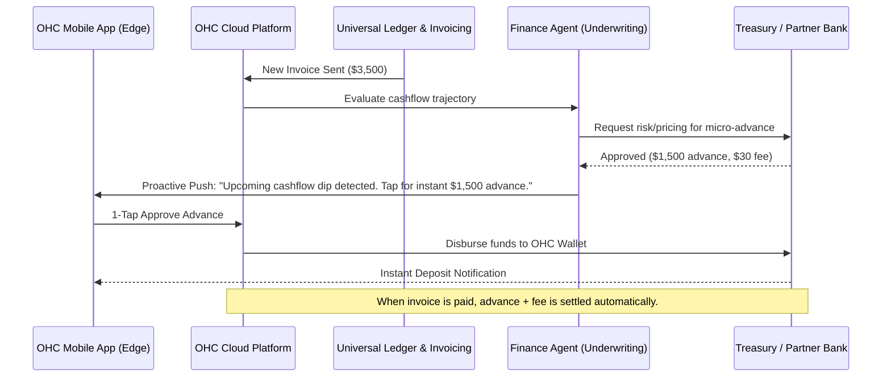

# Issue Brief: Autonomous Predictive Cashflow Engine

## Title
[Architecture] Autonomous Predictive Cashflow Engine

## Problem Statement
The #1 reason small businesses fail is cash flow mismanagement. Solopreneurs like Carlos (handyman) or Maya (baker) often have a full pipeline of bookings or unpaid invoices, but struggle to pay immediate expenses (supplies, fuel) while waiting 30-90 days for client payouts. Existing platforms only report past income; they do not predict future dips or proactively bridge the gap.

## Research Report
- **Competitor Landscape**:
  - **Shopify**: Offers "Shopify Capital," but it's typically reactive, based on historical aggregate sales, and opaque in its underwriting.
  - **Wix/Squarespace**: Lack native working capital solutions completely.
  - **GoDaddy**: Focuses on processing payments rather than predicting cash flow shortages.
  - **QuickBooks**: Has predictive cash flow tools but requires extensive manual categorization and isn't actionable instantly from a mobile phone without a lengthy loan application.
- **User Needs**: Users don't want to apply for loans. They want the platform to say: "You have $2,000 in upcoming expenses this week, but your $3,500 invoice won't clear until next Friday. Tap here to get a $1,500 instant advance against that invoice."
- **AI Differentiation**: Instead of passive dashboards, OHC's Finance Agent actively monitors connected bank feeds, upcoming calendar bookings, and sent invoices. It predicts cash flow valleys *before* they happen and offers 1-tap, risk-assessed micro-advances invisibly integrated into the daily workflow.

## Design Doc

### Architecture Diagram

### UI Wireframes & Mobile UX Flow (375px First)
1. **Push Notification**: "Good morning Carlos. You have $500 in materials due today, but your big invoice clears next week. Tap to bridge the gap."
2. **Dashboard Card (Glassmorphism)**: A premium, translucent card appears at the top of the feed: "Cashflow Alert". It shows a simple chart with a dip into the red on Thursday, returning to green next week.
3. **Action Modal**:
   - Headline: "Bridge the Gap"
   - Body: "Get a $1,500 advance on the Smith Invoice instantly."
   - Transparent Fee: "$30 flat fee. Automatically repays when Smith pays."
   - Button: "Tap to Deposit $1,500 Now" (Primary action button).
4. **Success State**: "Funds are in your OHC Wallet and ready to spend via Apple Pay."

### AI Agent Integration Points
- **Finance Agent**: Acts as an underwriter and forecaster. It reads historical seasonality, upcoming confirmed bookings, and unpaid invoices to model a 30-day cash flow projection. It triggers the advance offer only when a high-probability dip is detected.
- **Operations Agent**: Tracks upcoming recurring expenses (e.g., software subscriptions, rent) to inform the Finance Agent's model.

### Key Design Decisions
- **Proactive, Not Reactive**: The user is never asked to "apply for a loan". The system surfaces the liquidity only when mathematically necessary and backed by verifiable future receivables (invoices/bookings).
- **1-Tap Approval**: Hides the complex underwriting, KYC, and ledger operations behind a single button press.
- **Zero-Trust Multi-Tenancy**: The Ledger must strictly isolate tenant invoice data when making risk assessments to prevent cross-tenant data leakage.

## Implementation Prompt
Implement the Autonomous Predictive Cashflow Engine within the Finance Agent department. Create a background worker that periodically evaluates upcoming verified receivables against predicted expenses for a given tenant. When a cash flow deficit is detected, generate a 1-tap micro-advance offer in the mobile app's Action Feed. Build the underlying ledger mechanics to track the advance disbursement and intercept the subsequent invoice payment for automatic settlement. Ensure the mobile UX adheres to the Glassmorphism design tokens and requires zero configuration from the user.

## Priority
P1

## Estimated Scope
Large
