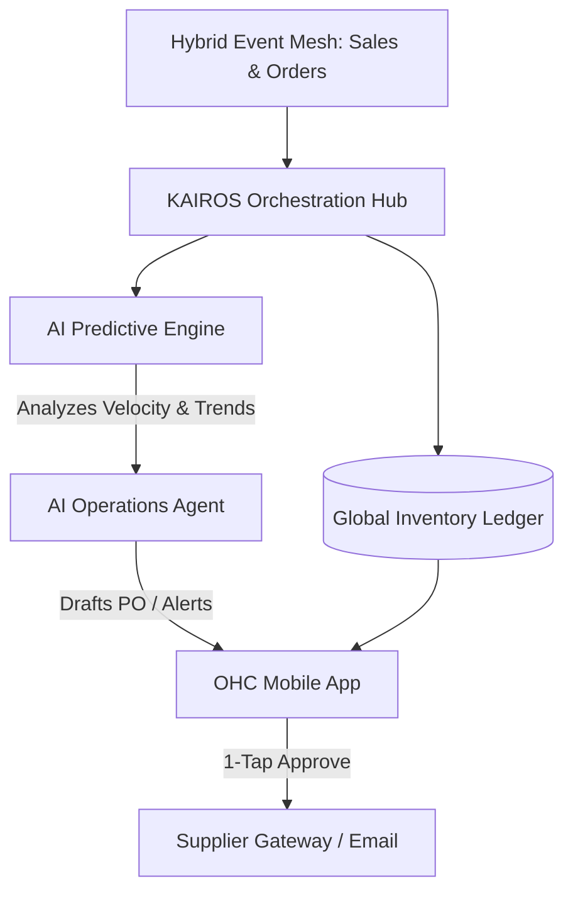

# Title: Autonomous Predictive Inventory & Restock Engine

## Problem Statement
Small business owners like Priya (boutique owner) and Maya (baker) constantly run out of critical supplies or popular variants without realizing it until a customer tries to buy them. Priya has to manually count dresses every week and guess when to reorder based on "feeling." Fatima (food cart operator) runs out of chicken during the lunch rush because she couldn't predict the surge in demand. Existing platforms (Shopify, Wix) only track what is currently in stock, but they don't *predict* when you will run out based on sales velocity, seasonality, or upcoming local events, nor do they automate the restocking process. For a solopreneur, stockouts mean lost revenue and manual inventory management is a time-consuming nightmare.

## Research Report
*   **Competitor Analysis**:
    *   **Shopify**: Provides basic low-stock alerts and manual purchase orders (PO), but relies on third-party apps (like Stocky) for demand forecasting, which are complex and expensive for micro-businesses.
    *   **Wix / Squarespace**: Very basic inventory tracking. No predictive capabilities out of the box. Users are forced to manually update numbers and remember to reorder.
    *   **Square**: Good real-time tracking, but predictive ordering requires upgrading to expensive retail tiers or using complex integrations.
*   **The OHC Differentiator**: OneHumanCorp will move from passive tracking to active, autonomous management. The AI Operations Agent will analyze real-time sales velocity, historical trends, and external signals to predict stockouts before they happen and draft automated supplier reorder requests for a "1-Tap Approval" by the business owner.

## Design Doc

### High-Level Architecture

### Key Design Decisions & Invariants
*   **Proactive, Not Reactive**: The system doesn't just say "Stock is low." It says, "You will run out of Medium Red Dresses by Thursday based on current sales. Tap to restock from Supplier X."
*   **Zero-Trust Multi-Tenancy**: Inventory predictions and supplier data are strictly isolated per tenant using SPIFFE/SPIRE to ensure competitive sales velocity data is never leaked.
*   **AI Agent Coordination**: The AI Predictive Engine identifies the trend. The Operations Agent drafts the restock order and calculates the optimal quantity. If approved, the Finance Agent updates the cash flow projection.
*   **Mobile-First "1-Tap" UI**: The business owner does not need to log into a complex dashboard to create a Purchase Order. They receive a rich notification on their phone and can approve the restock with a single tap.

### Mobile UX Flow (375px First)
1.  **Smart Notification**: Priya receives a notification: "⚠️ Running low: Medium Red Dresses. You'll sell out by Thursday. Restock 20 units for $150?"
2.  **Insight Card**: Tapping the notification opens a clean, macOS-glass style card. It shows a simple graph of recent sales velocity vs. remaining stock.
3.  **Action Area**: Massive, high-contrast buttons at the bottom.
    *   Primary: "Approve Restock ($150)" (Triggers automated email/PO to supplier).
    *   Secondary: "Edit Quantity" or "Dismiss".
4.  **Confirmation State**: A satisfying haptic feedback and a success animation. The Operations Agent takes over to handle the supplier communication invisibly.

## Implementation Prompt
**Objective**: Implement the Autonomous Predictive Inventory & Restock Engine, focusing on the predictive intelligence layer and the mobile 1-tap approval flow.

**User Journey (CUJ) & Acceptance Criteria**:
1.  **Velocity Tracking**: The system must calculate a rolling sales velocity for each SKU in the `Global Inventory Ledger` and project a "days until stockout" metric.
2.  **Predictive Alerting**: When the projected stockout date falls below the configured supplier lead time, the AI Operations Agent must generate a restock proposal.
3.  **Mobile 1-Tap UI**: Expose an API endpoint for the mobile app to fetch active restock proposals and a mutation endpoint to "Approve" the proposal, which updates the ledger's incoming stock state.
4.  **Performance**: Predictive calculations should run asynchronously (e.g., via background job queue) without impacting the real-time checkout latency (< 100ms).

**Constraints**:
Focus on the data models for velocity, predictions, and the restock proposal state machine. Do not prescribe specific ML frameworks for the prediction; start with a robust heuristic/statistical model that the AI Operations Agent can utilize. Ensure all UI endpoints adhere to the premium, minimalist design principles (hiding complex PO logic from the user).

## Priority
`P1`

## Estimated Scope
Large