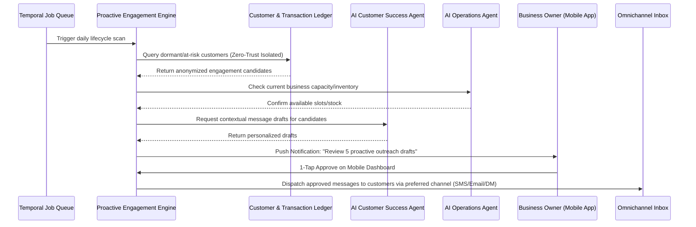

# Issue Brief: Autonomous Proactive Lifecycle Engagement Engine

## Title
[Architecture] Autonomous Proactive Lifecycle Engagement Engine

## Problem Statement
Small business owners (like Leo the music tutor or Priya the boutique owner) lose significant recurring revenue because they lack the time and tooling to proactively engage with inactive customers, follow up on quotes, or nurture existing client relationships. Traditional CRM systems (like Salesforce or Mailchimp) are reactive, requiring the owner to manually build segments, write emails, and schedule campaigns. This manual, technical overhead means engagement simply doesn't happen. The core gap is the absence of an autonomous system that understands the business's natural cadences (e.g., a student hasn't booked a lesson in 3 weeks) and proactively initiates personalized outreach on the owner's behalf, transforming lost leads into retained revenue.

## Research Report
- **Competitor Systems Audit**:
  - **Shopify / Wix / Squarespace**: Focus on reactive automation (e.g., abandoned cart emails triggered by immediate session data) but lack long-term, relationship-driven engagement engines. Their tools require manual configuration of complex workflows.
  - **GoDaddy / Mailchimp**: Provide templates but still rely on the user to identify who to contact, when, and with what message.
- **OHC's Opportunity**: We need to shift from "User-Driven CRM" to "AI-Driven Lifecycle Management". By analyzing the Universal Capacity and Inventory Ledger, the engine can identify dormant relationships (e.g., Carlos the handyman's client hasn't requested seasonal maintenance in 6 months) and automatically draft highly contextual, personalized outreach via the Omnichannel Unified Inbox. This engine bridges the gap between historical transactions and future bookings invisibly.

## Design Doc

### Business Journey Mapping & AI Department Coordination
- **Retention & Revenue Phase**: The engine continuously monitors the multi-tenant ledger for behavioral patterns (e.g., purchase frequency, booking cadences).
- **AI Coordination**:
  - **Data Analysis Department**: Scans customer histories securely to identify engagement opportunities.
  - **Marketing / Customer Success Department**: Drafts personalized messages based on the customer's previous interactions (e.g., "Hi Sarah, it's been a month since your last guitar lesson. Want to book a refresher this Thursday?").
  - **Operations Department**: Verifies inventory/capacity availability before an offer is made.
- **Owner Journey**: The business owner wakes up to a daily briefing on their phone. The engine suggests: "I drafted 5 follow-ups to students who haven't booked this month. Tap to approve and send."

### Architecture Diagram

### Mobile UX Flow (375px First)
1. **Push Notification**: "Good morning Leo! You have 3 students who haven't booked in a month. I've drafted follow-ups."
2. **Dashboard Card (The "Grandmother Test")**: A translucent glass card on the main screen showing a summary: "Proactive Outreach: 3 drafts ready."
3. **Review Screen**: Swiping or tapping the card reveals a simple list. Each item shows the customer's name, the context (e.g., "Last lesson: 4 weeks ago"), and the AI-drafted message.
4. **Action**: The user can swipe right to "Approve All" or tap an individual message to edit.
5. **Confirmation State**: A subtle haptic feedback and a "Sent" animation.

### Key Design Decisions
- **Opt-In/Approval First**: To maintain trust, all proactive outreach requires a "1-Tap Approval" from the owner initially. Once confidence is built, an "Auto-Send" toggle can be enabled in Advanced Settings.
- **Multi-Tenant Isolation & Zero Trust**: The engine must operate within strict multi-tenant boundaries. Data analysis and draft generation must use tenant-isolated memory spaces, verified by SPIFFE/SPIRE identity checks, ensuring one business's customer data never leaks to another's model context.
- **Contextual Awareness**: Messages must never be sent if the business lacks capacity (e.g., don't offer a lesson if Leo's calendar is full). The engine must tightly integrate with the Capacity Ledger.

## Implementation Prompt
**Objective**: Build the Autonomous Proactive Lifecycle Engagement Engine. This system should periodically scan customer transaction and interaction histories to identify dormant relationships or engagement opportunities. It must then coordinate with the AI Customer Success Agent to draft personalized outreach messages and present them to the business owner for a 1-tap approval via the mobile dashboard.
**Acceptance Criteria**:
1.  A background job scheduling mechanism that evaluates customer lifecycles per tenant without cross-tenant data spillage.
2.  Integration with the AI agent departments to generate context-aware message drafts based on historical data and current capacity.
3.  A mobile-first API endpoint that serves these drafted actions to the front-end dashboard for 1-tap approval.
4.  Strict adherence to Zero-Trust architecture, validating multi-tenant boundaries on every data read and AI invocation.

## Priority
P0

## Estimated Scope
Large