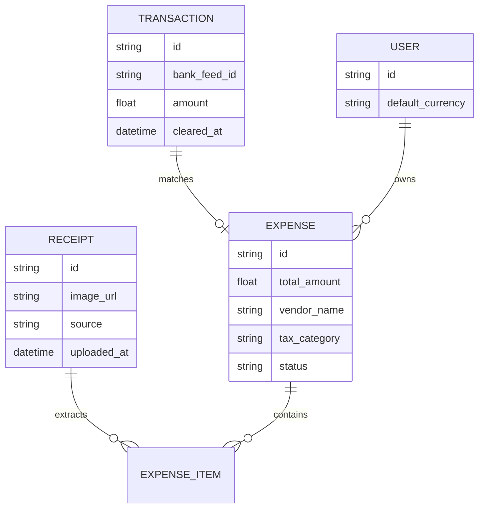
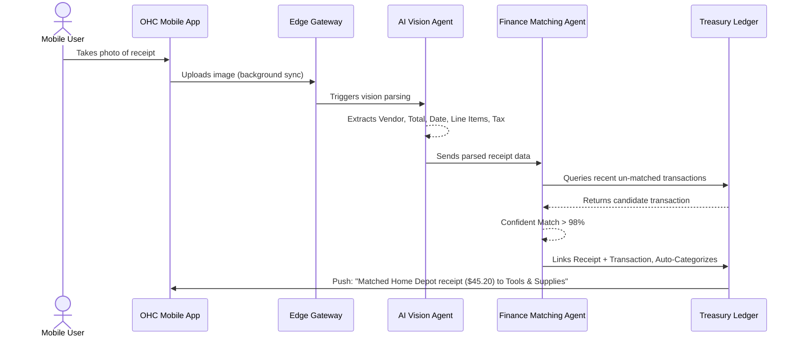

# [Issue Brief] Autonomous Receipt Scanning & Zero-Click Expense Intelligence Engine

## Title
Autonomous Receipt Scanning & Zero-Click Expense Intelligence Engine

## Problem Statement
Small business owners (like Maya the baker or Carlos the handyman) completely lose track of their expenses. While OneHumanCorp perfectly captures their revenue, their costs are scattered across lost paper receipts, email invoices, and mixed bank statements. Come tax time, it's a nightmare. They operate totally blind to their actual real-time profit margins. They don't want to become accountants, configure charts of accounts, or swipe left/right to categorize expenses. They just want to take a picture of a crumpled receipt and forget about it.

## Research Report
### Market Landscape & Competitors
- **QuickBooks Self-Employed**: Requires manual sorting (Tinder for expenses). Too much friction.
- **Expensify**: Built for corporate employees getting reimbursed, not single-owner small businesses.
- **Wave Accounting**: Good OCR, but still requires the user to review, categorize, and approve every transaction.
- **Shopify/Wix**: They only track COGS if manually entered. They don't handle general business expenses (gas, tools, software subscriptions).

### The OHC Opportunity
By combining OHC's Autonomous Treasury Wallet with an AI Finance Agent, we can achieve **Zero-Click Expense Tracking**. When a user snaps a photo of a receipt or forwards an email to their OHC inbox, the AI agent uses multimodal vision to extract the items, amount, and date. It then autonomously searches the connected bank feeds or OHC Wallet ledger, matches the transaction, categorizes it according to tax-friendly buckets, and recalculates the real-time P&L — entirely invisibly.

## Design Doc

### Architecture Diagram

### Key Design Decisions
1. **Multimodal AI over traditional OCR**: Instead of legacy OCR templates, we use an LLM with vision capabilities to understand receipts in any language (crucial for Fatima) or format (crumpled, stained).
2. **Probabilistic Matching Engine**: The Finance Agent actively monitors incoming bank feeds. If a user swipes their card but forgets the receipt, the agent sends a gentle push: "Did you get a receipt for $15.00 at Shell Gas?"
3. **Multi-Tenant Isolation**: Receipts and financial ledgers are strictly sandboxed by tenant ID. Agent contexts are ephemeral and tenant-scoped.
4. **Offline-First Uploading**: The user can snap 10 receipts in a dead zone. The mobile app queues the high-res images locally and background-syncs them when connection is restored.

### Mobile-First UX Flow (375px)
- **Home Screen Card**: A simple "Snap Receipt" floating action button (FAB) visible on the financial dashboard.
- **Camera View**: Opens native camera instantly. Edge-detection highlights the receipt.
- **Confirmation**: A brief haptic success checkmark. "Receipt saved. We'll handle the rest." User immediately returns to their dashboard. No waiting for processing.
- **Feed Interaction (Optional)**: In the background, an expense card appears in their timeline: "Home Depot • $45.20 • Categorized as Supplies". No manual approval needed unless confidence is low.

## Implementation Prompt
**To the Implementer Agent:**
Build the Autonomous Expense Intelligence Engine. Create the robust backend data models (`Receipt`, `Expense`, `BankTransaction`, `ExpenseCategory`). Implement the asynchronous ingestion pipeline where an uploaded image triggers a multimodal AI task to parse the receipt. Develop the fuzzy-matching logic that reconciles parsed receipt amounts and dates with raw bank feed transactions. Ensure all operations are strictly tenant-isolated and fail gracefully if OCR confidence is low, putting the expense into a "Needs Review" queue for the user. Design the API endpoints to support offline-first mobile sync for image uploads.

## Priority
P0

## Estimated Scope
Medium
