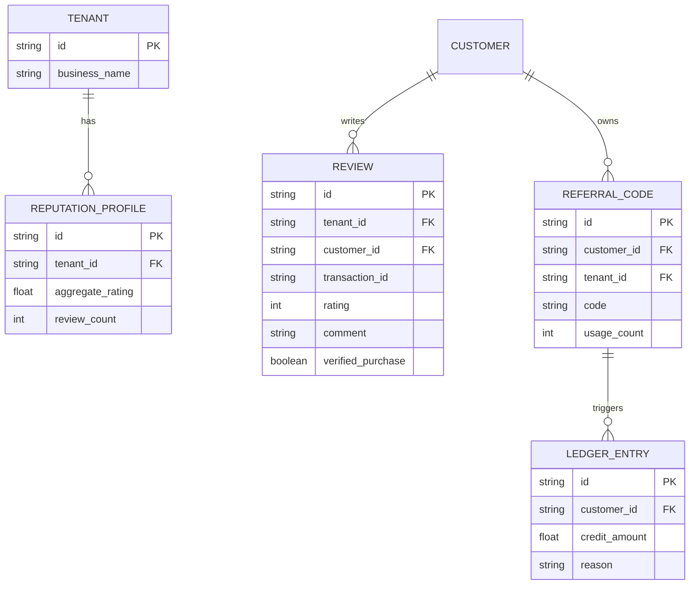
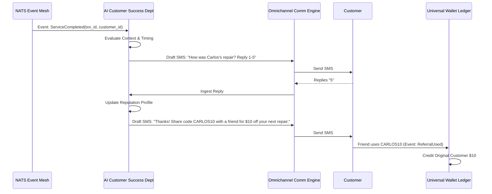

# [Architecture] Autonomous Reputation and Referral Engine

## Title
Implement Autonomous Reputation & Referral Engine

## Problem Statement
Small business owners (like Carlos the handyman and Maya the baker) rely intensely on word-of-mouth and local reputation to grow. However, asking for reviews or managing referral programs is incredibly high-friction. They simply forget, feel awkward asking, or lack the technical tools to track referral credits. Competitor platforms (Shopify, Wix) rely on third-party apps like Loox or Smile.io, which are expensive, desktop-first, require manual setup, and feel "tacked on." OHC needs an invisible, autonomous "Growth Partner" that proactively solicits verified reviews at the exact right moment (e.g., right after a 5-star service delivery or unboxing) and automatically credits referrers without the business owner lifting a finger.

## Research Report

### Competitive Analysis

| Platform | Reputation & Referral Approach | Key Constraint |
|---|---|---|
| Shopify | App Store (Loox, Smile.io, Yotpo). | High cost, complex configuration, brittle integrations. |
| Wix | Built-in basic loyalty, no autonomous outreach. | Passive; requires merchant to configure email campaigns manually. |
| Durable | None natively. | Growth relies solely on SEO/Ad spend rather than organic retention. |
| **OHC (Target)** | **Autonomous, Zero-touch, Event-Driven.** | **Must be completely invisible, abstracting SMS/Email routing and ledger accounting.** |

### Market Insights
- **Timing is Everything:** Review solicitation conversion drops by 70% if asked more than 2 hours after the "aha moment" (e.g., delivery, service completion).
- **The "Awkward Ask":** Solopreneurs report that asking for reviews face-to-face or via manual text feels "needy." An automated system removes this psychological barrier.
- **Referral Friction:** Complex affiliate links fail for local SMBs. Simply saying "tell a friend and you both get $10 off your next booking" works perfectly if the accounting is invisible.

## Design Doc

### Key Design Decisions
1. **Event-Mesh Integration:** The engine listens passively to the NATS Hybrid Event Mesh for triggers like `OrderDelivered`, `ServiceCompleted`, or `InvoicePaid`.
2. **Context-Aware Outreach:** The AI Customer Success Department evaluates the transaction context. If the transaction was flawless, it dispatches an SMS or WhatsApp message asking for a quick 1-tap rating.
3. **Ledger-Backed Referrals:** If a customer refers a friend, the `UniversalWalletLedger` handles the credit allocation invisibly. When the friend books Carlos, the credit is automatically applied at checkout.

### Architecture Diagram (ER)

### Sequence Diagram

### Mobile-First UX Flow (375px Viewport)
1. **The Merchant View:** Maya doesn't see a "Reviews App." On her mobile dashboard, a simple UniFi-style card appears: *"Agent collected 3 new 5-star reviews today. View."*
2. **The Customer View (Review):** The customer receives an SMS. They reply with a number (1-5). If 4 or 5, they get an automated link to optionally cross-post to Google.
3. **The Customer View (Referral):** The checkout screen on Maya's mobile storefront automatically detects the logged-in customer's wallet balance and shows a translucent glass toggle: *"Apply $10 Referral Credit."*

### Security & Multi-Tenancy
- **Zero Trust:** The engine validates that `tenant_id` matches across the `Review`, `Transaction`, and `Customer` records before committing any changes.
- **Ledger Immutability:** Referral credits are appended as immutable entries in the `UniversalWalletLedger` to prevent double-spending or fraud.

## Implementation Prompt

**To the Implementer:**
Build the `Autonomous Reputation and Referral Engine` backend services.
1. Create a service that subscribes to the NATS `ServiceCompleted` and `OrderDelivered` events.
2. Implement the logic to queue a review solicitation via the `Omnichannel Comm Engine` (SMS/WhatsApp).
3. Handle incoming numeric replies (1-5) and store them in a secure `Review` entity.
4. Implement the referral credit issuance logic, hooking into the `UniversalWalletLedger` when a new user checks out using a recognized referral code.
Ensure all database interactions strictly enforce multi-tenant isolation. Do not prescribe specific database schemas; design the entities to integrate cleanly with our existing multi-tenant architecture. Ensure performance targets (<50ms latency for ledger operations) are met.

## Priority
**P1** (High) - Critical for organic growth and retention loop completion.

## Estimated Scope
**Medium**
