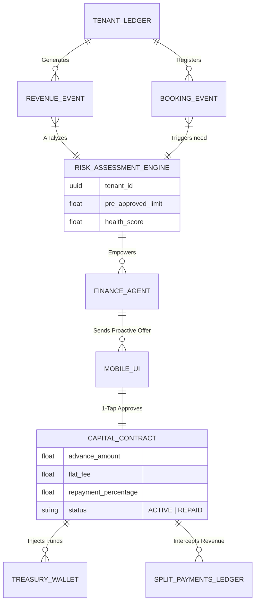

# [Architecture] Autonomous Revenue-Based Capital Engine

## Title
Autonomous Revenue-Based Capital Engine

## Problem Statement
Small business owners experience severe cash flow bottlenecks when trying to scale or fulfill large orders. When Maya the baker receives a massive wedding cake booking, she might need to purchase a $600 industrial mixer immediately, but she hasn't received the full payout yet. Carlos the handyman often needs to buy $1,000 in parts before starting a major job. Traditional bank loans are completely unviable for these micro-loans ($500 - $5,000) due to extensive paperwork, credit checks, and weeks of waiting. Even existing platform solutions (like Shopify Capital or Stripe Capital) feel like traditional loans retrofitted into complex desktop dashboards. Owners need instant, frictionless access to micro-capital based on their actual real-time business performance, delivered exactly at the moment of need, without any technical or financial jargon.

## Research Report
*   **Competitor Systems Audit**:
    *   **Shopify Capital / Stripe Capital**: Both offer revenue-based financing, but they require the user to actively monitor a dashboard, understand financial terms, and manually accept offers. They are disconnected from the immediate operational trigger (e.g., they don't offer capital *because* you just got a big booking).
    *   **Wix / Squarespace**: Offer limited native capital, relying heavily on third-party app integrations that introduce massive friction, separate logins, and disjointed repayment experiences.
    *   **Traditional SMB Banking**: Requires high credit scores, personal guarantees, and weeks of underwriting. Structurally incapable of serving the micro-solopreneur in real-time.
*   **OHC's Differentiation ("Invisible Capital")**: Because OHC already manages the `Universal Capacity Ledger`, the `Instant Localized Invoicing Ledger`, and the `Autonomous Treasury`, it has perfect, real-time visibility into the merchant's health, upcoming bookings, and historical revenue. The Autonomous Finance Agent can proactively offer micro-advances precisely when an event triggers a need, recovering the funds invisibly via a small percentage split of future daily sales.

## Design Doc

### Architecture Diagram

### UI Wireframes & Mobile UX Flow (375px First)
**Visual Identity**: macOS-style Translucent Glass materials (`backdrop-filter: blur(20px)`) combined with clean Ubiquiti UniFi modular dashboard cards.
*   **Trigger (Push Notification)**: Maya receives a notification: "✨ You just booked a $1,200 wedding cake! Need extra cash for supplies? Tap for a $300 instant boost."
*   **Offer Card (The "Grandmother Test")**: Opening the app reveals a frosted glass card. It strips away all financial jargon (no APR, no compounding interest).
    *   **Headline**: "Growth Boost: $300"
    *   **Terms**: "Take $300 instantly to your OHC Wallet. We'll automatically keep 10% of your future sales until $330 is repaid. No hidden fees."
    *   **Action**: A massive, thumb-friendly primary button: `[Get $300 Now]` (44x44px minimum touch target).
*   **Repayment Tracker**: On the main dashboard, an active Capital Boost is represented by a satisfying, subtle progress ring around a "Boost" icon, visually ticking down as new sales automatically repay the balance.

### AI Agent Integration Points
*   **Finance Department**: Continuously monitors the `TENANT_LEDGER` to calculate a dynamic, pre-approved capital limit based on cash flow velocity and refund rates, strictly within tenant-isolated boundaries.
*   **Operations Department**: Correlates incoming large bookings or "Low Inventory" alerts to trigger the Finance Agent to surface the offer exactly when it's most useful.
*   **Advisory Agent**: Handles any customer questions about the capital offer in plain language via the unified inbox (e.g., "What happens if I have a slow month?").

### Key Design Decisions (Why, not How)
*   **Event-Driven Context**: Capital is offered contextually (tied to a booking or inventory need) rather than statically sitting in a dashboard. This converts financing from an administrative chore to a magical enabler.
*   **Flat Fee / Revenue Split**: No compounding interest or fixed monthly payments. Repayment scales with the business, eliminating the fear of defaulting during slow months.
*   **Instant Wallet Injection**: Funds must be instantly available on the OHC Virtual Card, allowing the owner to use Apple Pay at a supplier immediately.
*   **Zero-Trust Multi-Tenancy**: The Risk Assessment Engine must operate under strict SPIFFE/SPIRE identity checks to ensure Tenant A's revenue data never influences Tenant B's risk profile.

## Implementation Prompt
**To the Implementer Swarm:**
Your objective is to architect the backend logic and mobile-first UI for the "Autonomous Revenue-Based Capital Engine."

**Customer User Journey (CUJ):**
Maya receives a large booking event that triggers a contextual capital offer. She reviews a simple, jargon-free translucent glass card detailing a flat-fee advance. Upon 1-tap approval, the system instantly credits her OHC Treasury Wallet and configures the Split Payments Ledger to automatically route a fixed percentage of all future incoming transactions to repay the advance.

**Acceptance Criteria:**
*   **Risk Engine Hook**: Implement a background worker that securely calculates a `pre_approved_limit` based on a tenant's historical ledger volume, ensuring strict multi-tenant isolation.
*   **Split Payment Routing**: Extend the `Split Payments Ledger` to automatically intercept and route the specified `repayment_percentage` of new sales to the repayment pool until the `advance_amount` + `flat_fee` is satisfied.
*   **Mobile Parity**: Implement the Offer Card and Repayment Progress Ring UI components perfectly for a 375px viewport, adhering to the premium visual mandate (shimmer loading states, no horizontal scrolling).
*   **Agent Trigger**: Provide an interface for the Operations/Finance agents to proactively trigger a notification when a qualifying business event occurs.

## Priority
P1

## Estimated Scope
Large