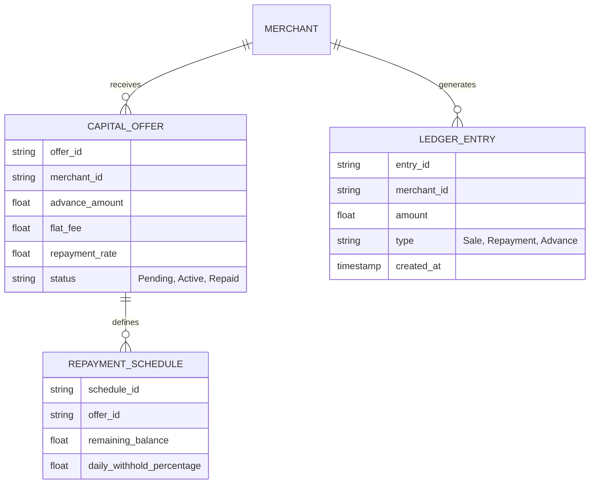
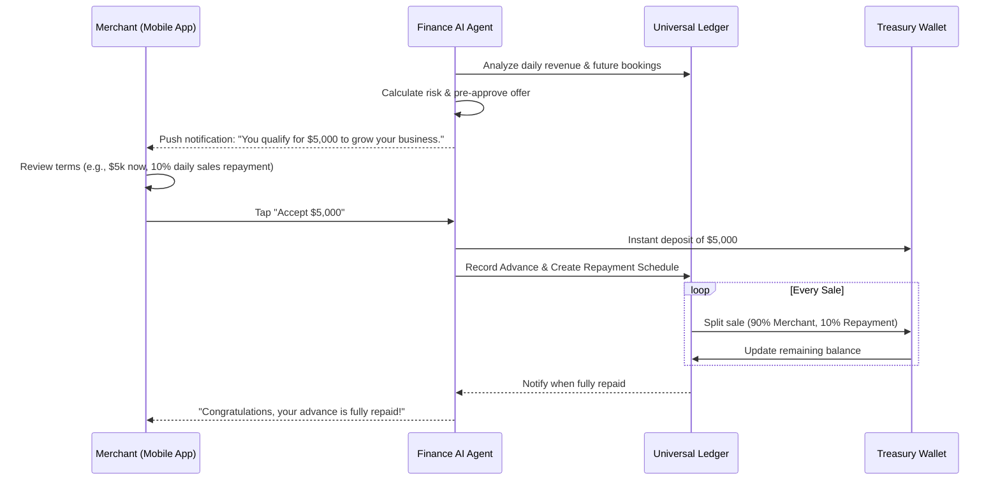

# [architecture]_autonomous_revenue_based_capital_engine

## Title
Autonomous Revenue-Based Capital Engine (OneHumanCorp Capital)

## Problem Statement
Small business owners—whether it's Maya buying a second industrial oven for her bakery, or Fatima repairing her food cart—often face critical cash flow crunches or growth bottlenecks that require immediate capital. Traditional bank loans are too slow, require complex paperwork, personal guarantees, and pristine credit scores.
For non-technical owners who already run their entire operation on OneHumanCorp (OHC), this is a missed opportunity. Because OHC possesses exact, real-time data on their revenue, deposit streams, and customer retention, we can pre-approve and offer capital instantly. They need a simple, single-tap "Accept Capital" button that drops funds into their Treasury instantly, and repays automatically as a fixed percentage of daily sales, completely invisibly, with zero paperwork.

## Research Report
### Market Context
- **Shopify Capital / Square Loans / Stripe Capital**: These platforms dominate the SMB financing space by utilizing merchant payment volume data to pre-qualify businesses for loans or cash advances. They typically offer a lump sum in exchange for a fixed fee, repaid automatically as a percentage of daily card sales (e.g., 10-15%).
- **The Gap**: Existing platforms still frame this around "loans" with complex terms, separate dashboards, or rigid underwriting criteria. Often, cash is delayed by 1-3 business days unless extra fees are paid. Furthermore, they don't integrate tightly with operational AI.

### Why OHC is Unique
- OHC's ledger and multi-tenant systems already act as the core operating system.
- **AI-Driven Underwriting**: OHC's Finance AI can dynamically assess cash flow health and future bookings (e.g., Leo's scheduled tutoring sessions) to predict revenue stability more accurately than lagging historical card volume alone.
- **Zero-Friction Acceptance**: OHC can disburse directly to the built-in Autonomous Treasury/Wallet instantly.

## Design Doc

### Architecture Diagram

### UI Wireframes & Screen Flow Description (375px First)
1. **Dashboard Nudge**: A soft, translucent macOS-style card at the top of the main dashboard: "Growth Opportunity: $5,000 available instantly."
2. **Offer Details Screen**:
   - **Header**: "Unlock $5,000 today."
   - **Body**: Three simple, large-font bullet points:
     - "Funds arrive in your OHC Wallet instantly."
     - "One flat fee of $500. No compounding interest."
     - "You repay automatically with 10% of your daily sales. If sales are slow, you pay less."
   - **Action**: A large, edge-to-edge "Accept & Get Funds" primary button.
3. **Success State**: Confetti animation, "Funds are in your wallet."
4. **Active Capital Tracker**: A small circular progress bar on the dashboard showing "$4,500 of $5,500 repaid."

### Mobile UX Flow
- **Grandmother Test**: The language completely avoids terms like "underwriting," "APR," "amortization," or "lien." It speaks in plain English: "Get money now, pay it back as you sell."
- **Frictionless**: The entire process from seeing the offer to having funds takes 2 taps. No forms, no uploading bank statements, no credit checks.

### AI Agent Integration Points
- **Finance AI Department**: Continuously monitors the `Universal Ledger` to identify healthy businesses (e.g., consistent 3-month revenue, low chargeback rates). It dynamically generates pre-approved offers and determines the optimal withholding percentage (e.g., 8% vs 12%).
- **Communications AI Department**: Drafts the contextual push notification (e.g., "Maya, Mother's Day is coming. Need extra funds for supplies?").
- **Operations AI Department**: Adjusts the payment routing on every checkout to split the transaction and automatically route the repayment portion to the internal capital ledger.

### Key Design Decisions
- **Revenue-Based vs. Term Loan**: Repayment scales with revenue. This protects the merchant during slow periods and aligns OHC's incentives with the merchant's success.
- **Flat Fee Structure**: No complex APR calculations. Transparency is key for non-technical users.
- **Instant Treasury Payout**: Funds are deposited into the OHC Treasury Wallet, keeping the capital within the ecosystem and avoiding 1-3 day ACH delays.
- **Zero-Trust & Isolation**: The capital ledger must be strictly tenant-isolated to ensure merchants only see their own repayment schedules and cannot access other tenants' financial data.

## Implementation Prompt
**To the Implementer:**
Implement the "Autonomous Revenue-Based Capital Engine."
The goal is to allow pre-approved merchants to accept capital advances with a single tap, with the funds instantly available in their OHC Treasury Wallet. Repayment should be handled invisibly by intercepting a fixed percentage of every incoming sale on the platform.
**Acceptance Criteria:**
1. A background process (simulating the Finance AI) evaluates a merchant's ledger history and flags them as "eligible" with a specific offer amount and flat fee.
2. An API endpoint allows the merchant to "accept" the offer.
3. Upon acceptance, the advance amount is instantly credited to their OHC Treasury balance.
4. A multi-tenant isolated Repayment Schedule entity is created.
5. Every subsequent sale transaction (checkout/payment) is automatically split based on the daily withhold percentage, crediting the merchant's treasury with the remainder and updating the Repayment Schedule balance.
6. The entire flow must be testable via mobile-first API responses, ensuring latency is minimal.

## Priority
P1

## Estimated Scope
Large
