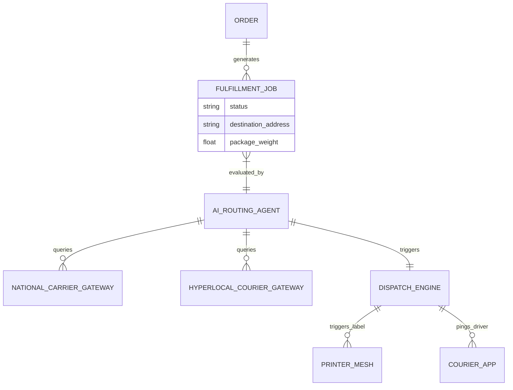

# Autonomous Shipping & Hyperlocal Fulfillment Mesh

## Problem Statement
For small business owners like Maya the baker or Priya the boutique owner, fulfillment is a messy, manual process. They currently have to calculate shipping rates manually, copy-paste addresses into different carrier portals (USPS, UPS), and guess whether a local delivery (via Uber Direct or DoorDash Drive) would be cheaper or faster than traditional mail. This manual routing between national shipping and hyperlocal couriers costs them time, money, and leads to a fragmented customer experience. They need a system that invisibly routes orders to the most cost-effective and timely fulfillment method without them ever lifting a finger or opening a manual.

## Research Report
### Current Market Landscape
- **Shopify**: Offers solid native shipping (Shopify Shipping) but hyperlocal delivery relies entirely on third-party apps (e.g., Zapiet, Store Pickup + Delivery), which require complex configuration, monthly fees, and manual oversight.
- **Wix/Squarespace**: Basic national shipping integrations exist, but local delivery is mostly "manual local delivery" where the merchant fulfills it themselves. No native automated routing to fleets like Uber Direct.
- **GoDaddy**: Limited to basic flat-rate or weight-based shipping. No intelligent routing.

### The Gap
There is a massive opportunity for OHC to provide a "Zero-Touch Fulfillment Engine" that natively blends national carriers with hyperlocal on-demand fleets. The AI should analyze the drop-off location, package dimensions, and real-time courier pricing, automatically purchasing the label or dispatching the driver, completely abstracting the logistics away from the merchant.

## Design Doc

### Architecture Diagram

### UI Wireframes & Mobile-First UX Flow (375px Viewport)
The design follows macOS-style Translucent Glass materials combined with clean Ubiquiti UniFi modular dashboard cards.
- **Screen 1: Order Details (Auto-Routed)**: A clean card displaying the order. Instead of asking the merchant *how* to ship, it says "Fulfillment scheduled via Uber Direct (Cheapest/Fastest)" with an "Undo/Change" button hidden behind an "Advanced Settings" context menu.
- **Screen 2: Fulfillment Status**: A visual progress bar on the dashboard: "Driver arriving in 5 mins" or "USPS Label Printed".
- **Screen 3: Zero-Touch Setup**: During onboarding, a single toggle: "Automate my deliveries (We'll pick the best carrier or local driver automatically)."

### AI Agent Integration Points
- **Operations Department (Routing Agent)**: Continuously monitors new orders, calculates distances, queries rate APIs in the background, and selects the optimal path.
- **Customer Success Department (Tracking Agent)**: Automatically SMS/emails the buyer with tracking updates or live courier maps without the merchant doing anything.

### Key Design Decisions
- **Invisible Routing**: Do not present the user with a complex matrix of shipping rates and local delivery zones. The AI makes the decision based on predefined cost/time optimization rules.
- **Unified Ledger**: Treat a local courier dispatch and a national shipping label as the same underlying entity (a `FulfillmentJob`) to keep the data model simple and extendable.
- **Grandmother Test**: If Fatima the food cart owner needs to deliver a catering order, she just taps "Send it", and a driver appears. No configuring API keys or weight zones.

## Implementation Prompt
**To the Implementer Agent:**
Build the unified backend engine and mobile-first UI for the Autonomous Shipping & Hyperlocal Fulfillment Mesh.
**User Journey (CUJ)**: A customer places an order. The system autonomously evaluates the shipping address. If it's within 10 miles, it fetches a quote from a local courier API; if further, it gets a USPS quote. It automatically selects the best option, deducts the cost, and either generates a printable label or dispatches a local driver. The merchant sees a single, unified "Order Dispatched" status on their mobile dashboard.
**Acceptance Criteria**:
1. A unified fulfillment interface on mobile (375px) that abstracts away the difference between local and national shipping.
2. Background worker/agent logic that evaluates routing options based on cost and distance.
3. Adherence to the visual design tokens (glassmorphism, modular cards).
4. No required manual configuration for basic routing; it must work out of the box with sensible defaults.

## Priority
P1

## Estimated Scope
Large