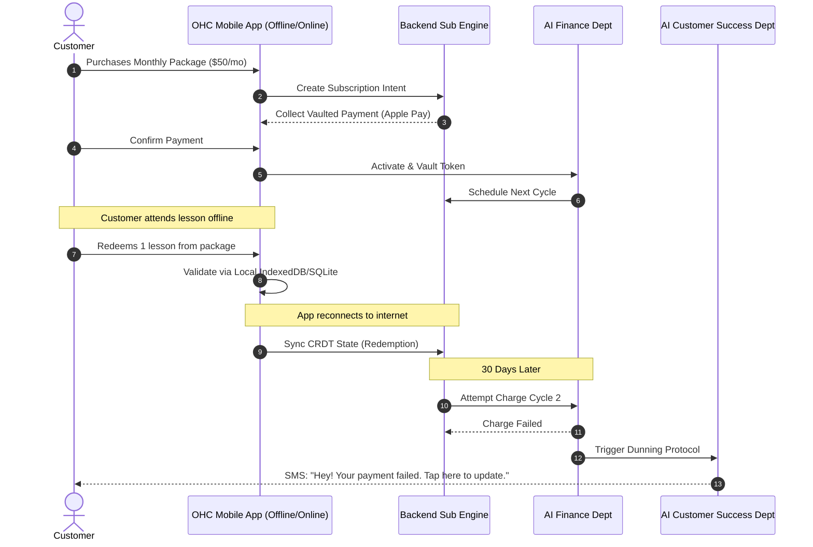

# Autonomous Subscription and Recurring Billing Engine

## Persona Identified
- **Leo the Music Tutor** (22, non-technical): Needs subscription-based pricing (monthly lesson packages).
- **Maya the Baker** (28, non-technical): Might want to offer a "Cake of the Month" subscription.
- **Priya the Boutique Owner** (35, semi-technical): Might want to offer a monthly VIP style box.

## Problem Statement
Small business owners like Leo and Priya need a way to offer recurring subscriptions and memberships. However, existing platforms either don't support this natively, require expensive third-party apps, or involve complex configurations (webhooks, dunning setups). They need a zero-configuration, AI-powered system where they can just tap "Make this a monthly subscription" on their phone and the platform handles the rest. They don't know what "dunning" or "proration" means, and they shouldn't have to.

## Proposed Solution: The OHC Zero-Configuration AI Subscription Engine

To provide a seamless, offline-capable, and AI-driven subscription experience, OHC will implement a multi-layered architecture:

1. **Offline-First Storage & CRDT Sync (IndexedDB/SQLite):**
   - **Mobile Clients (PWA/Flutter):** Store subscription states, active memberships, and redemption counts (e.g., Leo's lesson packages) locally using IndexedDB (Web) or SQLite (Mobile).
   - **Conflict-Free Replicated Data Types (CRDTs):** Ensure that local offline redemptions (e.g., student redeems a lesson package offline) sync correctly with the backend once reconnected.
   - **Benefit:** Fast, reliable validation at the point of sale/service, even with spotty connectivity.

2. **AI Finance Agent (The Accountant):**
   - **Autonomous Dunning:** The Finance Agent monitors subscription lifecycles. When a payment fails, it automatically triggers a recovery sequence.
   - **Smart Retries:** Instead of fixed intervals, the AI determines the optimal time to retry the charge based on historical data and industry best practices.
   - **Customer Communication:** Triggers the Customer Success (CS) Agent to send personalized SMS/WhatsApp messages with a 1-tap magic link to update payment methods.
   - **Zero-Config:** Merchants do not configure retries, intervals, or webhook URLs. The AI handles it all behind the scenes.

3. **Multi-Tenant Backend (PostgreSQL + Rust/Go):**
   - Strict row-level security isolates subscriptions, ledgers, and payment tokens per tenant.
   - **Subscription Intents:** Abstract representations of a subscription, un-tied to a specific provider initially, allowing flexibility.

4. **1-Tap Magic Link Management:**
   - Customers do not need to create accounts or remember passwords.
   - They receive an SMS/Email with a secure, expiring magic link to manage their subscription (pause, resume, update payment).

## Architecture Diagram

## AI Agent Integration Points
- **Finance Department:** Monitors for payment failure, triggers retries, and handles ledger reconciliation.
- **Customer Success (CS) Department:** Sends the friendly SMS/WhatsApp recovery messages.
- **Operations Department:** If the subscription is for a physical good (Maya's Cake of the Month), Ops Agent creates a fulfillment task when the subscription successfully renews.

## Verification
- Ensures Leo can offer subscriptions effortlessly.
- Ensures offline reliability using local storage and CRDTs.
- Eliminates third-party tool dependency.
