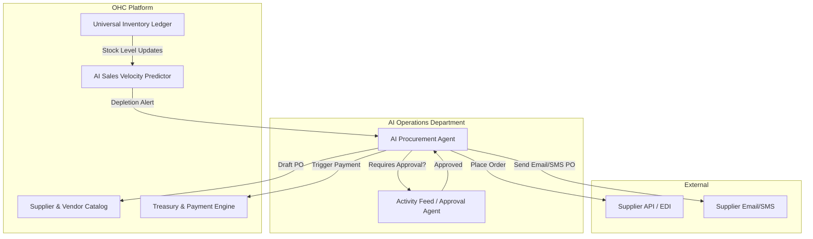

# [architecture]_autonomous_supplier_ordering_engine

## Title
Autonomous Supplier Ordering Engine

## Problem Statement
Small business owners like Fatima (food cart) and Priya (boutique owner) spend hours every week managing inventory and manually reordering supplies from various vendors (wholesale suppliers, local bakeries, packaging companies). When they run out of a critical ingredient or product, they lose revenue and customer trust. The process of predicting when stock will run out, generating purchase orders, and paying suppliers is entirely manual, prone to human error, and time-consuming. They need a system that seamlessly and invisibly monitors stock levels, predicts depletion based on sales velocity, and automatically places orders with suppliers before stock runs out, handling the payment and communication without requiring them to lift a finger (unless they want to approve).

## Research Report
- **Market Gap:** Current platforms (Shopify, Wix, Squarespace) offer inventory tracking but lack autonomous reordering. They require third-party apps (e.g., Stocky) which only send "low stock alerts." The merchant still has to manually create POs, email them, and handle invoicing.
- **Data & Insights:** Small businesses spend up to 15 hours a week on inventory and supplier management. Stockouts account for an estimated 4% loss in annual revenue.
- **Competitive Analysis:**
  - *Shopify:* Has basic reorder points, but relies heavily on apps for automated PO generation. No autonomous agentic negotiation or direct supplier integration out-of-the-box.
  - *Square:* Good POS inventory, but POs are manual.
  - *OneHumanCorp Opportunity:* Introduce an AI Operations Agent that not only tracks inventory but autonomously contacts suppliers (via email, SMS, or API), places orders based on predictive algorithms, and manages the accounts payable ledger.

## Design Doc

### Architecture Diagram

### Mobile UX Flow (375px first)
1. **Home Screen Feed:** The merchant sees an actionable card on their mobile dashboard (macOS Translucent Glass style). Card text: "Flour is running low. Auto-order 50lbs from Supplier X for $45?"
2. **One-Tap Action:** A large, easily tappable "Approve" button, or "Edit Order".
3. **Automated Mode:** For trusted suppliers, a settings toggle "Auto-order without approval" can be set. The card simply states "Ordered 50lbs of Flour. Arriving Tuesday."
4. **Supplier Management:** A simple list view of suppliers with standard cards. Tapping a supplier shows recent orders and active AI procurement settings.

### AI Agent Integration Points
- **AI Procurement Agent:** Monitors the `SalesVelocityPredictor` and `InventoryLedger`. When a threshold is met, it drafts a PO using context from the `SupplierCatalog`.
- **AI Communications Agent:** If the supplier doesn't have an API, this agent drafts a natural language email or SMS (e.g., "Hi Bob, can we get our usual 50lbs of flour delivered this week?").
- **Operations & Finance:** The procurement agent coordinates with the Treasury Engine to reserve funds or schedule a payment once the invoice is received.

### Key Design Decisions
- **Event-Driven:** The system relies on real-time inventory decrement events to trigger velocity predictions.
- **Multi-Tenant Isolation:** Supplier details, pricing contracts, and POs are strictly isolated per tenant using Zero-Trust policies.
- **Graceful Degradation:** If an API is unavailable or a supplier only accepts text messages, the AI falls back to SMS/Email communication for placing the order.

## Implementation Prompt
**Context:** Implement the Autonomous Supplier Ordering Engine. This system must monitor inventory levels and automatically trigger purchase orders when stock is predicted to run out.
**User Journey (CUJ):**
1. Fatima (Food Cart) sets up a supplier for her Halal Chicken and sets a minimum stock threshold (or lets the AI predict it).
2. The system notices stock will run out in 2 days based on current sales.
3. The AI Procurement Agent drafts an order to the supplier and sends a push notification to Fatima.
4. Fatima taps "Approve" on her phone. The order is sent via SMS to the supplier, and funds are escrowed.
**Acceptance Criteria:**
- Create the data models for mapping products to suppliers and tracking POs.
- Implement the background job/agent that evaluates inventory levels against velocity/thresholds.
- Build the mobile-first UI components for the unified inbox/activity feed to approve drafted POs.
- Ensure all data is multi-tenant isolated and actions are logged for audit.

## Priority
P1

## Estimated Scope
Large
