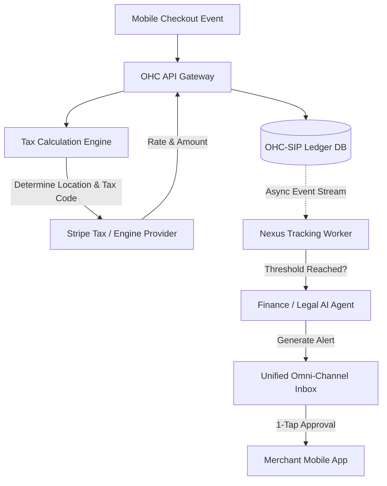

# Architecture Brief: Autonomous Tax and Compliance Engine

## Title
Autonomous Multi-Jurisdiction Tax & Compliance Engine

## Problem Statement
Small business owners (like Priya running her boutique, or Maya shipping custom cakes out of state) face immense friction understanding and managing sales tax, VAT, and economic nexus thresholds. Existing platforms like Shopify or Wix require users to manually understand their tax liabilities, monitor thresholds, and configure tax rates or install expensive third-party apps like TaxJar or Avalara. This is a terrifying, highly technical process for a non-technical user. If OHC is the invisible operations team, it must handle tax tracking, collection, and filing preparation autonomously without requiring the user to become a tax accountant.

## Research Report
- **Competitor Landscape**:
  - **Shopify**: Provides built-in tax calculation (Shopify Tax) but puts the burden on the merchant to know *when* and *where* to register for taxes (nexus). It charges extra for robust liability tracking.
  - **Wix**: Relies heavily on Avalara integration, requiring users to manage a separate SaaS relationship and understand complex tax codes.
  - **Stripe Tax**: Excellent API, but the UI/UX is built for developers, not for "Maya the baker."
- **User Psychology**: Users are terrified of doing taxes wrong and facing penalties. They want a "set it and forget it" solution that simply collects the right amount and tells them what to pay.
- **The OHC Differentiator**: Instead of just providing a tax calculator, OHC employs a Legal/Finance Agent that actively monitors sales volume per jurisdiction, alerts the user *before* they hit an economic nexus, and automatically applies the correct tax rate to the checkout without manual configuration.
- **Key Findings**: To maintain the "Zero Setup" ethos, OHC must automatically geolocate the buyer, classify the product taxability (e.g., clothing vs. digital goods vs. food), and calculate real-time tax at checkout, storing the ledger data for the autonomous reporting engine.

## Design Doc

### Key Design Decisions
1.  **Invisible Configuration**: The system automatically determines the seller's home jurisdiction based on their profile and sets up base tax collection instantly.
2.  **Autonomous Nexus Tracking**: The KAIROS Orchestrator passively tracks sales volume (GMV and transaction count) per state/country against known economic nexus thresholds.
3.  **Real-Time Product Classification**: The AI Operations Agent automatically maps plain-English product descriptions (e.g., "Vegan Chocolate Cake") to standard tax codes (e.g., "Food and Beverage - Prepared") so the correct local rate is applied.
4.  **Zero-Jargon UI**: The merchant only sees simple alerts: "You are nearing the tax threshold in California. Tap here to let OHC register you."

### Architecture Diagram (Mermaid.js)

### Mobile UX Flow (375px First)
- **Settings View**: A simple "Taxes" card under the Finance tab using Glassmorphism. It shows a green checkmark saying "OHC is handling your taxes."
- **The Nexus Alert**: If Maya ships too many cakes to New York and hits a threshold, she receives a push notification. Tapping it opens a bottom sheet: "Great news! Your sales in New York are booming. You need to start collecting NY sales tax. [Approve & Setup Automatically]"
- **Tax Reports**: A clean, single-screen "Tax to Pay" summary showing exactly how much is owed to which state, with a 1-tap "Export for Accountant" button.

### AI Agent Integration Points
- **Finance/Legal Agent**: Monitors the `Ledger` for transaction density by region. Proactively notifies the user when they approach nexus thresholds.
- **Operations Agent**: Scans the product catalog during creation and assigns the correct, granular tax code based on the product description (e.g., distinguishing between a digital gift card and a physical t-shirt).

## Implementation Prompt
Implement the Autonomous Tax & Compliance Engine architecture. Create the background Nexus Tracking Worker that consumes ledger events and evaluates them against predefined jurisdiction thresholds. Integrate a third-party tax calculation provider (e.g., Stripe Tax) into the checkout flow. Develop the Finance Agent behavior to trigger plain-language notifications when nexus thresholds are approached. On the frontend, build the mobile-first "Taxes" summary view and the 1-tap approval bottom sheet for new jurisdictions, strictly adhering to the Glassmorphism and Outfit font visual tokens. Do not prescribe specific database schemas; focus on the data flow and the agentic trigger mechanisms.

## Priority
P1

## Estimated Scope
Medium
