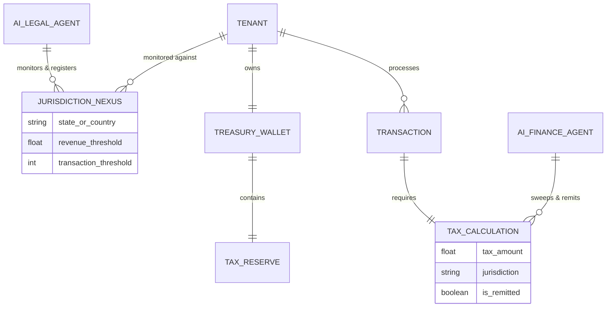

# Architecture Brief: Autonomous Tax & Global Compliance Engine

## Title
OHC Autonomous Tax & Global Compliance Engine

## Problem Statement
Small business owners like Priya (boutique owner shipping globally) and Leo (music tutor with international online students) face a massive legal and financial burden: tax compliance. Calculating Sales Tax, VAT, or GST across different states and countries is confusing, terrifying, and risky. US economic nexus laws mean that even small sellers can accidentally trigger tax obligations simply by having a viral TikTok video that drives sales from another state.

Currently, OHC requires merchants to manually configure tax rates or rely on complex, expensive third-party integrations (like Avalara or TaxJar). Business owners are not accountants. They need a completely invisible system that automatically monitors their sales, detects when they cross a legal threshold (nexus), accurately calculates tax at checkout down to the rooftop level, and seamlessly reserves and remits those funds to the government without any manual intervention.

## Research Report

We investigated tax and compliance solutions across leading platforms to understand how to solve this burden for small business owners.

### Competitive Analysis

| Platform | Tax & Compliance Approach | Key Constraint |
|---|---|---|
| Shopify | Shopify Tax offers automatic calculations. | Still requires merchants to manually monitor nexus states and register themselves. Charges a fee per transaction after the first $100k. |
| Stripe Tax | Excellent API for calculation and nexus monitoring. | Developer-centric. Merchants still must handle the actual filing and remittance themselves outside the platform. |
| Wix / Squarespace | Integrates with Avalara or provides basic manual tables. | Extremely brittle and manual. "Grandmother test" fails completely; requires a CPA to set up correctly. |
| TaxJar / Avalara | Comprehensive compliance. | Expensive enterprise software with clunky UIs not designed for micro-businesses. |
| **OHC (Target)** | **Autonomous nexus monitoring, rooftop calculation, and auto-remittance.** | **Must completely abstract the concept of "tax settings" away from the merchant.** |

### Industry Findings
- **Wayfair vs. South Dakota (US):** Economic nexus means a business no longer needs a physical presence to owe sales tax. Thresholds vary wildly (e.g., $100,000 in sales or 200 transactions).
- **Digital Goods & Services:** Leo's digital music lessons might be subject to VAT in the EU under the One Stop Shop (OSS) rules, even if he is based in the US.
- **Cash Flow Risk:** Merchants often spend collected tax money by mistake, leading to catastrophic tax bills at the end of the quarter.

## Design Doc

### Key Design Decisions
1. **Invisible Nexus Monitoring:** OHC autonomously tracks transaction volume against global and state-level economic nexus thresholds in real-time.
2. **Proactive Auto-Registration:** When a merchant approaches a threshold (e.g., 80% to the Texas threshold), the Legal AI Agent proactively notifies the user and can auto-generate the registration paperwork.
3. **Rooftop-Level Accuracy:** The checkout engine uses the buyer's exact geolocation/shipping address to apply precise local tax rates (including municipal and county taxes), adjusting instantly if the item is tax-exempt (e.g., clothing in some states for Priya).
4. **Auto-Sweep to Tax Reserve:** Utilizing the OHC Treasury Wallet, every time tax is collected on a transaction, the exact tax amount is instantly swept into an inaccessible "Tax Reserve" bucket to prevent accidental spending.
5. **Autonomous Remittance:** The Finance AI Agent automatically files the required returns and wires the funds from the Tax Reserve to the appropriate tax authority on schedule.

### Architecture and Entity-Relationship Diagram (Mermaid.js)

### Mobile UX Flow (375px First)
The goal is zero configuration. The merchant never sees a "Tax Settings" page unless they explicitly look for it.

**Scenario:** Priya's boutique gets a sudden influx of orders from Texas, nearing the nexus threshold.
1. **Push Notification:** "🤠 You're getting popular in Texas! You are approaching the state sales tax limit."
2. **Action Card (Home Dashboard):** A beautifully designed, translucent glass card appears on the OHC home screen:
   - *Title:* Texas Sales Tax Registration
   - *Body:* "You've sold $85,000 in Texas this year. By law, at $100,000 we must start collecting sales tax. Tap below to have OHC automatically register your business with the state."
   - *Primary Action (Button):* "Auto-Register (Free)"
   - *Secondary Action (Text):* "Learn more"
3. **Post-Registration:** OHC handles the state filing in the background. A subsequent notification confirms completion. During future checkouts for Texas buyers, tax is collected and silently swept into the "Tax Reserve".

### AI Integration Points
- **Legal AI Department:** Subscribes to global legislative updates to maintain the `JURISDICTION_NEXUS` rules engine. Handles parsing and auto-filling state registration forms.
- **Finance AI Department:** Intercepts payouts, routes the tax portion to the Tax Reserve, and handles the actual generation and submission of periodic tax returns.

## Implementation Prompt
**To the Implementer Agent:**
Build the Autonomous Tax & Global Compliance Engine. Your goal is to create the core calculation middleware, the nexus monitoring background job, and the Treasury Wallet integration that sweeps collected taxes.
- **User Journey:** The business owner should never have to manually input a tax rate. The checkout must dynamically query the tax engine based on the buyer's address and the product's tax category.
- **Acceptance Criteria:**
  1. A background process successfully tracks rolling 12-month revenue per jurisdiction per tenant.
  2. The system triggers an event (e.g., via NATS) when a tenant hits 80% of a jurisdiction's nexus threshold.
  3. The checkout flow successfully calculates precise tax without adding noticeable latency (<50ms).
  4. The calculated tax portion of a transaction is logically separated from the merchant's available payout balance.
- **Note:** Do not design specific database schemas or pick specific tax API providers (e.g., Stripe Tax vs TaxJar). Focus on the core domain logic, event emission, and the Zero-Trust multi-tenant isolation required for financial compliance.

## Priority
P0 (Critical - prevents legal liability and massive cash flow issues for successful merchants).

## Estimated Scope
Large
