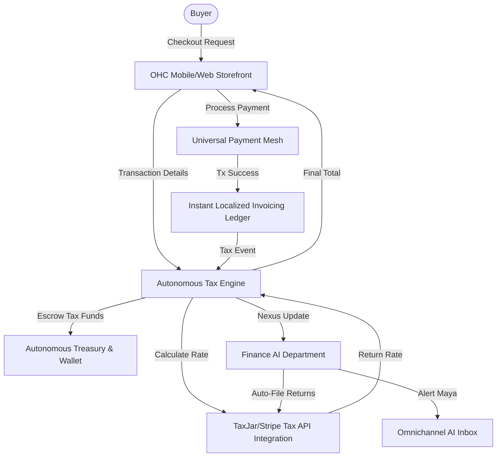

# Autonomous Tax Compliance & Filing Engine Architecture

## Title
Implement a Zero-Touch Autonomous Tax Compliance & Filing Engine

## Problem Statement
Small business owners—like Priya running her boutique, or Maya selling custom cakes across state lines—face a paralyzing burden when dealing with sales tax and financial compliance. Tracking changing nexus laws across multiple jurisdictions, calculating correct rates per transaction, saving portions of income for taxes, and manually filing returns costs significant time and thousands of dollars in CPA fees. They live in constant fear of an audit. They need a system that handles every aspect of tax compliance invisibly: collecting exactly what is owed, holding it securely, and filing automatically with zero manual data entry required.

## Research Report
*   **Competitors & Baselines:**
    *   **Shopify Tax:** Calculates rates well but leaves the burden of multi-state filing, registration, and remittance entirely on the merchant unless they pay for high-tier apps.
    *   **QuickBooks / TurboTax:** Require manual reconciliation, complex setup of tax codes, and still expect the user to understand accounting principles.
    *   **Stripe Tax (TaxJar):** Excellent API for calculation and basic auto-filing, but lacks deep integration into the day-to-day operations of an omni-channel physical/digital business.
*   **The OHC Platform Gap:** Currently, OHC lacks a unified, invisible mechanism to guarantee global tax compliance out-of-the-box. We need a system that acts as a true "fractional CFO," handling multi-jurisdiction calculation, nexus monitoring, and automated remittance without the user ever opening a spreadsheet.
*   **Key Findings:** Small businesses will switch platforms entirely for guaranteed peace-of-mind regarding tax liability. The solution must support multi-tenant isolation, real-time calculation at checkout, and secure funds escrow for remittance.

## Design Doc

### Architecture Diagram

### AI Department Coordination
*   **Finance Department:** Continuously monitors transaction volume per jurisdiction against nexus thresholds. Automatically drafts tax returns and coordinates with the Treasury wallet to remit funds on time.
*   **Legal/Compliance Department:** Stays updated on local tax law changes and automatically adjusts product tax codes (e.g., distinguishing between digital goods, services, and apparel).
*   **Customer Service Department:** If a buyer disputes a tax amount or requests a tax-exempt status (e.g., wholesale), the CS agent handles document verification and updates the customer profile.

### Mobile-First UX Flow (375px Viewport)
1.  **Dashboard Card:** A sleek, glassmorphic card on the home screen: "Q3 Sales Tax: $450 (Fully Escrowed & Ready to File)."
2.  **Detail View:** Tapping the card reveals a clean map view or simple list showing where tax was collected. No complex tables.
3.  **Action / Toggle:** A simple master switch labeled "Auto-File Taxes for Me." When enabled, the user never has to click another button.
4.  **Notifications:** The user receives a plain-language push notification: "We automatically filed your NY State sales tax today. You're all set!"

### Key Design Decisions (The "Grandmother Test")
*   **Invisible by Default:** Do not show complex tax code configuration pages during onboarding. Use AI to auto-categorize products and determine the correct tax class based on plain English descriptions.
*   **Zero Trust / Multi-Tenant Isolation:** Tax data and API credentials must be strictly isolated per tenant using SPIFFE/SPIRE identity protocols. Escrowed funds must be mathematically separated in the ledger.
*   **No Accounting Jargon:** Never use terms like "Nexus," "Remittance," or "Liability" in the core UI. Use phrases like "Taxes collected," "Where you sell," and "Money saved for tax time."

## Implementation Prompt
Implement the core logic and backend architecture for the Zero-Touch Autonomous Tax Compliance Engine.

Your task is to build a highly performant, multi-tenant module that intercepts checkout requests, calculates precise tax based on location and product type, and records the liability in our ledger.
- You must ensure strict tenant data isolation.
- You must implement the capability for the system to automatically trigger funds escrow for tax liabilities.
- Do not build complex configuration UI; instead, rely on sane defaults and background AI categorization.
- Ensure all logic is robust enough to handle offline-first scenarios (e.g., falling back to the last known rate for a jurisdiction if the external tax calculation API is unreachable).

Provide a robust foundation that the Finance AI Department can interact with to pull reports and trigger automatic filings.

## Priority
P1

## Estimated Scope
Large
