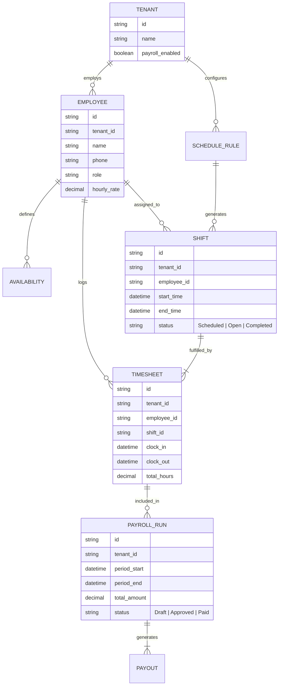

# [Issue Brief] Autonomous Team Scheduling & Payroll Engine

## Title
Autonomous Team Scheduling & Payroll Engine

## Problem Statement
Small business owners who scale beyond solo operations (like a small cafe, a cleaning business, or a multi-tutor agency) face a massive operational cliff: managing a team. They currently use WhatsApp groups to beg people to cover shifts, paper timesheets that get lost, and separate, expensive software (like Gusto or ADP) for payroll that requires manual data entry. They spend hours every Sunday night trying to build a schedule that doesn't conflict with their employees' lives. When an employee is sick, the owner has to scramble. They need an invisible system that auto-generates schedules based on availability and demand, handles shift swaps autonomously, tracks time precisely, and calculates payroll instantly.

## Research Report
### Market Landscape & Competitors
- **Homebase / Sling**: Good for scheduling, but disconnected from the actual business revenue and point-of-sale data (unless heavily integrated).
- **Gusto / ADP**: Powerful payroll, but requires the owner to act as an HR manager. Complex setup and high fees for very small teams.
- **WhatsApp / SMS**: The reality for 80% of small teams. Completely manual, zero integration with timesheets or payroll.
- **Square Team Management**: The closest competitor. Connects POS to timesheets, but still requires manual scheduling and manual payroll execution.

### The OHC Opportunity
By integrating team management deeply into the core OHC platform, we can completely automate the HR lifecycle. Since OHC knows the business's demand (bookings, expected foot traffic), the **HR Agent** can generate the optimal schedule. Employees use the OHC mobile app to clock in/out (with geofencing). If an employee calls out sick via SMS to the business number, the HR Agent autonomously messages available backup staff to cover the shift. Because OHC handles the Treasury Wallet, payroll becomes a one-tap approval process, instantly dispersing funds from the OHC Wallet to the employees' accounts.

## Design Doc

### Architecture Diagram

### UI Wireframes & Screen Flow (375px First)

1. **Manager View - The Roster (Dashboard Card)**
   - A clean card showing "Today's Team" (Who is clocked in, who is scheduled next).
   - A prominent "Approve Payroll ($1,240)" button if a payroll period has ended.
   - A single tab to view the auto-generated schedule for the week.

2. **Employee View - The Hub (Mobile App)**
   - A large, satisfying "Clock In" button (only active when geofenced near the business or scheduled for a remote job).
   - A list of upcoming shifts.
   - A "Drop Shift" button. Tapping this hands the problem to the AI Agent.

3. **The Autonomous Shift Swap Flow (Conversational)**
   - Employee taps "Drop Shift".
   - OHC HR Agent (via SMS/WhatsApp): "Got it, dropping your Tuesday 9am shift. I'll ask the team to cover."
   - OHC HR Agent texts available employees: "Hey [Name], [Employee] dropped Tuesday 9am-5pm. Reply 'CLAIM' to take it."
   - First to reply gets it. Schedule updates instantly. Manager gets a single notification: "Shift covered."

### Mobile UX Flow
- **Offline Reliability**: Clock-ins must be recorded locally on the device with an encrypted timestamp if the network drops, syncing automatically when connectivity is restored to prevent wage theft disputes.
- **Zero-Friction Onboarding**: Adding an employee is just typing their name and phone number. They get an SMS link to download the app and enter their own bank details for direct deposit.

### AI Agent Integration Points
- **The HR Agent (Department: Human Resources)**: Monitors shift status, handles the conversational shift swapping via the unified inbox, and calculates the draft payroll run at the end of the period.
- **The Operations Agent**: Uses historical sales/booking data to predict staffing needs and feeds constraints to the HR Agent for schedule generation.

### Key Design Decisions
- **Unified Identity**: Employees are specialized identities within the tenant, allowing role-based access control (RBAC) to the POS or Inbox depending on their assigned permissions.
- **Geofenced Clock-In**: Ensures accurate timesheets without requiring dedicated hardware timeclocks.
- **Instant Payouts**: Leveraging the existing OHC Treasury Wallet, payroll isn't a complex ACH batch file; it's an internal ledger transfer or rapid payout to connected employee debit cards.

## Implementation Prompt
Implement the Autonomous Team Scheduling and Payroll Engine. The system must provide data models for Employees, Shifts, Timesheets, and Payroll Runs, strictly enforcing multi-tenant isolation. Create the background worker logic for the HR Agent to handle conversational shift-swapping (broadcasting available shifts to eligible employees and handling claims). Ensure timesheet clock-ins support offline-first local caching on the mobile client. Do not prescribe specific database schemas or API endpoints. Focus on the domain events: ShiftPublished, ShiftDropped, ShiftClaimed, TimesheetLogged, and PayrollDraftGenerated. The end goal is that a manager can approve a week's payroll with a single tap.

## Priority
P1

## Estimated Scope
Large
