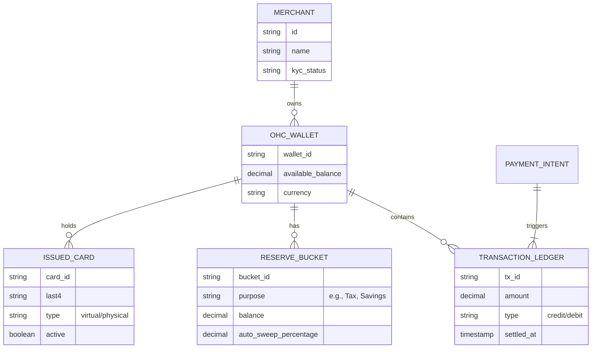
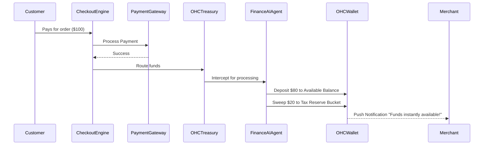

# Autonomous Treasury & Instant Payout Wallet

## Title
Autonomous Treasury & Instant Payout Wallet for Zero-Delay Cash Flow

## Problem Statement
For OneHumanCorp’s core personas—like Maya (baker), Carlos (handyman), and Fatima (food cart operator)—cash flow is the lifeblood of their business. Traditional payment gateways (like standard Stripe or PayPal) often enforce 2-5 day rolling payout delays, and require manual transfers from a digital balance to an external bank account. Furthermore, small business owners must manually calculate and set aside money for taxes, materials, and savings. If Fatima has a busy weekend at her food cart, she needs those funds *immediately* on Monday morning to buy fresh ingredients. If the money is locked in transit, her business halts. They need a zero-friction, instantaneous financial ledger where incoming payments are instantly available to spend via a physical/virtual debit card, with autonomous AI tax-withholding.

## Research Report
**Market Gap Analysis:**
- **Shopify Balance & Square Checking:** Both offer zero-fee business accounts with instant payouts from their respective POS/e-commerce sales. Square offers a "Checking" account that gives sellers immediate access to their funds via a debit card. Shopify Balance provides similar functionality with cashback rewards.
- **Stripe Treasury / Issuing:** Provides Banking-as-a-Service APIs that allow platforms to embed financial services, creating virtual bank accounts and issuing physical/virtual cards directly to merchants.
- **Current OHC State:** OHC currently handles payments and booking deposits but lacks an embedded treasury system. Merchants still rely on external banks, introducing a 2+ day delay for payouts and manual reconciliation.

**Proposed Solution:**
Embed a fully compliant banking and treasury layer (using a BaaS provider like Stripe Treasury) directly into OneHumanCorp. Every merchant gets an "OHC Wallet" automatically upon signup. Payments received via OHC storefronts, POS, or invoices are instantly deposited into this wallet, bypassing the standard ACH delay. A Finance AI Agent autonomously sweeps a user-defined percentage of every transaction into a "Tax Reserve" bucket.

## Design Doc

### Architecture Diagram

### Core System Flows

### Mobile UX Flow (375px First)
1. **Wallet Dashboard Card (Home Screen):**
   - A translucent glass card at the top of the main dashboard.
   - Large text: "Available Balance: $1,250.00"
   - Two prominent buttons below the balance: "Spend" (reveals virtual card Apple/Google Pay details) and "Transfer".
2. **Auto-Save Settings:**
   - Tapping the wallet opens the Ledger View.
   - A toggle switch at the top: "Auto-Save for Taxes".
   - When toggled on, a slider appears (default 20%). The Finance AI handles the rest invisibly.
3. **Transaction Feed:**
   - Clean, modular list of transactions below the cards.
   - Green text for income ("+ $50.00 Custom Cake Deposit"), black for spending.

### AI Agent Integration Points
- **Finance AI Department:**
  - Monitors the `TRANSACTION_LEDGER`.
  - Automatically calculates and routes percentages of incoming funds to `RESERVE_BUCKET`s based on merchant preferences.
  - Generates plain-language weekly cash-flow summaries for the "grandmother test" (e.g., "You made $500 this week, and we safely set aside $100 for taxes. You're fully covered!").

### Key Design Decisions
- **Zero-Trust Multi-Tenancy:** The `TRANSACTION_LEDGER` must strictly enforce multi-tenant isolation via tenant IDs on every database read/write. Funds cannot leak between merchants.
- **Embedded vs. External:** We choose to embed the wallet natively via BaaS (e.g., Stripe Treasury) rather than just accelerating external bank payouts, as this keeps the merchant entirely within the OHC ecosystem and enables instant issuing of OHC branded debit cards.

## Implementation Prompt
**For the Engineering Swarm:**
Implement the backend ledger and mobile UI for the "OHC Wallet" feature.
- **CUJ (Customer User Journey):** Maya completes a $100 cake sale via her OHC storefront. She immediately opens her OHC app, sees her Wallet balance increase by $80, and sees $20 automatically placed in her "Tax Reserve". She then taps her OHC Virtual Card via Apple Pay at the grocery store to buy flour, which successfully debits her Available Balance.
- **Acceptance Criteria:**
  - Create the necessary tenant-isolated data models for Wallets, Transactions, and Reserve Buckets.
  - Implement a mock BaaS webhook endpoint that simulates an instant payout settling into the Wallet.
  - Implement the Finance AI Agent hook that intercepts incoming deposits and splits the funds into reserve buckets based on user config.
  - Build the mobile-first (375px) Wallet Dashboard UI using the design system's translucent glass components. All technical financial terms must be hidden; use plain language.

## Priority
P0

## Estimated Scope
Large
