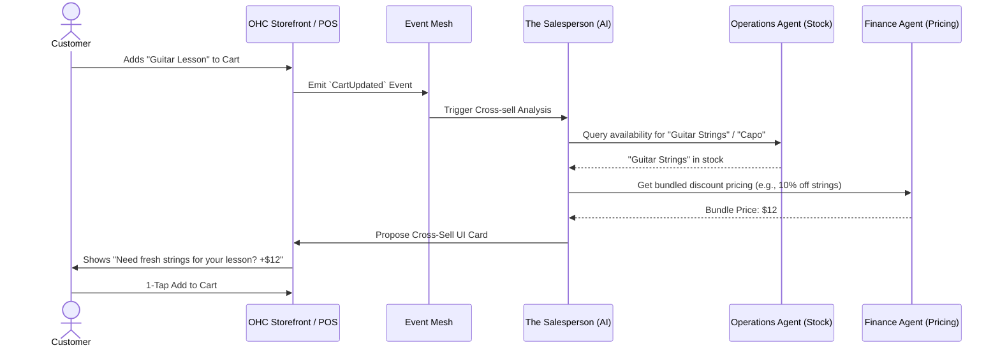
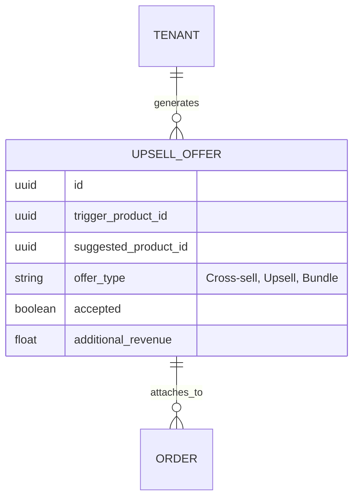

# Issue Brief: Autonomous Upsell & Cross-Sell Engine

## Title
[Sales] Autonomous Upsell & Cross-Sell Engine

## Problem Statement
Small business owners (like Priya the boutique owner or Leo the music tutor) consistently miss out on an estimated 15-30% in potential revenue because they do not have the time, skill, or context to offer relevant upsells (e.g., matching accessories, extended lesson packages) at the exact moment of high customer intent. Traditional platforms like Shopify or Wix require manual configuration of "frequently bought together" rules, which creates "Operational Fatigue". Owners need an invisible, AI-driven engine that dynamically analyzes cart contents, booking contexts, and past customer behaviors to generate and propose highly relevant, 1-tap upsell and cross-sell offers instantly during checkout and post-purchase flows.

## Research Report
- **Competitive Audit**:
  - **Shopify / Wix**: Rely on rigid, manual configurations or expensive third-party apps for upselling. They lack real-time conversational adaptability.
  - **Amazon / UberEats**: Use highly sophisticated algorithmic models that are entirely out of reach for non-technical small business owners.
  - **OHC Advantage**: By integrating directly into the KAIROS Teammate Mesh, OHC can leverage the AI Salesperson to instantly infer what complements a purchase based on the existing product catalog and inventory, offering highly personalized cross-sells naturally without requiring any configuration from the business owner.
- **Key Findings**:
  - 35% of Amazon's revenue comes from its recommendation engine.
  - Small businesses see a 10-30% increase in Average Order Value (AOV) when relevant upsells are presented contextually.
  - If a user has to manually link "Product A" to "Product B", the feature is unused by 85% of merchants.

## Design Doc

### Architecture Diagram (Mermaid.js)

### Data Model & Invariants
- **Multi-Tenant Isolation**: The Sales Agent only queries products and availability from the active `tenant_id` context.
- **Upsell_Ledger**: We will track `upsell_offer_id`, `conversion_status` to allow the Business Advisory agent to report on extra revenue generated.

### Mobile-First UX Flow (375px First)
1. **Checkout Flow (Customer)**: After tapping "Checkout" but before payment, a smooth Glassmorphism bottom sheet slides up: "Customers who booked this also added..." with a prominent, 44x44px 1-tap "Add" button.
2. **Post-Purchase Flow**: For service bookings, a follow-up SMS or email with a 1-tap magic link to add an extra service without re-entering payment details (handled via Stripe SetupIntents).
3. **Owner Dashboard**: The Business Advisory card says, "Your AI Salesperson generated $140 in extra revenue this week by recommending Guitar Strings with Lessons."

## Implementation Prompt
**To Implementer Agent:**
Implement the Autonomous Upsell & Cross-Sell Engine within the KAIROS framework.
1. Build the event listener for `CartUpdated` and `CheckoutInitiated` events that calls the Salesperson Agent.
2. Implement the AI logic to dynamically identify complementary products from the local SQLite/SIPDB catalog without explicit user rules.
3. Coordinate with the Operations Agent to ensure suggested items are in stock.
4. Implement the Glassmorphism mobile UI component (`UpsellBottomSheet`) that displays the offer seamlessly during checkout.
5. Create the `Upsell_Ledger` metrics tracking so the Business Advisory agent can report on added revenue.

## Priority
P1

## Estimated Scope
Medium
