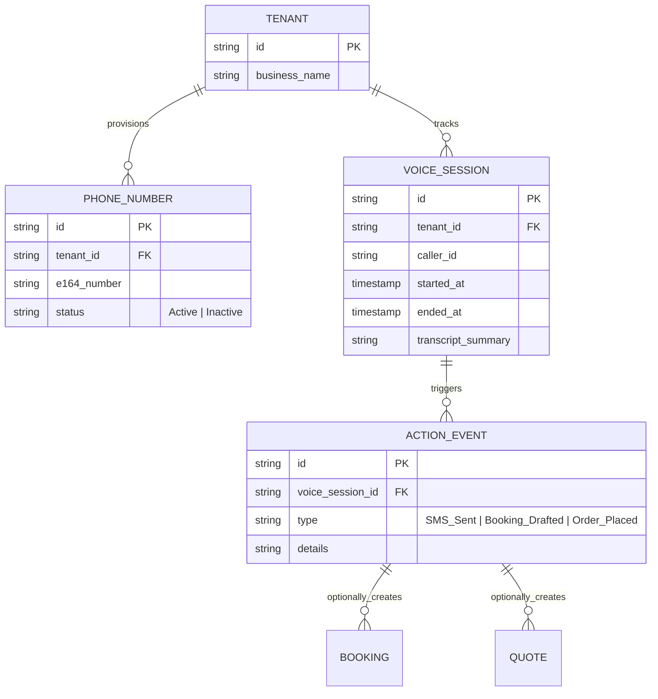
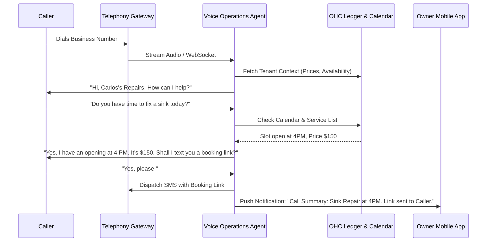

# Title: Autonomous Voice Receptionist Engine

## Problem Statement

For local service providers and food vendors (like Carlos the handyman or Fatima the food cart operator), the phone call is still the highest-converting channel. However, calls invariably happen when they are busiest: driving between jobs, fixing a pipe, or cooking during a rush. Missing a call means missing revenue to a competitor. Traditional voicemail is an operational dead-end that customers hate, and hiring a human receptionist is prohibitively expensive. Small business owners need an intelligent, instant-on voice assistant that can answer calls, securely handle FAQs, quote prices, and take pre-orders—all without any complex setup or "prompt engineering."

## Research Report

* **Current Capabilities:** OHC excels at digital and text-based Omni-channel (WhatsApp, IG DMs) but completely lacks real-time voice telecommunications routing and conversational AI voice capabilities.
* **Competitor Analysis:**
  * *Shopify & Wix:* Exclusively focus on digital/text web experiences. They offer no native telephony or voice AI, leaving a massive gap for service/local businesses.
  * *GoDaddy:* Offers basic call forwarding or simple IVR (press 1 for hours), which feels robotic and frustrates callers.
  * *Standalone AI Voice Startups (Bland AI, Vapi, PolyAI):* Extremely powerful, but require API keys, complex system prompting, webhook configuration, and testing. They fail the "Grandmother Test" and are disconnected from the user's unified OHC business data (inventory, calendar, quoting).
* **Gap Identified:** A 1-tap deployable, unified voice agent that automatically inherits context from the OHC ecosystem (storefront policies, calendar availability, product catalogs) to act as a seamless, natural-sounding receptionist.
* **Strategic Advantage:** Bridging the offline/online gap. By giving every user an instant, intelligent business phone number (or forwarding capability) driven by the AI Operations Agent, OHC becomes an indispensable operational lifeline, entirely leapfrogging traditional eCommerce platforms.

## Design Doc

### Architecture Diagram

### Mobile UX Flow (375px First)

1. **1-Tap Activation:** On the dashboard, a simple Translucent Glass card prompts: "Never miss a call. Activate your AI Voice Receptionist." Tapping it provisions a local number instantly.
2. **Live Call Monitoring:** When a call comes in, the OHC app displays a dynamic island or full-screen modal showing a real-time speech-to-text transcript.
3. **Live Takeover:** If the owner is available, they can tap a prominent "Take Over Call" button to seamlessly bridge into the conversation, muting the AI.
4. **Post-Call Summary Feed:** Completed calls appear in the unified Action Feed. Instead of raw audio or dense transcripts, the feed shows a plain-language summary: "Fatima, a caller asked if the chicken is Halal. I answered yes and texted them the pre-order link."
5. **Voice Configuration (Hidden):** There are no script builders. The AI Agent automatically reads the user's generated storefront (policies, pricing, location) to answer questions. Any manual overrides are handled conversationally: "If someone asks for a discount, say no."

### AI Agent Integration Points

* **The Vigilant Manager (Operations):** Intercepts the call, leverages the unified context to answer questions about inventory or hours.
* **The Silent Ambassador (Customer Success):** Follows up the call by automatically sending SMS links (for booking deposits, pre-orders, or quoting) based on the caller's request.
* **The Business Advisor (Analytics):** Summarizes weekly call volume and missed opportunities in the daily brief.

### Key Design Decisions & Integrity

* **Zero Configuration:** The user must never write a prompt. The Voice Agent's persona is derived entirely from the business profile and existing catalogs/services.
* **Edge-Latency Focus:** Voice interactions demand extremely low latency (<500ms). The architecture must decouple the voice streaming layer from heavier backend OHC ledger transactions.
* **Privacy & Multi-Tenancy:** Transcripts and caller IDs are strictly partitioned by `tenant_id`. Call recordings (if enabled for training) must adhere to Zero-Trust principles and be scrubbed of PII unless explicitly vaulted.

## Implementation Prompt

Implement the Autonomous Voice Receptionist Engine.
The system must provide the ability to provision a telephony endpoint (a phone number) mapped to a specific tenant. It needs to establish a low-latency streaming connection to a Voice AI model that dynamically pulls context from the tenant's business profile (catalog, calendar, policies) to answer questions naturally.
The backend must track the voice session, capture a summarized transcript, and publish action events (like "Send SMS Booking Link") to the OHC Orchestration Hub.
Ensure the UI components are mobile-first, using macOS-style Translucent Glass materials. The setup flow must be 1-tap, and live call transcripts must update asynchronously in the UI.
Acceptance criteria include: successful telephony provisioning, a voice session that correctly answers a question based on tenant data, automatic SMS dispatch triggered by the voice agent, and real-time transcript appearance in the mobile action feed. Do not mandate a specific telephony provider (e.g., Twilio) or LLM provider; focus on the internal interfaces, the state machine of the voice session, and the event-driven handoffs to other OHC components.

## Priority

P0

## Estimated Scope

Large
