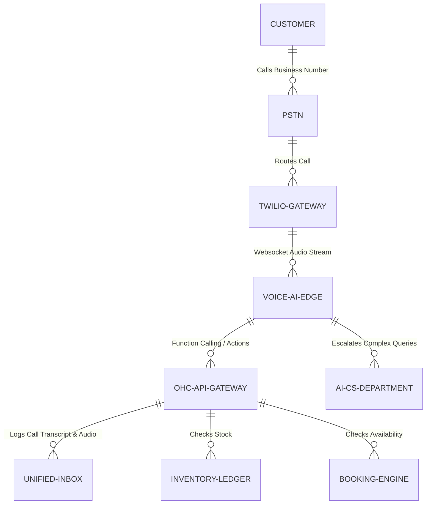

# Title: Autonomous Voice Receptionist & Telephony Order Engine

## Problem Statement

Small business owners like Carlos (handyman, often in basements with tools in
hand) and Fatima (food cart, operating in a loud, busy environment) rely heavily
on phone calls for leads and orders. However, they are frequently physically
occupied and cannot answer the phone. Missed calls mean lost revenue. When they
do answer, they are often rushed, leading to poor customer experiences or
misrecorded information. They need an invisible, highly resilient AI Voice
Receptionist that can answer calls, answer FAQs (e.g., "Do you do vegan cakes?",
"What are your hours?"), provide quotes, and take structured orders/bookings
directly over the phone, feeding seamlessly into the OHC unified inbox and order
management systems.

## Research Report

- **Current Architecture Limits:** OHC currently handles text-based asynchronous
  communication (Instagram DMs, SMS, Email) well through the Omnichannel Unified
  Inbox, but lacks a synchronous, real-time voice channel.
- **Competitor Analysis:**
  - _Shopify/Wix/Squarespace:_ Do not offer native telephony or AI voice
    reception. Merchants must rely on third-party VoIP services (like
    RingCentral or Google Voice) which do not integrate natively into the
    merchant's unified order system or calendar without complex Zapier
    workflows.
  - _GoDaddy:_ Offers a basic smartline/second number but lacks advanced AI
    conversational capabilities to actually close a sale or book an appointment.
  - _Bland AI / Vapi (API Providers):_ Powerful developer tools for voice AI,
    but too complex for a non-technical SMB owner to configure and integrate
    with their catalog and calendar.
- **Discovery:** OHC requires an integrated Telephony Order Engine that
  provisions a local phone number (or ports an existing one) and deploys an
  ultra-low-latency voice AI agent. This agent must have real-time access to the
  merchant's Unified Capacity and Inventory Ledger to book appointments or take
  pre-orders without double-booking or selling out-of-stock items.

## Design Doc

### Architecture Diagram

### UI Wireframes / Screen Flow (375px Viewport)

1. **Onboarding Card (Translucent Glass):** "Never miss a call." A single toggle
   switch: "Enable AI Voice Receptionist".
2. **Number Selection:** "We assigned you (555) 123-4567. Want to keep your old
   number? [Port it here]."
3. **Agent Persona Configuration:** Three simple mood cards to select the voice
   tone: "Friendly & Casual", "Professional & Crisp", "Fast & Efficient".
4. **Active Call State:** A live, pulsing audio wave on the unified inbox screen
   indicating the AI is currently handling a call.
5. **Call Summary Card:** After the call, a simple card in the inbox: "New Order
   from John: 2 Vegan Cakes for 3 PM Pickup. [Approve & Charge $40]".

### Mobile UX Flow

- **Setup:** Maya taps "Enable Voice AI". She selects the "Friendly & Casual"
  voice. She's done in 15 seconds.
- **Action:** A customer calls. Maya is baking and ignores her ringing phone.
  The AI picks up.
- **Post-Action:** Maya checks her OHC app. She sees a new notification: "New
  Call Handled." Tapping it reveals a summarized transcript, the audio
  recording, and a pre-drafted order card ready for 1-tap approval.

### AI Agent Integration Points

- **Customer Service (CS) Department:** Handles general FAQs, greeting, and call
  routing based on the business's custom knowledge base.
- **Operations Department:** Triggered via function calls during the
  conversation to check real-time inventory (Fatima's halal cart) or calendar
  availability (Carlos's schedule).
- **Finance Department:** Generates a secure "Tap to Pay" link sent via SMS to
  the caller immediately after the voice call concludes to secure the deposit.

### Key Design Decisions

- **Zero-Config Setup:** We abstract away Twilio/SIP trunking completely. The
  merchant just toggles it on.
- **Real-Time Data Access:** The voice model must have synchronous access to the
  unified inventory and calendar ledgers to prevent hallucinating availability.
- **Asynchronous Handoff:** The AI does not process payments over the phone for
  security and friction reasons; it texts a payment link to the caller's number
  to finalize the transaction.
- **Multi-Tenant Voice Boundaries:** Strict prompt isolation ensures Maya's
  bakery AI does not accidentally quote prices for Carlos's handyman services.

## Implementation Prompt

**To Implementer:** Implement the "Autonomous Voice Receptionist" module.
Provision phone numbers dynamically via a telephony provider (e.g., Twilio). Set
up a low-latency bidirectional audio websocket connection to a Voice AI provider
(e.g., Vapi, or OpenAI Realtime API). The feature must appear as a simple toggle
in the OHC mobile app settings. When enabled, it answers incoming calls, queries
the OHC API for the specific tenant's knowledge base and inventory/calendar, and
can execute specific function calls (e.g., `create_draft_order`,
`book_appointment`, `send_sms_payment_link`). The resulting call transcript,
summary, and any created entities must flow into the Omnichannel Unified Inbox.
Ensure latency from user speech to AI response is under 800ms. Do not expose any
API keys or provider jargon to the end user.

**Acceptance Criteria:**

- User can provision a number and enable the AI Receptionist with a single tap.
- AI can answer a call, answer a specific FAQ from the tenant's profile, and
  hang up.
- AI can take a draft order and send a payment link via SMS.
- Call summaries and audio recordings appear in the mobile inbox.

## Priority

P0

## Estimated Scope

Large
