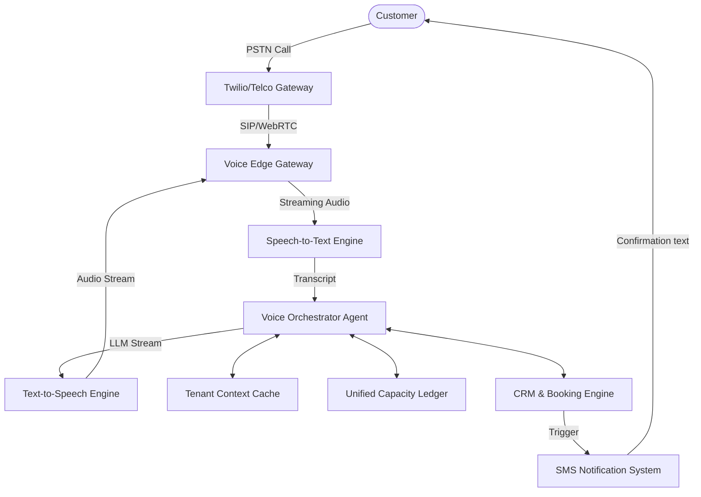

# Autonomous Voice Receptionist & Omnichannel Booking Engine

## Title
Autonomous Voice Receptionist & Omnichannel Booking Engine: Converting Legacy Phone Calls into Instant Bookings

## Problem Statement
Many small business owners, like **Carlos (handyman)** and **Leo (music tutor)**, receive a significant portion of their leads and inquiries via traditional phone calls (PSTN). However, they are often in the middle of a job or teaching a lesson and cannot answer the phone. When a call goes to voicemail, the potential customer often hangs up and calls a competitor. The business owner loses revenue simply because they were physically unavailable. Existing solutions are either expensive human answering services or clunky IVR menus ("press 1 for hours") that frustrate customers. There is a massive architectural gap in bridging the legacy PSTN network with the OneHumanCorp platform to capture these leads automatically and instantly.

## Research Report
*   **The Gap:** OneHumanCorp currently lacks an integrated, ultra-low-latency voice AI solution to handle inbound PSTN calls. Competitors like Square and GoDaddy offer basic call routing, but not autonomous conversational booking. Specialized voice AI companies (e.g., Bland AI, Vapi, Retell) provide APIs, but they are not deeply integrated into an SMB's CRM, inventory, or calendar.
*   **Opportunity:** By provisioning a unique local phone number for each OHC tenant and routing inbound calls to an ultra-low-latency Voice AI edge gateway, we can deploy an AI agent that speaks naturally, understands context, checks real-time availability, and books appointments or takes messages.
*   **Competitor Analysis:**
    *   **Shopify/Wix:** Rely on third-party app ecosystem for voice integrations; fragmented experience.
    *   **Square/Appointments:** Offers automated SMS follow-ups for missed calls, but no conversational voice AI.
    *   **Standalones (Vapi, Bland AI):** High capability but requires technical integration with calendars and CRMs. OHC can build this natively.
*   **Target User Impact:** Carlos the handyman gets an inbound call while under a sink. The AI answers, "Hi, you've reached Carlos. I'm his virtual assistant. How can I help?" The caller asks for a quote on a leaky faucet. The AI checks Carlos's calendar, offers a slot for tomorrow at 2 PM, and sends a booking confirmation SMS. Zero missed revenue.

## Design Doc

### Architecture Diagram

### UI Wireframes & Screen Flow (375px first)
1.  **Dashboard Hub Card:** A "Missed Calls & Voicemails" card is replaced with "AI Voice Assistant". Shows active number, total calls handled, and bookings generated today.
2.  **Configuration Screen (The "Grandmother Test"):**
    *   **Toggle:** "Turn on AI Receptionist" (Big, thumb-friendly toggle).
    *   **Phone Number:** "Your business number is (555) 123-4567."
    *   **Voice Voice:** A simple carousel of 3 voices (e.g., "Professional", "Friendly", "Energetic") with play buttons.
    *   **Goal Selector:** Checkboxes for "Book appointments", "Answer FAQs", "Take messages".
3.  **Call Log Screen:** List of handled calls. Tapping a call shows a clean transcript, summary, and actions taken (e.g., "Booked appointment for Tuesday").
4.  **Advanced Settings (Hidden):** Prompts for custom instructions, SIP trunking details, webhook configurations.

### Mobile UX Flow
1.  **Activation:** User opens OHC app -> Taps "Voice AI" -> Taps "Enable". System auto-provisions a Twilio number in the background and links it to the tenant.
2.  **Notification:** User receives a silent push notification: "AI Receptionist booked a new job for tomorrow at 2 PM."
3.  **Review:** User taps notification, sees the call summary ("Caller had a leaky faucet, booked assessment").

### AI Agent Integration Points
*   **CS Department:** The Voice AI agent acts as the frontline Customer Service agent. It maintains context of business hours, FAQs, and pricing.
*   **Operations Department:** Checks the Unified Capacity Ledger in real-time to offer available slots.
*   **Marketing Department:** Can seamlessly handle outbound calls for review requests or lead follow-ups if enabled.

### Key Design Decisions
*   **Ultra-Low Latency:** We must use streaming STT/TTS (e.g., Deepgram, ElevenLabs) to achieve <500ms conversational latency. Turn-taking must feel human.
*   **Tenant Isolation:** Voice contexts and custom instructions must be strictly isolated per tenant using their unique OHC ID.
*   **Fallback to SMS:** If the voice agent cannot complete a complex task, it gracefully ends the call and triggers an SMS handoff to the business owner.
*   **Zero-Config Default:** The system automatically builds the voice agent's context from the existing business profile, website, and calendar without requiring the user to write a prompt.

## Implementation Prompt
**Objective:** Implement the Autonomous Voice Receptionist engine that handles inbound PSTN calls for OHC tenants.
**User Journey (CUJ):** A business owner enables the AI Receptionist with one tap. A customer calls the provided number. The AI answers, converses naturally, and successfully books an appointment by interacting with the existing capacity ledger. The owner receives a notification of the booking.
**Acceptance Criteria:**
1.  A tenant can provision a phone number via the mobile UI.
2.  Inbound calls to that number are routed to a streaming voice session.
3.  The voice agent has access to the tenant's business hours, FAQs, and calendar availability.
4.  The agent can successfully create a booking in the system via function calling/tools.
5.  Call transcripts and summaries are saved to the tenant's call log.
6.  End-to-end latency from user speech to agent response must be optimized for natural conversation.
7.  Strict multi-tenant data isolation must be enforced during the voice session.

## Priority
P1

## Estimated Scope
Large
