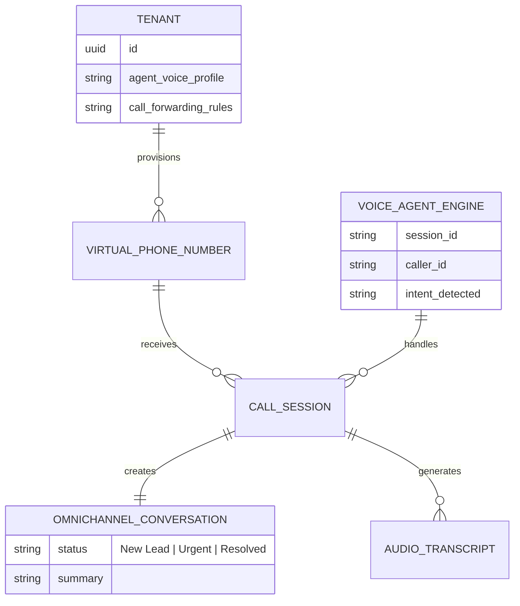
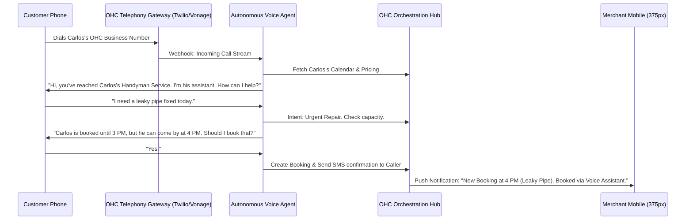

# Architecture Brief: Autonomous Voice Receptionist Engine

## Title
OHC Autonomous Voice Receptionist & Unified Telephony Engine

## Problem Statement
Service-based small business owners like Carlos (Handyman) and Fatima (Food Cart) lose thousands of dollars in revenue simply because they cannot answer the phone while working. When Carlos is under a sink or driving, a missed call from a potential new client often results in that client calling the next handyman on Google. Fatima misses lucrative pre-orders during the lunch rush because her hands are full. Currently, they either use personal voicemail (unprofessional, no immediate follow-up), hire an expensive virtual receptionist service (too costly, disjointed), or accept the lost revenue. They need an invisible, zero-configuration system where an AI agent answers missed calls, converses naturally, captures intent, books appointments, and routes urgent issues—all while feeling like a true, professional teammate.

## Research Report
- **Market Gap**: Small businesses lose an estimated 20-30% of potential leads to missed calls. The immediacy of service requires instant response.
- **Competitor Analysis**:
    - **Shopify/Wix**: Strictly web-focused. They offer no native telephony or voice capability, assuming all commerce happens via screen interactions.
    - **GoDaddy**: Offers basic VoIP line forwarding (SmartLine), but without conversational AI capabilities. It just forwards calls to voicemail.
    - **Specialized Tools (Ruby Receptionists, Slang.ai)**: Expensive monthly retainers ($250+/mo) and require complex setup to integrate with a business's calendar and CRM. They are tools, not integrated platform features.
- **The OHC Opportunity**: By routing inbound phone calls through our Unified Omnichannel Inbox, OHC can deploy an AI Voice Agent that instantly answers, understands the merchant's live calendar, quotes prices, and logs the entire transcript into the customer's CRM profile.

## Design Doc

### Architecture and Entity-Relationship Diagram (Mermaid.js)

### Key Architectural Invariants
1. **Low-Latency Streaming**: The voice interaction must operate on a low-latency WebRTC or SIP streaming connection to ensure the AI responds naturally without awkward pauses (sub-800ms response time target).
2. **Contextual Awareness**: The Voice Agent must be injected with the Tenant's real-time state (calendar availability, inventory, pricing) before answering.
3. **Graceful Handoff**: If the caller requests a human or the intent is extremely complex, the system must gracefully put the caller on hold and ring the merchant's physical device.
4. **Multi-Tenant Isolation**: Audio streams and transcripts must be strictly isolated to the specific `tenant_id` at the edge gateway to prevent cross-contamination of PII.

### UI Wireframes & Screen Flow (375px First)
- **Call Settings Card**: Clean, macOS-style Translucent Glass card in the OHC Dashboard. Toggle switch: "AI Receptionist (Answers when you don't)". A simple slider to select the agent's voice tone (Friendly, Professional, Casual).
- **Inbox View**: When a call is completed, it appears in the Unified Inbox exactly like a text message. A clean Ubiquiti UniFi style card displays a plain-text summary ("Customer needs a pipe fixed. Booked for 4 PM."), the full transcript below, and a play button for the audio recording.
- **Live Call Handoff**: If the agent escalates, Carlos's phone rings with a rich notification showing the AI's summary of the call *before* he answers, empowering him with context.

### Mobile UX Flow
- Carlos is busy and lets a call ring out.
- He finishes his task 10 minutes later and checks his phone.
- Instead of dialing a voicemail inbox, he sees a single push notification: "New Appointment Booked: John Smith (Leaky Pipe, 4 PM)."
- Tapping the notification opens the OHC app to the Unified Inbox, where he can read the 3-bullet summary of the AI's conversation with John, passing the "grandmother test" of absolute simplicity. No configuration or setup was required.

### AI Agent Integration Points
- **Customer Success Agent**: Transcribes the live audio, analyzes sentiment, and formulates natural language responses back into the audio stream.
- **Operations Agent**: Listens to the stream for booking or quoting intents and interacts with the internal calendar/capacity ledger to confirm appointments.
- **Marketing Agent**: Automatically flags new callers to receive a follow-up SMS the next day asking for a review or offering a discount.

## Implementation Prompt
**To Implementer Agent:**
Implement the Autonomous Voice Receptionist backend infrastructure. Create a Webhook receiver that integrates with a telephony provider (e.g., Twilio or Plivo) to handle incoming voice streams. Design the orchestration layer that connects the live audio stream to our LLM Voice endpoints. Ensure the agent can query the unified `tenant_id` context (calendar, services) during the call. Finally, map the output of the completed call (transcript, summary, and action items) into the existing Unified Omnichannel Inbox data model. Focus on secure, multi-tenant connection handling and ultra-low latency response cycles.

## Priority
P1

## Estimated Scope
Large
