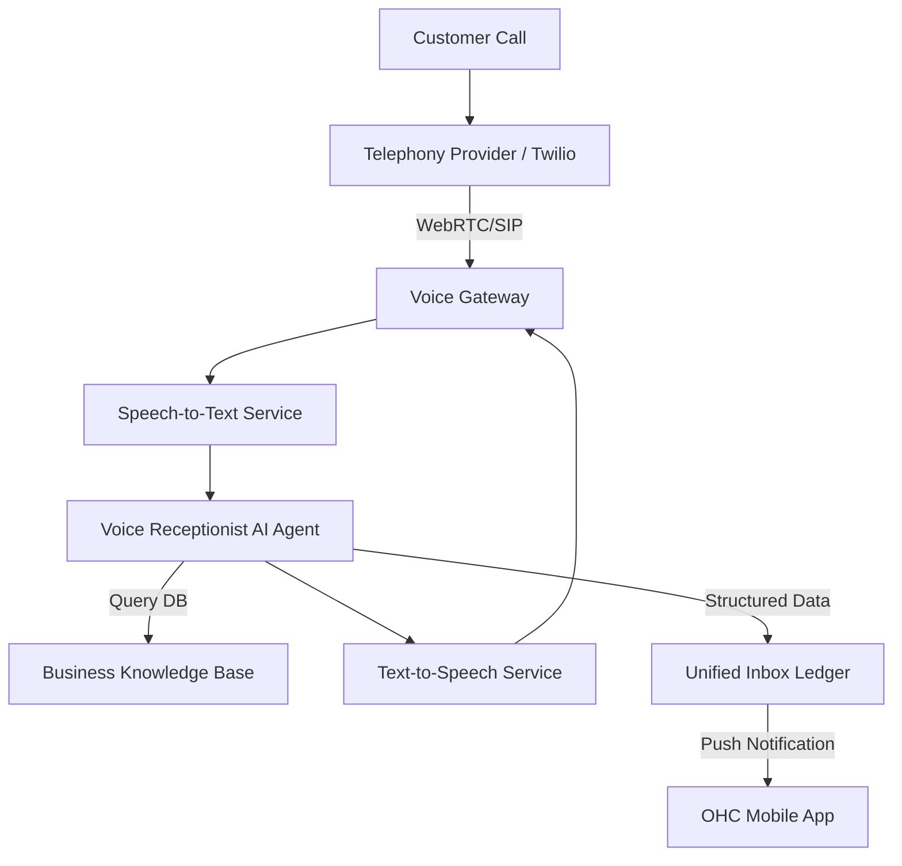
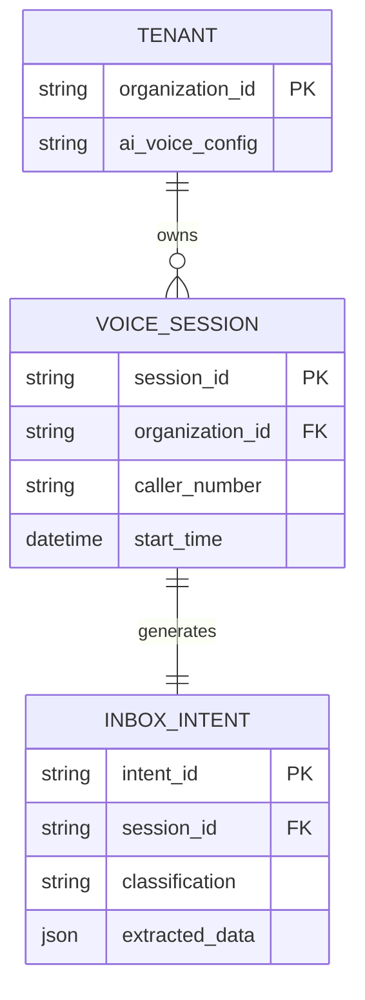

# Architecture Brief: Autonomous Voice Receptionist Engine

## Title
Autonomous Voice-to-Action AI Receptionist Engine

## Problem Statement
Small business owners like Carlos (the handyman) and Fatima (the food cart operator) often miss phone calls while they are actively working (on a ladder or cooking). Missing a call often means missing a lead or an order. They don't have the time or technical skill to configure complex IVR (Interactive Voice Response) menus or third-party answering services. They need an AI that answers the phone in a natural voice, takes messages, answers basic questions (like business hours or location), and seamlessly turns calls into actionable text and appointments in their OneHumanCorp app.

## Research Report
- **Market Gap**: Existing SMB solutions (like Wix or Shopify) focus primarily on digital channels (web/email) or rely on rigid third-party integrations (like Twilio Studio) that are too complex for non-technical users. Standard voicemails lack context and don't take action.
- **Competitor Landscape**: Twilio, Plivo, and Bland AI offer voice APIs, but they require developers. OHC's differentiation is making this invisible and agentic.
- **User Needs**:
  - Ability to claim a local phone number instantly.
  - An AI that answers with the business name and can handle custom instructions ("Tell them we only do vegan cakes on Tuesdays").
  - Transcription and extraction of intent (Booking, Order, Question).
  - Push notification to the mobile app with the transcribed intent and a 1-tap action (e.g., "Accept Booking" or "Call Back").

## Design Doc

### Key Design Decisions
1.  **Voice-to-Text Bridging**: Voice calls will be routed through a telephony provider (e.g., Twilio or Plivo), immediately streamed to an STT (Speech-to-Text) engine, processed by our LLM Agent, and streamed back via TTS (Text-to-Speech) for near real-time latency.
2.  **Intent Engine**: The AI won't just transcribe; it will classify the call intent (e.g., Lead, Support, Spam) and extract structured data (Name, Phone Number, Date).
3.  **Unified Inbox Integration**: All calls appear in the OHC Unified Inbox alongside DMs and emails, avoiding fragmented communication silos.
4.  **Invisible Configuration**: The user simply toggles "AI Receptionist" on and selects a voice. The AI reads the business profile to know hours, services, and FAQs without manual programming.
5.  **Multi-Tenancy & Security**: Telephony WebRTC streams and all processed intents must be strictly scoped to `organization_id` via zero-trust boundaries (SPIFFE/SPIRE).

### Business Journey Mapping
- **Acquisition**: User activates AI Voice in 1 tap, claims local number.
- **Onboarding**: Knowledge base instantly bootstraps from OHC Profile (hours, services, address). No manual scripts needed.
- **Activation**: Customer calls, AI greets and handles query (e.g., "I need a quote"). AI logs intent.
- **Retention**: User sees unified push notification "Lead: New Quote Request from Call". 1-tap to respond.
- **Revenue**: User converts lead directly via Inbox context.

### Architecture Diagram (Mermaid.js)

### Entity-Relationship Diagram (Mermaid.js)

### AI Agent Integration Points
- The **"Voice Receptionist"** agent handles the real-time conversation.
- The **"Operations"** agent monitors the Inbox Ledger and triggers follow-up actions (e.g., drafting a quote if the caller asked for a price estimate).

### Mobile UX Flow (375px First)
- **Settings Toggle**: Under Communication Settings, a simple "Enable AI Receptionist" switch.
- **Voice Selection**: A horizontal scroll of glassmorphic cards to preview AI voices (e.g., "Friendly, Professional, Casual").
- **Incoming Call Push**: When the AI takes a call, a rich push notification arrives: "New Lead: John wants a quote for roof repair. [View Details]".
- **Inbox View**: The call appears in the Unified Inbox with a text transcript, an audio playback button, and quick-action chips (e.g., "Create Quote," "Message Back").

## Implementation Prompt
Implement the Autonomous Voice-to-Action AI Receptionist Engine. Set up the voice gateway to handle incoming SIP/WebRTC streams and connect them to real-time STT and TTS services. Create the Voice Receptionist AI Agent that can query the business's data (hours, services) and maintain conversation state. Route the output to the Unified Inbox ledger, extracting intents and structured data. Ensure the mobile UI allows easy toggling of the feature and displays calls clearly in the inbox with quick-action buttons. Keep the architecture multi-tenant and secure with strict SPIFFE/SPIRE isolation boundaries. Do NOT prescribe specific database schemas or API signatures; design for low latency and high reliability.

## Priority
P1

## Estimated Scope
Large
