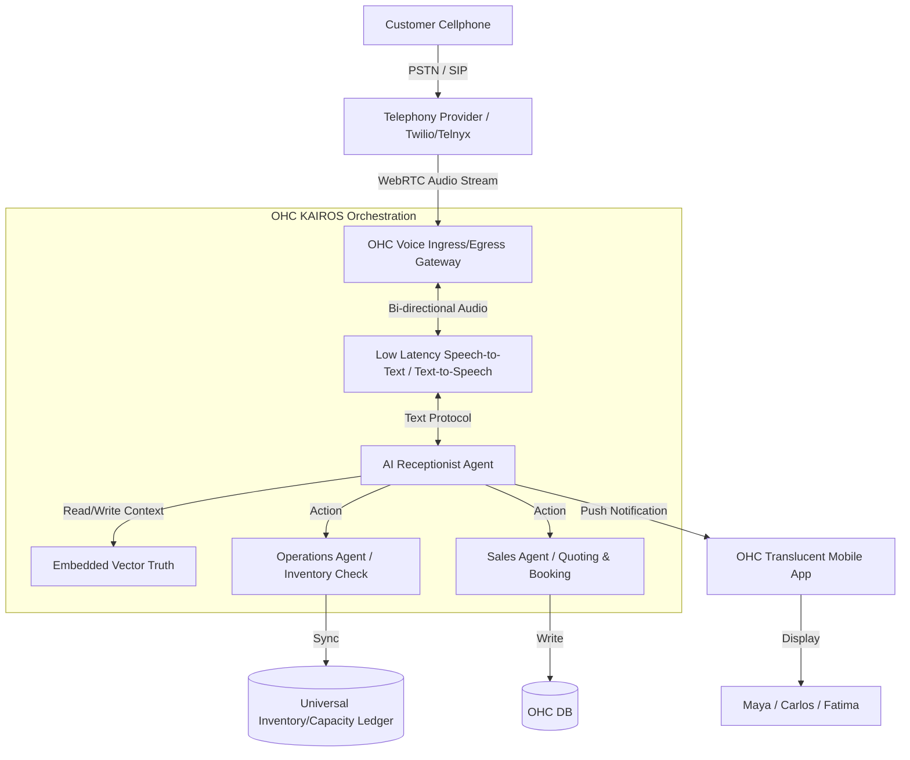

# [Architecture] Autonomous Voice Telephony & AI Receptionist Engine

## Title
Implement Autonomous Voice Telephony & AI Receptionist Engine

## Problem Statement
Small business owners miss calls while they are actively working.
- **Carlos (handyman, 42)** is often driving or under a sink with his hands full. When a potential customer calls for a quote and he doesn't answer, they immediately call the next handyman on Google. He needs an AI receptionist to answer the call, understand the problem, give a rough quote, and book a time.
- **Fatima (food cart, 50, limited English)** is busy cooking during the lunch rush. Customers try to call to place pre-orders, but she can't answer the phone over the noise of the grill. She needs an AI voice agent that can speak Arabic and English, take the order, verify the menu is not sold out, and print the order to her receipt printer.

Missing a phone call often means missing a sale or a booking. These business owners need a voice receptionist that acts exactly like a knowledgeable employee, capable of taking orders, providing quotes, and booking appointments automatically 24/7.

## Research Report
### Competitor Analysis
- **Shopify / Wix / Squarespace**: Focus entirely on digital storefronts (web/mobile). They offer text-based chatbots but completely ignore the voice channel. Small businesses using these platforms have to buy a separate phone system (like RingCentral) or an AI voice service (like Slang.ai) and duct-tape them together.
- **Traditional IVR (Press 1 for Sales)**: Highly frustrating for users. Not conversational. Does not work for dynamic scenarios like taking a food order with modifiers or diagnosing a plumbing issue.
- **Dedicated AI Voice Tools (Slang.ai, PolyAI)**: High cost, complex to set up, and crucially, they are disconnected from the platform's core inventory, ledger, and calendar. If a restaurant uses Slang.ai, syncing the sold-out items from the POS to the voice agent requires custom API work that no SMB can do.

### The OHC Opportunity
By integrating a low-latency WebRTC/SIP Voice AI Engine directly into the OHC KAIROS Orchestration layer, we give the AI receptionist native, real-time access to the **Universal Capacity and Inventory Ledger**. The voice agent can book a slot on Carlos's calendar instantly or reject an order for Fatima if the daily special is sold out. No integration required.

## Design Doc

### Architecture Diagram

### Key Design Decisions
1. **Low-Latency Architecture**: Voice AI must have sub-500ms conversational latency to feel natural. We must stream audio directly into the STT engine rather than waiting for discrete audio file uploads.
2. **Native KAIROS Integration**: The Receptionist Agent is an orchestrator that can spawn sub-agents (Operations for checking Fatima's inventory, Sales for generating Carlos's quote). It must securely read the unified state machine.
3. **Multilingual by Default**: The system must detect the caller's language and switch instantly, supporting Fatima's requirement for Arabic and English interchangeably.
4. **Handoff Protocol**: If the AI is unsure, it must gracefully park the call and trigger a high-priority push notification to the owner's app to take over the SIP session live.

### Zero Trust & Security
- Complete multi-tenant isolation on the telephony gateway: SIP trunks and incoming phone numbers must be cryptographically bound to the tenant's `organization_id`.
- The Receptionist Agent operates with a SPIFFE/SPIRE identity scoped only to read the specific tenant's public catalog and write to their booking queue. It cannot access ledger internals or other tenants.

### Performance Targets
- **Time to First Byte (Audio)**: < 500ms from user finishing sentence to AI audio response.
- **Offline Reliability**: If OHC goes offline, the Telephony Gateway must failover to a standard voicemail box automatically.

### Mobile UX Flow (375px First) & UI Wireframes
The UI must pass the grandmother test. No mention of SIP, STT, or WebRTC.
1. **Home Dashboard Card**: A clean, Translucent Glass card on the home screen: "AI Receptionist is Active. Handled 4 calls today."
2. **Setup Screen (30 seconds)**:
   - A simple toggle: "Turn on phone number" -> Assigns a local number.
   - Text area: "What should your receptionist know?" (Pre-filled with business context: "You are Fatima's Halal Cart. Address is 5th & Main. Check inventory before taking orders.")
   - Voice selector: A horizontal scrolling list of 3-4 natural-sounding voices. Play button to preview.
3. **Call History**:
   - A list of missed/handled calls. Tapping a call shows a WhatsApp-style chat bubble summary of the call and any action taken (e.g., "$45 Quote Sent", "Order #402 Printed").
   - A big "Call Back" button.

## Implementation Prompt
Implement the Autonomous Voice Telephony & AI Receptionist Engine.
- **User Facing Outcome**: Business owners should be able to toggle on a dedicated phone number in their mobile app in under 30 seconds. When customers call this number, an AI voice agent will converse with them with low latency, answer questions based on the business profile, and execute actions like booking an appointment or taking an order.
- **Core User Journey**:
  1. The business owner opens the app, taps "Enable Phone Number", and types brief instructions.
  2. A customer calls the number.
  3. The AI converses naturally, checks inventory/calendar via the KAIROS engine, and finalizes the transaction.
  4. The business owner receives a push notification summarizing the call and the action taken.
- **Acceptance Criteria**:
  - The voice stream operates with conversational latency (no awkward 5-second pauses).
  - The agent successfully books an appointment for a service business.
  - The agent successfully places an order for a product business, correctly rejecting items that are out of stock.
  - Mobile UX uses translucent glass styling and requires no technical configuration.
  - Strict multi-tenant data boundaries are maintained.

## Priority
P0

## Estimated Scope
Large