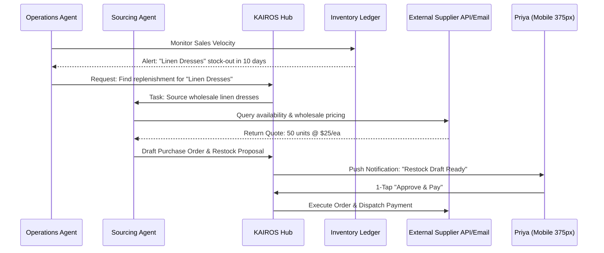
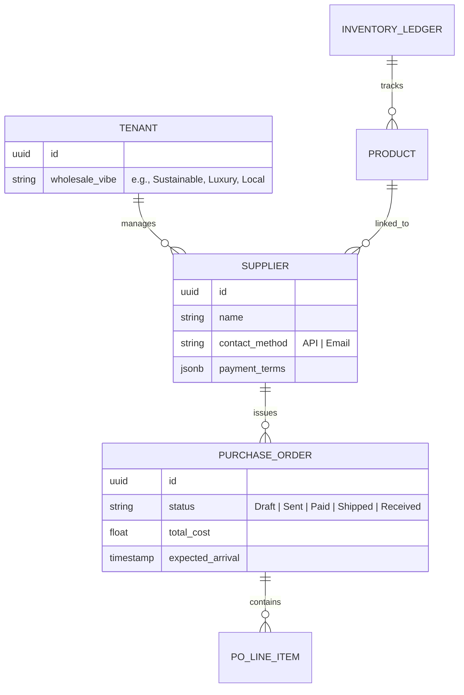

# [Architecture] Autonomous Wholesale Sourcing & Intelligent Supply Chain

## 1. Title
**Autonomous Wholesale Sourcing & Intelligent Supply Chain: The Zero-Touch Inventory Engine**

## 2. Problem Statement
For OneHumanCorp (OHC) core personas selling physical goods—like **Priya (boutique owner)** and **Maya (baker)**—inventory replenishment is a reactive, manual, and stressful process. They must manually monitor stock levels, hunt for new wholesale products on fragmented platforms like Faire or Amazon Business, negotiate with suppliers via email, and manually create Purchase Orders.

Small business owners suffer from "Procurement Paralysis": they know they need to restock or diversify their catalog but are overwhelmed by the administrative burden. Current platforms (Shopify, Wix) treat inventory as a static database. They tell you when you are out of stock, but they don't help you find and buy the next batch. OHC needs an autonomous supply chain engine that not only predicts when to restock but actively sources products and negotiates wholesale terms, presenting the owner with a single "1-Tap Approve" button.

## 3. Research Report
### Competitive Landscape
*   **Faire / Ankorstore:** Massive wholesale marketplaces. Highly successful because they aggregate suppliers, but they are external to the commerce platform. The owner must still manually bridge the gap between "What I sold on Shopify" and "What I buy on Faire."
*   **Shopify Collective:** A step in the right direction, allowing Shopify stores to sell products from other Shopify brands. However, it is largely manual and restricted to the Shopify ecosystem.
*   **Amazon Business:** Robust logistics but lacks personalized, agentic sourcing for specialized boutiques or artisans.
*   **Legacy ERPs (NetSuite, SAP):** Powerful supply chain tools but fail the "Grandmother Test" and are prohibitively expensive for solopreneurs.

### OHC Market Advantage: The "Agentic" Supply Chain
While competitors provide **Marketplaces**, OHC provides a **Procurement Department**.
1. **Predictive Replenishment:** Instead of simple low-stock alerts, the OHC Operations Agent analyzes sales velocity to predict "Stock-Out Dates" weeks in advance.
2. **Autonomous Sourcing:** The Sourcing Agent proactively scans connected wholesale networks (via MCP or public APIs) to find products that match the merchant's "Vibe" and price points.
3. **Automated Negotiation:** The AI can draft and send restock inquiries or wholesale applications to suppliers, handling the back-and-forth communication invisibly.

## 4. Design Doc

### Architecture Diagram (Mermaid.js)

### Data Model & Invariants

### AI Agent Integration
*   **The Vigilant Manager (Operations):** Detects stock risks and initiates the procurement flow.
*   **The Global Scout (Sourcing):** Specialized agent that uses MCP tools to browse wholesale catalogs, verify supplier ratings, and negotiate bulk discounts.
*   **The Finance Agent:** Handles the secure payment to the supplier and updates the `Smart Ledger` to reflect the outgoing cost and pending asset.

### Mobile UX Flow (375px First)
1. **The Proactive Alert:** A dashboard card appears: *"Low Stock Alert: Your Linen Dresses are selling fast. I found a restock option from your preferred supplier."*
2. **The "Restock Sheet":** Tapping the alert opens a clean, macOS-style summary card showing the quantity, cost, and estimated delivery date.
3. **1-Tap Action:** A prominent button: `[ Approve & Restock ]`.
4. **Discovery Feed:** A secondary "Discovery" tab shows: *"I found 3 new products that match your store's aesthetic. Would you like to add them to your catalog?"*

## 5. Implementation Prompt
**Objective:** Build the backend infrastructure for the "Autonomous Wholesale Sourcing & Intelligent Supply Chain" engine.

**Core User Journey (CUJ):**
1. The system detects that a product's inventory is falling below a velocity-adjusted threshold.
2. A "Sourcing Agent" is triggered to find a restock option (either from a saved supplier or by scouting new ones).
3. The agent drafts a `Purchase Order` and surfaces it in the user's `Shared Task` feed.
4. The user approves the PO with one tap on their mobile device.
5. The system records the pending PO and prepares the fulfillment event.

**Acceptance Criteria:**
* **Replenishment Logic:** Implement a service that calculates stock-out dates based on historical sales velocity (not just fixed thresholds).
* **PO Entity:** Define a multi-tenant isolated `PurchaseOrder` and `Supplier` data model.
* **Agent Handoff:** Implement the handoff between the Operations Agent (risk detection) and the Sourcing Agent (procurement drafting).
* **Mobile Payload:** Ensure the `SharedTask` payload for restock approvals contains all necessary financial data for a 375px display.
* **Security:** All supplier credentials and PO history must be strictly isolated via `tenant_id`.

## 6. Priority
`P1` (High - Critical for scalability of physical goods personas like Priya and Maya).

## 7. Estimated Scope
Large (Requires integration with the Inventory Ledger, Sales History, and External Agent Tools).
