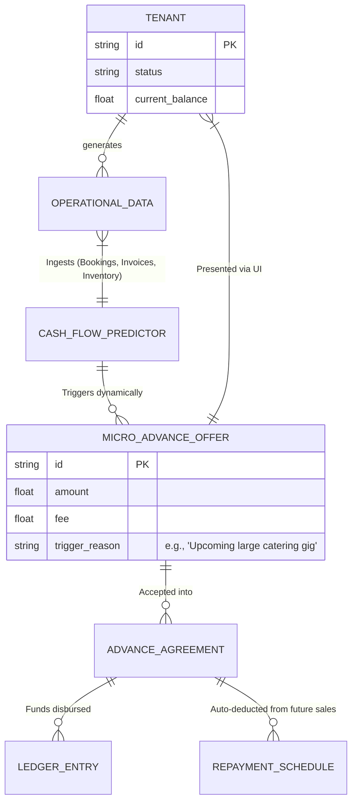

# Title: Autonomous Working Capital & Micro-Advance Engine

## Problem Statement
Small business owners—like Priya (boutique owner buying inventory) or Carlos (handyman buying supplies for a big job)—often face severe cash flow bottlenecks. They need capital to grow or complete jobs, but traditional bank loans take weeks and require complex paperwork. Even existing platforms like Shopify Capital only review history periodically. Our users need an intelligent, real-time mechanism that anticipates cash flow dips based on their unified data (upcoming calendar bookings, raw material inventory depletion, unpaid invoices) and proactively offers 1-tap micro-advances directly on their mobile devices, exactly when they need it most.

## Research Report
*   **Current Capabilities:** OneHumanCorp (OHC) captures extensive operational data (bookings, deposits, inventory, sales) across all business types, but currently does not leverage this for predictive cash flow assistance.
*   **Competitor Analysis:**
    *   *Shopify Capital / Square Loans:* Excellent embedded finance models, but they rely mostly on trailing sales volume and are reactive. They offer lump sums rather than precision micro-advances tied to a specific impending operational need (like a calendar full of bookings next week but no cash for supplies today).
    *   *Stripe Capital:* Powerful API-driven lending, but abstract and not consumer-friendly for a baker or handyman.
*   **Gap Identified:** A highly contextual, predictive micro-advance engine. By leveraging OHC's unique position of knowing *both* future operational commitments (bookings/orders) and financial history, our AI Finance Department can confidently offer risk-assessed, single-tap cash advances exactly at the moment of need.
*   **Strategic Advantage:** Offering proactive liquidity reduces churn. If OHC funds the raw materials for a baker's busy weekend, OHC secures the transaction volume and builds immense loyalty. It shifts OHC from just a software tool to a true business partner.

## Design Doc

### Architecture Diagram

### 375px Mobile UX Flow
1.  **Contextual Nudge:** On the OHC mobile dashboard, a macOS-style Translucent Glass card appears conditionally: "You have 5 large orders next week. Need $400 for supplies today?"
2.  **Offer Details (1-Tap):** Tapping the card opens a bottom sheet. It shows the advance amount ($400), a flat transparent fee ($20), and the repayment terms (e.g., "10% of future daily sales until paid").
3.  **Grandmother Test Pass:** No interest rate math, no credit checks visible. Just "Get $400 now, pay back $420 automatically as you sell."
4.  **Acceptance:** A single large "Accept & Deposit" button. Biometric authentication (FaceID/TouchID) confirms the agreement.
5.  **Instant Availability:** The ledger instantly credits the tenant's OHC virtual card/balance, ready for immediate use via tap-to-pay or digital spend.

### AI Agent Integration Points
*   **AI Finance Department:** Continuously monitors the unified data mesh (calendar, inventory, ledger). If it detects a high probability of a cash crunch preceding a revenue spike, it calculates the risk and generates the `MICRO_ADVANCE_OFFER`.
*   **AI Operations Department:** Communicates with the Finance Agent to verify that the upcoming calendar bookings or pre-orders are legitimate and not anomalous/fraudulent.

### Key Design Decisions (The "Why")
*   **Proactive vs. Reactive:** Small business owners are too busy to apply for loans. The system must present the capital *before* the user realizes they are short, based on unified operational data.
*   **Percentage-Based Repayment:** Fixed monthly payments crush seasonal or volatile businesses. Deducting a small percentage of daily sales automatically aligns OHC's success with the business's success and requires zero manual repayment effort.
*   **Zero Trust & Multi-Tenant Isolation:** The predictive engine must strictly isolate data per tenant. A spike in one tenant's bookings must never leak context to another. SPIFFE/SPIRE identities are required for all inter-department AI agent communications regarding financial data.

## Implementation Prompt
**To the Implementer:**
Build the foundational predictive engine and mobile UI components for the Autonomous Micro-Advance feature. Your objective is to create the event listener that monitors the unified event mesh for significant upcoming revenue indicators (like a cluster of new bookings or a large approved quote) juxtaposed against a low current ledger balance. When triggered, it should generate a simulated `MICRO_ADVANCE_OFFER` entity.

On the frontend, construct the premium, translucent glass "Contextual Nudge" card for the 375px dashboard, and the corresponding bottom sheet for 1-tap acceptance. Ensure the repayment mechanism securely hooks into the payment routing engine to auto-deduct the specified percentage from future transactions. Focus on the end-to-end user journey (CUJ) of Maya receiving an offer based on her busy weekend cake schedule and accepting it instantly. Do not worry about actual bank integrations yet; mock the ledger disbursement.

## Priority
`P1`

## Estimated Scope
Large