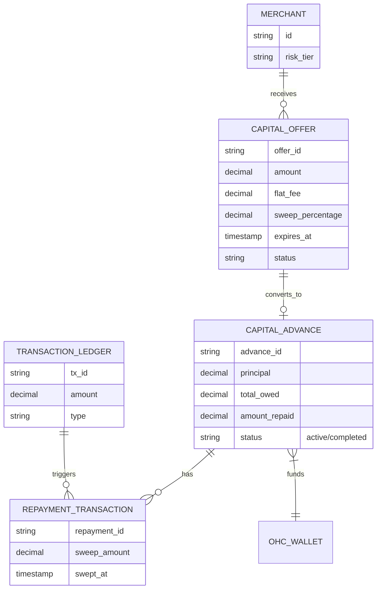
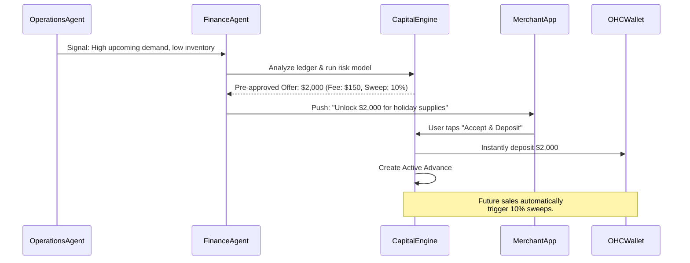

# Issue Brief: Autonomous Working Capital & Micro-Lending Engine

## Title
Autonomous Working Capital & Micro-Lending Engine for Frictionless SMB Growth

## Problem Statement
Small business owners (like Maya the baker or Carlos the handyman) frequently hit growth ceilings because they lack access to working capital. Maya might need a new $3,000 commercial mixer to fulfill a surge in holiday orders, or Carlos might need $2,000 for materials before a large kitchen remodel starts. Traditional bank loans require extensive paperwork, credit checks, and take weeks to approve—by which time the opportunity is lost. Existing SMB platforms like Shopify Capital or Square Loans offer cash advances, but they are often buried in dashboards and require manual application steps. For non-technical users, understanding interest rates, compounding, and repayment terms is a source of severe "Financial Fog." They need an invisible, proactive system that automatically offers them the exact amount of capital they need, right when they need it, with simple, plain-language repayment terms that adjust dynamically to their daily sales.

## Research Report
**Market Gap Analysis:**
- **Shopify Capital & Square Loans:** Both use historical sales data to offer pre-approved merchant cash advances (MCAs). Repayment is collected automatically via a fixed percentage of daily sales. However, these offers are typically static, dashboard-bound, and not integrated contextually with inventory or booking signals.
- **Stripe Capital:** Offers embedded lending APIs, allowing platforms to underwrite and offer financing seamlessly.
- **Current OHC State:** OHC has an embedded Treasury Wallet (`[architecture]_autonomous_treasury_and_instant_payout_wallet.md`) and a unified Ledger, but lacks a credit, risk-underwriting, and proactive capital deployment subsystem.

**Proposed Solution:**
Leverage the OHC Unified Ledger and the Finance AI Agent to continuously monitor cash flow, upcoming bookings, and inventory constraints. The system dynamically generates pre-approved `CapitalOffer`s. If Maya's inventory agent notices she's out of flour and has $5,000 in upcoming pre-orders, the Finance Agent proactively sends a push notification offering a $1,000 instant cash advance directly into her OHC Wallet. Repayment is handled invisibly via an automatic, zero-thought daily sweep (e.g., 10% of daily sales) until the principal plus a flat fee is repaid. No interest rates, no complex terms—just a transparent flat fee and revenue-based repayment.

## Design Doc

### Architecture Diagram

### Core System Flows

### Mobile UX Flow (375px First)
1. **Proactive Push Notification:** "Maya, your holiday orders are up 40%! Need working capital for ingredients? Tap to get $2,000 instantly."
2. **The "Plain Language" Offer Card (Glassmorphic UI):**
   - No financial jargon (no APR, no compounding interest).
   - "We give you: **$2,000 today**."
   - "You pay a one-time fee: **$150**."
   - "How you pay it back: We automatically take **10% of your daily sales** until $2,150 is reached. If you have a slow day, you pay less. No deadlines."
3. **One-Tap Acceptance:** A single large "Accept & Deposit" button with biometric authentication (FaceID/TouchID).
4. **Wallet Integration:** Confetti animation as the OHC Wallet balance instantly updates. The Wallet view now shows a subtle progress bar: "Working Capital Repayment: 20% complete."

### AI Agent Integration Points
- **Finance Agent (The Underwriter):** Continuously monitors the `TRANSACTION_LEDGER` to calculate dynamic risk scores and generate offers.
- **Operations Agent (The Catalyst):** Triggers the Finance Agent when it detects operational bottlenecks that capital could solve (e.g., stockouts on fast-moving SKUs).
- **Customer Success Agent:** If the user opens the support chat and asks "What happens if I make zero sales next week?", the CS Agent explains the revenue-based repayment structure plainly, assuring them there are no late fees.

### Key Design Decisions
- **Revenue-Based Repayment, No Interest:** To pass the Grandmother Test, avoid APR and compounding interest entirely. Use a flat fee and a percentage sweep. This aligns OHC's incentives with the merchant's success.
- **Embedded Underwriting:** By leveraging Stripe Capital APIs or an internal ledger-based risk model, underwriting is instantaneous. No credit checks are visible to the user.
- **Tenant Isolation:** The Risk Model must safely compute across tenants using aggregated, anonymized patterns, but strict multi-tenant boundaries (SPIFFE/SPIRE) must protect PII and ledger balances.

## Implementation Prompt
**For the Engineering Swarm:**
Implement the CapitalEngine microservice, backend data models, and mobile UI components for the Autonomous Working Capital feature.
- **CUJ:** Carlos (handyman) accepts a $1,500 cash advance to buy tiles for a large project. He authenticates via FaceID on the offer screen, the funds appear instantly in his OHC Wallet, and subsequent invoices paid by his clients automatically have 15% swept towards repayment until the advance is settled.
- **Acceptance Criteria:**
  - Create the `CapitalOffer`, `CapitalAdvance`, and `RepaymentTransaction` database schemas with strict tenant isolation.
  - Implement a daily job (or event listener) in the CapitalEngine that intercepts incoming `TRANSACTION_LEDGER` credits and autonomously sweeps the designated percentage if an active `CapitalAdvance` exists.
  - Build the Mobile UI Offer Card using the design system's translucent glass materials, ensuring the "Plain Language" terms are perfectly legible on a 375px screen.
  - Expose internal APIs for the Finance AI Agent to generate and push `CapitalOffer`s based on simulated inventory constraints.

## Priority
P1

## Estimated Scope
Large
