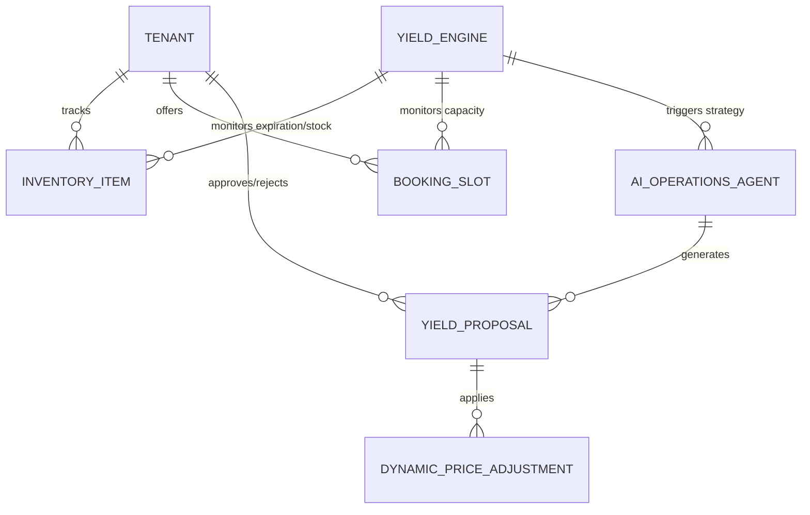

# Title: Autonomous Yield Management & Dynamic Pricing Engine

## Problem Statement
Small business owners frequently lose revenue due to perishable inventory (e.g., Fatima's unsold meals at the end of the day) or unbooked service slots (e.g., Carlos's handyman schedule having empty hours, Leo's last-minute cancellation for a music lesson). Managing dynamic pricing to recover this lost revenue is too complex and time-consuming for non-technical users. They need a system that autonomously detects idle capacity or expiring inventory and proactively adjusts pricing or creates limited-time offers to maximize yield.

## Research Report
*   **Current Capabilities:** OHC has basic inventory and booking capabilities but lacks intelligent, time-aware pricing rules and proactive, context-aware agent interventions for yield management.
*   **Competitor Analysis:**
    *   *Shopify:* Requires complex third-party apps for dynamic pricing and flash sales, creating "app store fatigue" for users like Maya.
    *   *Wix & Squarespace:* Focus on static pricing structures. Any discounts are manually configured by the user.
    *   *Uber/Airlines:* Employs sophisticated dynamic pricing, but the implementation is hidden. SMB platforms lack a democratized, simplified version of this.
*   **Gap Identified:** A built-in Autonomous Yield Management Engine that connects inventory/calendar availability with pricing logic. The AI agent acts as a yield manager, proposing strategic discounts to the business owner when underutilization is detected.

## Design Doc

### Architecture Diagram

### Key Design Decisions
1.  **AI-Driven Proposals, Human Approval:** The system should not blindly slash prices. The AI agent will detect the anomaly (e.g., 5 empty slots tomorrow) and push a single, clear proposal to the owner's mobile device for approval.
2.  **Multi-Tenant Isolation:** Yield strategies and historical performance data must be strictly siloed per tenant to ensure Zero-Trust compliance.
3.  **Edge Execution:** Once a yield proposal is approved (e.g., 20% off), the dynamic price must propagate immediately to edge caches so customers see the updated price with zero latency, especially important for conversational commerce.

### Mobile-First UX Flow (375px First)
1.  **Detection & Notification:** The AI agent detects that Fatima has 15 pre-portioned meals unsold by 3:00 PM. It sends a push notification: "Flash Sale Opportunity."
2.  **The "Yield Card" (Translucent Glass UI):** Fatima opens the app and sees a clean card:
    *   *Header:* "15 meals left today."
    *   *AI Proposal:* "Offer a 30% 'Happy Hour' discount to your last 50 local customers via WhatsApp to clear stock?"
    *   *Actions:* A large, prominent **"Approve & Send"** button, and a smaller "Edit" or "Dismiss" button.
3.  **Execution:** Fatima taps "Approve." The AI automatically updates the edge-cached storefront price and dispatches targeted WhatsApp messages. No complex rules configuration required.

## Implementation Prompt
Design and implement the Autonomous Yield Management Engine. This engine must define the data models to track inventory perishability and calendar utilization against time. It should integrate with the existing AI Operations Agent, which will act upon these data points to generate and push `YieldProposal` objects to the mobile client. Implement a background job queue to evaluate yield conditions periodically. Ensure strict multi-tenant isolation for all yield data and guarantee that price adjustments immediately invalidate edge caches. Focus on creating the robust backend models and agent interfaces; do not prescribe specific database schema definitions or API function signatures.

## Priority
P1

## Estimated Scope
Large