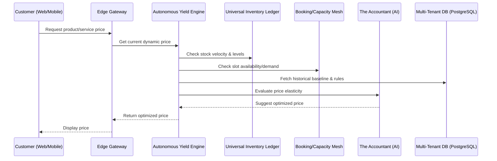

# [Architecture] Autonomous Yield Management Engine: AI-Driven Dynamic Pricing and Capacity Optimization

## 1. Title
**Autonomous Yield Management Engine: AI-Driven Dynamic Pricing and Capacity Optimization**

## 2. Problem Statement
For OneHumanCorp (OHC)'s core personas—especially **Leo (music tutor, 22)** and **Fatima (food cart operator, 50)**—managing capacity and pricing is a significant challenge. When demand is high (e.g., Leo's prime after-school slots or Fatima's lunch rush), they miss out on potential revenue because their prices are static. Conversely, during slow periods, capacity goes unused. Existing platforms (Shopify, Wix) treat pricing as a fixed attribute, requiring manual intervention to run sales or adjust prices, which non-technical users find tedious and often forget to do. This results in lost revenue and inefficient capacity utilization. We need an autonomous engine that acts as a "Yield Manager," automatically adjusting prices and managing capacity based on real-time demand, seasonality, and historical data, without the user lifting a finger.

## 3. Research Report
### Competitive Analysis
*   **Shopify/Wix:** Pricing is static. Merchants must manually create discount codes or adjust prices for sales. They lack any built-in dynamic pricing or capacity-aware yield management.
*   **Airlines/Hotels (e.g., Sabre, Amadeus):** Highly sophisticated yield management systems, but far too complex and completely inaccessible for SMBs.
*   **Uber/Lyft:** "Surge pricing" is highly effective but platform-controlled, not merchant-controlled.

### Market Data
*   Dynamic pricing can increase revenue by 5-10% according to retail industry studies, yet fewer than 1% of SMBs use it due to complexity.
*   Service businesses (like tutoring or salons) often have 20-30% unused capacity during off-peak hours.

### Opportunity
OHC can democratize yield management. By introducing an autonomous AI "Advisor/Yield Manager," we can automatically optimize pricing for both physical goods (based on inventory levels and velocity) and services (based on calendar slot availability and demand). This directly increases the bottom line for OHC merchants, making the platform indispensable.

## 4. Design Doc

### Architecture Diagram (Mermaid.js)

### Mobile UX Flow
**Screen 1: Yield Management Settings (Advanced)**
*   Clean, Translucent Glass card under Finance/Pricing.
*   Toggle: `[ Enable Smart Pricing ]`
*   Sliders: "Minimum Acceptable Price" and "Maximum Price Cap" (to protect brand perception).
*   Toggle: `[ Auto-discount slow inventory ]`
*   Toggle: `[ Surge price high-demand slots ]`

**Screen 2: Business Advisory Report (Action Feed)**
*   Weekly plain-text summary from "The Advisor":
    *   *"Smart Pricing earned you an extra $45 this week! We slightly raised the price for your Tuesday 4 PM guitar lesson slot because it's always booked, and offered a 10% discount on Wednesday morning slots, filling two empty spaces."*

### AI Agent Integration Points
*   **The Accountant / The Advisor (Finance/Advisory AI):** Analyzes historical sales velocity, calendar density, and seasonality to determine the optimal price point within user-defined bounds.
*   **The Vigilant Manager (Ops AI):** Feeds real-time inventory levels and booking capacity data into the Yield Engine.

### Key Design Decisions
*   **Guardrails are Mandatory:** The user MUST set minimum and maximum price bounds. AI should never price a product at $0.01 or $10,000 without explicit permission.
*   **Transparency:** The merchant must always know *why* a price changed via the Business Advisory weekly reports.
*   **Edge-Cached but Dynamic:** The Yield Engine must operate with very low latency. Prices might be cached at the edge for short TTLs but must reflect real-time demand shifts.

## 5. Implementation Prompt
**To the Implementer:**
Your task is to implement the core logic and data models for the Autonomous Yield Management Engine.
*   Create the necessary database schemas (tenant-isolated) to store pricing rules, minimum/maximum bounds, and historical price elasticity data.
*   Implement the `YieldEngine` service that calculates dynamic prices based on current inventory/capacity (which you will mock or fetch from existing services) and predefined rules.
*   Expose a gRPC/REST endpoint to fetch the current optimized price for a given product/service.
*   Ensure the engine respects the user-defined upper and lower bounds.
*   Write comprehensive unit tests ensuring the pricing algorithm never violates the bounds and scales correctly with demand inputs.

*(Do not build the full UI, just the backend engine and API.)*

## 6. Priority
`P1` (High)

## 7. Estimated Scope
Medium
