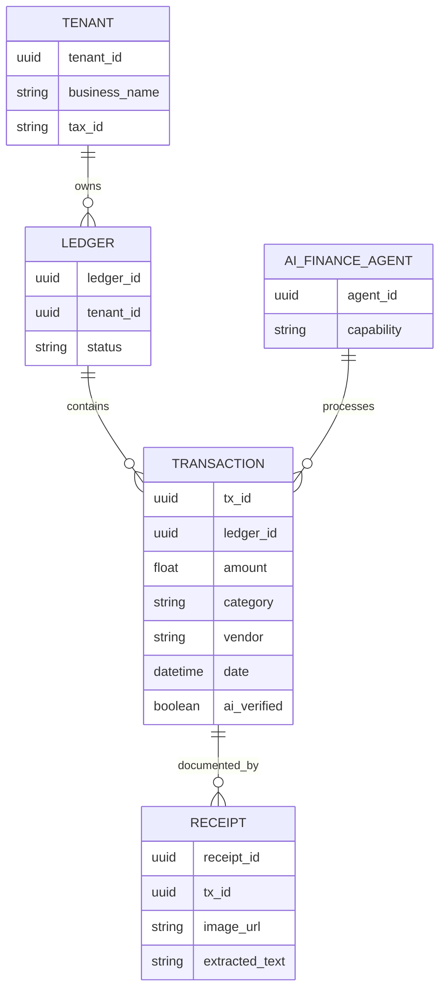
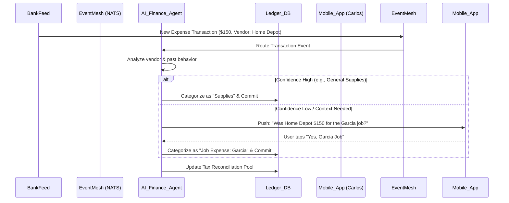

# Title: Autonomous Zero-Touch Bookkeeping & Tax Reconciliation Engine

## Problem Statement
Small business owners (like Maya the baker and Carlos the handyman) are experts in their craft, not accounting. They currently face immense friction tracking expenses, saving receipts, categorizing transactions, and preparing for tax season. The "end of month" bookkeeping scramble is a massive source of anxiety and lost time. They need an invisible, zero-touch system that automatically handles their finances, categorizes expenses, matches receipts, and pre-populates tax forms, allowing them to focus entirely on running their business without ever opening a spreadsheet or a complex accounting software dashboard.

## Research Report
### The Small Business Accounting Pain Point
Research consistently shows that administrative tasks, particularly bookkeeping and tax prep, are among the top stressors for small business owners. Traditional tools like QuickBooks, Xero, or FreshBooks are powerful but feature complex interfaces (ledgers, charts of accounts, double-entry bookkeeping) designed for accountants, not everyday users.

### Competitor Analysis
*   **QuickBooks/Xero**: High learning curve. Requires manual rule setup, manual receipt matching, and often a paid accountant to manage.
*   **Wix/Squarespace**: Offer basic revenue tracking but lack deep, automated expense reconciliation and tax preparation features.
*   **Stripe/Square**: Excellent at transaction processing, but still require integration into an accounting suite for full tax and expense management.

### The OHC Opportunity
By deeply integrating our hybrid mesh architecture with an AI Finance Department, OneHumanCorp can offer a truly "invisible" bookkeeping engine. When a transaction occurs (either incoming revenue or outgoing expense via linked cards/bank feeds), the AI agent instantly categorizes it, asks clarifying questions only if necessary via a simple push notification or text (e.g., "Was this $50 Home Depot charge for the Smith job or general supplies?"), and automatically updates a strictly isolated, multi-tenant ledger.

## Design Doc

### Architecture Diagram

### Mobile UX Flow (375px First)
1.  **Dashboard Feed**: The primary view is a simple feed of business health. No complex ledgers.
2.  **Smart Notifications**: A clean, translucent card appears: "We noticed a $45 charge at Staples. Is this for office supplies? [Yes] [Other]".
3.  **Receipt Snap**: A persistent, floating FAB allows the user to snap a photo of a physical receipt at any time. The UI immediately says "Got it. We'll match this to your transactions," and dismisses.
4.  **Tax Prep View**: A single screen showing "Estimated Q3 Tax Owed: $X" and "Potential Deductions Found: $Y", with a one-tap button to "Generate Tax Report for Accountant".

### Multi-Tenant Isolation & Security
*   **Zero-Trust Identity**: The AI Finance Agent uses SPIFFE/SPIRE workload identity to ensure it only accesses the specific `tenant_id` ledger it is currently processing.
*   **Data Partitioning**: All database queries strictly enforce `tenant_id` boundaries.
*   **Auditability**: Every AI categorization decision is logged with the model version and confidence score for auditable tracing.

## Implementation Prompt
**User Journey**: Carlos the handyman buys supplies at Home Depot. The transaction appears via bank feed. The AI Finance Agent automatically categorizes it as "Materials" based on his history. It then sends a simple push notification asking him to snap a picture of the receipt. When he does, it links the image to the transaction. At the end of the quarter, Carlos opens the app and sees a single screen summarizing his revenue, categorized expenses, and an estimated tax liability, ready to be exported.

**To the Implementer Agent**:
Implement the backend foundation for the Autonomous Zero-Touch Bookkeeping Engine.
1.  Create the multi-tenant `Ledger` and `Transaction` data structures.
2.  Implement the event listener (subscribing to the NATS mesh) that triggers the AI Finance Agent upon new transactions.
3.  Develop the AI interaction loop: attempt auto-categorization, and if confidence is low, trigger a "Request Clarification" event to the mobile client.
4.  Ensure all database interactions strictly enforce `tenant_id` isolation.
5.  Do not prescribe specific ORMs or UI frameworks; focus on the core logic and secure data handling.

## Priority
P1

## Estimated Scope
Large
