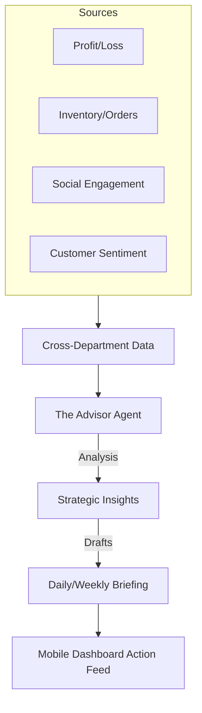

# Architecture Brief: Business Advisory ("The Advisor")

## Title
OHC "The Advisor": Autonomous Strategic Insights & Growth Architecture

## Problem Statement
Small business owners (Maya, Carlos, Priya) are overwhelmed by data. They have hundreds of emails, DM notifications, and order logs, but they don't know the answer to the most important question: "What should I do next to grow?" Most SaaS platforms provide complex "Analytics" dashboards with line charts that require a degree in data science to understand. They need a personal consultant who reads all the data and gives them 3 simple, actionable tasks every Monday morning.

## Research Report
- **Competitive Gap**: Shopify Analytics and Google Analytics are descriptive (what happened) but not prescriptive (what to do). They show "Conversion Rate: 2.1%" but don't say "Your product photos are too dark, making people leave."
- **The "Human-Language" Wedge**: SMB owners prefer a text message from a friend over a PDF report.
- **Strategic Oversight**: "The Advisor" has read-only access to all other departments (Accountant, Promoter, Manager), enabling cross-departmental insights.

## Design Doc

### High-Level Architecture (Mermaid.js)

### Mobile UX Flow (375px First)
1.  **The Briefing**: A "sticky" card at the top of the home screen: "Good morning, Maya. You're on track to beat last month's sales by 10%!"
2.  **Strategic Tasks**: "3 things for today: 1. Restock vanilla cake. 2. Reply to Sarah's quote. 3. Post a photo of your new donuts."
3.  **Growth Milestones**: Celebratory pop-ups: "🎉 Milestone! 100th Order! Here's a tip to get to 200."

### AI Agent Integration Points
- **Advisor + Promoter**: Suggests a social media campaign when it detects a trending product.
- **Advisor + Accountant**: Suggests raising prices when it detects high demand and low margins.
- **Advisor + Manager**: Predicts stock-outs before they happen based on sales velocity.

## Implementation Prompt
**To Implementer Agent:**
Implement "The Advisor" department. Create the "Insight Aggregator" that queries the `SIP DB` across all department schemas (Accountant, Manager, etc.) to build a weekly snapshot. Build the "Briefing Generator" that uses an LLM to translate these snapshots into human-language bullet points. Implement the "Task Injection" system that allows the Advisor to insert "Strategic Tasks" into the user's primary action feed. Ensure the Advisor's tone is encouraging, professional, and jargon-free.

## Priority
P1

## Estimated Scope
Medium
