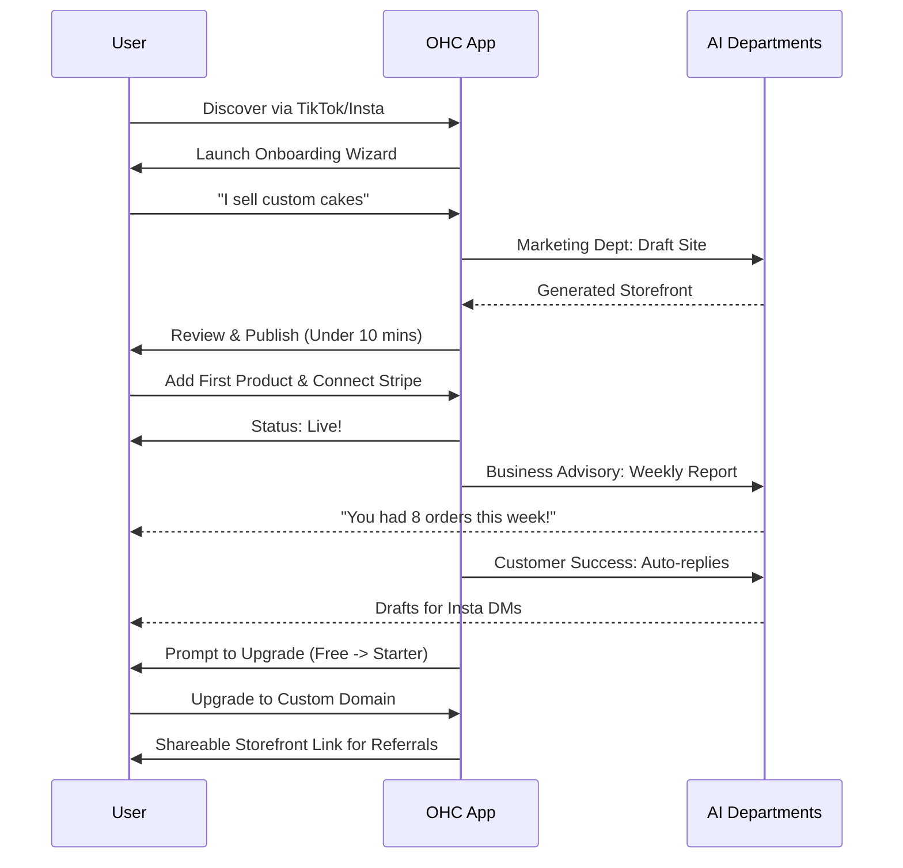

# Title: Business Journey Architecture

## Problem Statement
Small business owners, especially those with zero technical knowledge (like Maya the baker or Carlos the handyman), often struggle to navigate the complex lifecycle of launching and running an online business. Existing platforms like Shopify, Wix, or Squarespace focus heavily on the storefront but fail to guide the user cohesively through the critical stages of acquisition, onboarding, activation, retention, revenue scaling, and referral. Users need a simple, fully guided, end-to-end journey where AI acts as the connective tissue, managing the complexity so the business owner can focus on their craft.

## Research Report
Our competitive analysis shows:
- **Shopify**: Excellent for e-commerce, but setup requires 30-60 minutes and significant configuration. Onboarding is a steep learning curve.
- **Wix/Squarespace**: Good visual builders, but the user is left alone to figure out how to market, retain customers, and manage operations.
- **GoDaddy**: Fast setup but extremely limited functionality for complex services like bookings or pre-orders.

**OHC Differentiation**: By treating AI as invisible infrastructure, we can simplify the journey. The user doesn't build a website; the AI builds it based on conversational inputs. The user doesn't configure SEO; the AI automatically optimizes the content.

**Key Persona Insights**:
- **Maya (Baker)**: Needs an instant transition from Instagram to an online storefront. Acquisition happens via Instagram; onboarding must be mobile-first and less than 10 minutes.
- **Carlos (Handyman)**: Acquisition is word-of-mouth. Retention relies on his easy-to-use booking system and AI quote generation.
- **Priya (Boutique)**: Needs robust retention and revenue scaling tools like automated emails for new stock.

## Design Doc

### Architecture Diagram

### UI Wireframes or Screen Flow Description
All layouts start at 375px (Mobile-First):
1. **Acquisition Landing**: Simple input "What do you do?" -> "Start my business".
2. **Onboarding Wizard**: 3 steps.
   - Step 1: Business Name & Industry (e.g., "Maya's Cakes", "Bakery").
   - Step 2: Upload 3 photos (or AI generates them).
   - Step 3: Connect Bank (Stripe OAuth).
3. **Activation Dashboard**: A clean 375px feed. Top item: "Your site is live. Share it!"
4. **Retention View (Inbox & Advisory)**: Unified inbox for DMs/Emails. AI drafted replies are highlighted. A weekly advisory card showing revenue trends.
5. **Revenue/Upgrade Screen**: "You've hit 10 products! Upgrade to Starter for $9/mo to add more."
6. **Referral Flow**: "Share your OHC link-in-bio to TikTok."

### Friction Points
- **Bank Connection**: Users may hesitate to connect a bank account immediately. *Mitigation*: Allow deferred connection until the first order arrives.
- **AI Trust**: Users might not trust AI to talk to customers initially. *Mitigation*: All Customer Success AI messages are "Drafts" requiring manual 1-tap approval until the user opts into "Auto-Send".
- **Blank Page Syndrome**: Users don't know what to write for their site. *Mitigation*: AI generates everything from a single sentence prompt.

### Mobile UX Flow
- **Offline Capable**: Dashboard loads from local cache.
- **Gestures**: Swipe to approve AI drafted replies.
- **Inputs**: Native numeric keyboard for pricing, camera intent for photo uploads.
- **Navigation**: Bottom nav bar (Home/Dashboard, Inbox/AI, Orders, Settings).

### AI Agent Integration Points
- **Marketing & Advertising**: Triggered during onboarding to design the initial site. Continuously triggered to optimize SEO.
- **Customer Success**: Listens to connected inboxes (IG, Email) and generates drafts.
- **Business Advisory**: Scheduled cron job (e.g., Sunday 8 AM) to analyze weekly data and generate a plain-language push notification.
- **Sales & Acquisition**: Triggered when a booking inquiry is received to draft a quote.

### Key Design Decisions and Why
- **Deferred Complexity**: We do not ask for tax settings, shipping zones, or variant configurations during onboarding. We want the user to reach the "Aha!" moment (a live site) in under 10 minutes. Complex settings are introduced contextually when needed.
- **AI-as-Draft Default**: For critical touchpoints (customer communication, pricing changes), AI actions require human approval first. This builds trust before fully automating.
- **Unified Inbox**: We consolidate all customer communication channels into one view because small business owners shouldn't have to check 5 different apps.

## Implementation Prompt
**Task**: Implement the end-to-end Onboarding and Activation flow for the OHC mobile app.
**User-Facing Outcome**: A new user can open the app, enter their business type, review an AI-generated storefront, connect payments, and view their live dashboard within 10 minutes.
**Acceptance Criteria**:
1. Create the `OnboardingWizard` Flutter flow (Steps: Intro -> Details -> Connect -> Success).
2. Integrate the `Marketing` AI Department to fetch the initial storefront configuration based on the user's input.
3. The UI must strictly follow the 375px mobile-first design with Glassmorphism tokens.
4. Implement a comprehensive E2E test that starts at the landing page, navigates the wizard, and asserts the generated storefront is visible on the user's dashboard.

## Priority
P0

## Estimated Scope
Large

