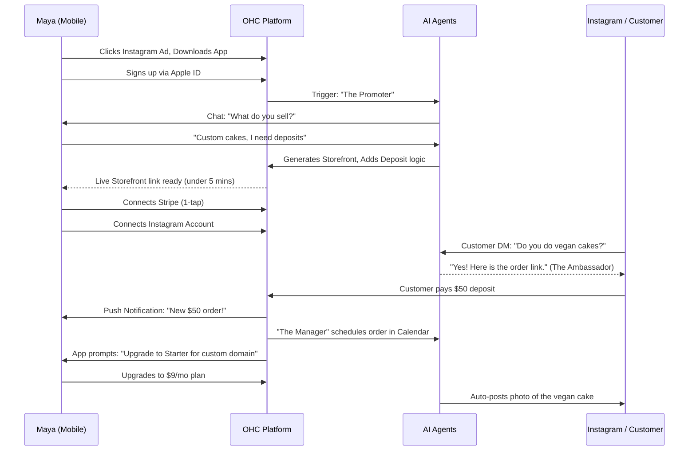
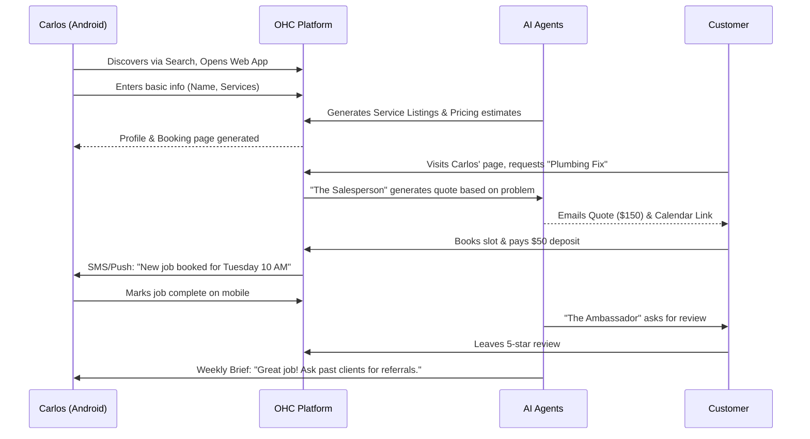
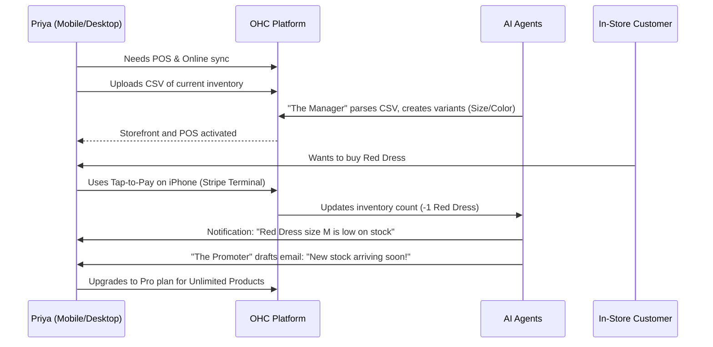
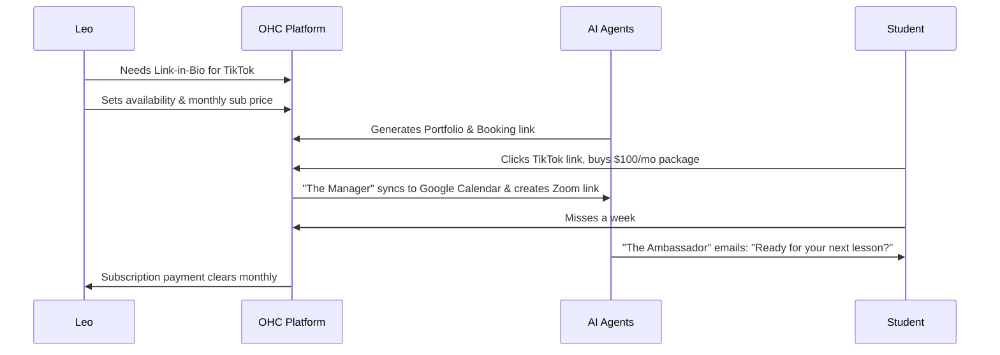
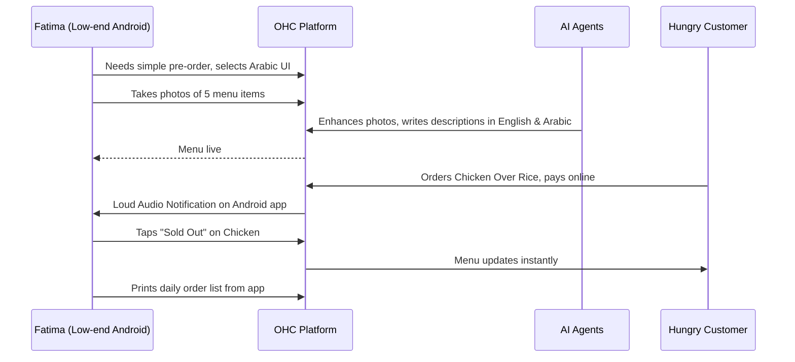

### Title
Research Report: End-to-End Business Journey Architecture

## Problem Statement
Small business owners (our core personas: Maya, Carlos, Priya, Leo, Fatima) currently experience significant friction when setting up online operations using existing platforms. Traditional tools require technical knowledge, piecing together multiple disparate services (website builder, calendar, payments, AI chatbots), and offer a fragmented mobile experience. The gap lies in a unified, mobile-first journey where AI handles the complexity invisibly, enabling non-technical users to go from idea to live business in under 10 minutes.

## Research Report
### Competitive Analysis & Market Position
- **Shopify:** Takes 30-60 minutes to set up. Requires piecing together apps for bookings, custom forms, and AI. Not truly mobile-first for management.
- **Wix/Squarespace:** Complex drag-and-drop builders that break easily on mobile. Overwhelming for a baker or handyman.
- **GoDaddy:** Basic setup, but lacks deep AI integration and comprehensive booking/portfolio features.
- **OHC Advantage:** Zero technical knowledge needed. "AI as infrastructure." Mobile-first management for 100% of operations.

### Persona Analysis
- **Maya (Baker):** Mobile-only (iPhone). Needs photo catalog, custom order deposits, and Instagram DM auto-replies.
- **Carlos (Handyman):** Android only. Needs service listings, booking calendar, quote generator.
- **Priya (Boutique):** Mobile + Desktop. Needs inventory sync, POS tap-to-pay, email marketing.
- **Leo (Music Tutor):** Needs calendar sync, auto Zoom links, recurring subscriptions, link-in-bio.
- **Fatima (Food Cart):** Low-end Android, limited English. Needs photo menu, pre-orders, sold-out toggles.

## Design Doc

### Key Design Decisions
1. **AI-Driven Onboarding:** Instead of blank templates, users converse with an AI agent ("The Promoter") that generates the initial site, catalog, and settings based on natural language input.
2. **Mobile-First Paradigm:** All management views (Dashboard, Inbox, Calendar) are optimized for a 375px screen width. Forms use native keyboards.
3. **Progressive Disclosure:** Advanced settings are hidden by default behind `is_advanced` toggles to reduce cognitive load during initial setup.
4. **Unified Inbox:** A single view for all communications (Instagram, Email, SMS) managed by "The Ambassador" (Customer Success agent).

### Friction Points & Solutions
- **Friction:** Adding 50 items to a menu/catalog manually.
  - **Solution:** AI ingestion from a photo of a physical menu or a spoken list.
- **Friction:** Setting up complex Stripe Connect or merchant accounts.
  - **Solution:** 1-tap Stripe Connect onboarding integrated directly into the progressive setup wizard.
- **Friction:** Knowing what to do next to grow.
  - **Solution:** Weekly plain-language actionable advice from "The Advisor".

### Architecture Diagrams (Mermaid.js)

#### 1. Maya (The Home Baker) Journey

#### 2. Carlos (The Freelance Handyman) Journey

#### 3. Priya (The Boutique Owner) Journey

#### 4. Leo (The Music Tutor) Journey

#### 5. Fatima (The Food Cart Operator) Journey

### Mobile UX Flow
1. **Splash/Sign Up:** Email/Social login, seamless Apple/Google Pay for eventual upgrades.
2. **AI Interview (Chat UI):** Conversational setup instead of massive forms.
3. **Dashboard (375px):**
   - Top: Actionable notifications ("1 order waiting", "Approve Instagram post").
   - Middle: Quick actions (Add item, Share link).
   - Bottom: Tab bar (Home, Inbox, Orders, Analytics).
4. **Inbox:** Consolidated view of emails, DMs, and SMS.
5. **Analytics:** Plain language summaries, no complex charts by default.

### AI Agent Integration Points
- **Onboarding:** "The Promoter" creating the initial site and catalog.
- **Operations:** "The Manager" syncing inventory, scheduling zoom links.
- **Sales:** "The Salesperson" drafting quotes.
- **Support:** "The Ambassador" replying to DMs and emails.
- **Advisory:** "The Advisor" providing weekly insights.

## Implementation Prompt
Implement the backend foundational routing, data models, and API endpoints required to support the onboarding and lifecycle journey for the 5 key personas. Ensure that the AI Agent trigger points (e.g., webhook for new signup, order placement) are stubbed out and integrated with the KAIROS Orchestrator. Implement E2E tests using Playwright covering a complete happy-path setup journey for a standard physical product business (Maya persona equivalent), ensuring it works on a simulated 375px mobile viewport. Ensure all backend data structures correctly map to `tenant_id` for multi-tenancy.

## Priority
P0

## Estimated Scope
Large
