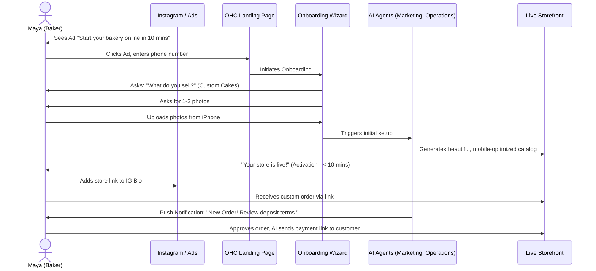
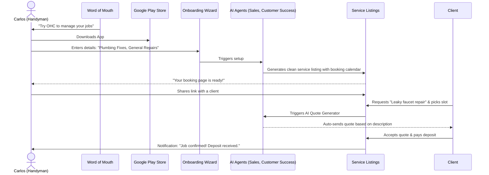
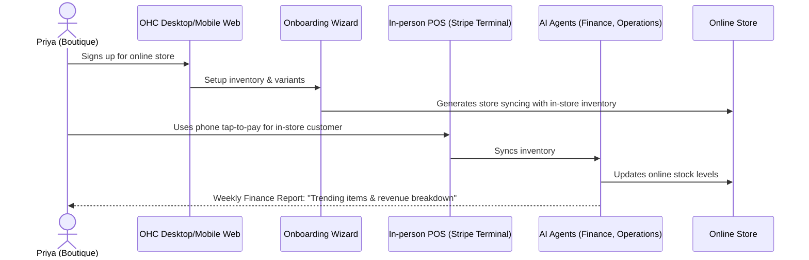
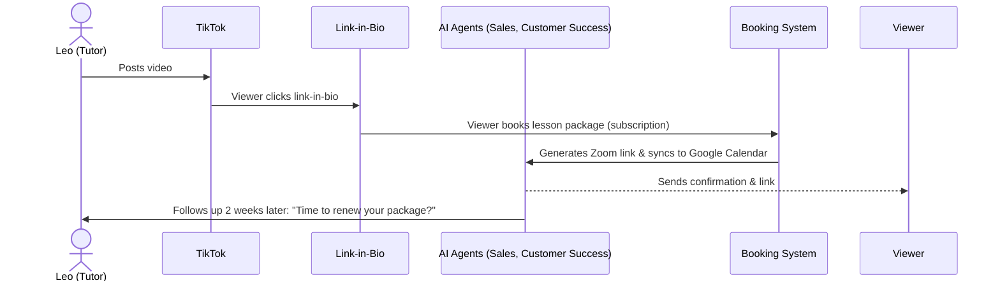
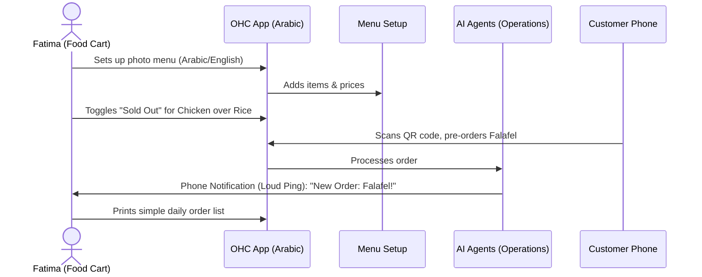

# Issue Brief: Business Journey Architecture

### Title
Business Journey Architecture: End-to-End User Journey Mapping for Small Business Owners

### Problem Statement
OneHumanCorp (OHC) aims to empower non-technical users to launch, run, and grow a small business entirely on their own in under 10 minutes. However, a fragmented user journey can cause non-technical business owners to abandon the platform. We need a clearly defined, holistic end-to-end user journey architecture for each persona (Maya, Carlos, Priya, Leo, Fatima) encompassing Acquisition, Onboarding, Activation, Retention, Revenue, and Referral. By doing this, we can ensure the platform effectively addresses friction points, provides intuitive "magic moments," and ensures a seamless experience across all touchpoints, specifically optimizing for a mobile-first experience.

### Research Report
- **Goal:** Design the complete end-to-end user journey for all target personas to ensure a smooth, intuitive experience from initial discovery to ongoing business growth.
- **Findings:**
  - **Acquisition:** Users often discover OHC through social media ads, organic search, or word-of-mouth referrals. The landing page must clearly communicate the "zero technical knowledge required" value proposition.
  - **Onboarding:** The initial onboarding wizard is critical. It must ask for the absolute minimum information required to go live (e.g., business name, primary offering, location) and defer complex setup (e.g., custom domains, detailed tax settings) to later.
  - **Activation:** A "magic moment" must occur quickly, ideally within the first 10 minutes. Examples include: generating a beautiful storefront, receiving a mock order, or seeing an AI agent successfully draft a response. Day 1 success is going live; Week 1 success is the first transaction; Month 1 success is establishing a routine.
  - **Retention:** AI agents play a key role in retention by proactively providing value (e.g., weekly health reports, next-action suggestions, automated follow-ups). Push notifications for significant events (e.g., new order, new review) encourage daily app usage.
  - **Revenue:** The upgrade path from Free to a paid tier (Starter/Pro/Business) must be contextual and value-driven, triggering when users hit specific limits or need advanced features (e.g., custom domain, increased AI actions).
  - **Referral:** A built-in viral loop is essential. This can be achieved through shareable links, referral incentives, or prominent "Powered by OHC" branding on free tier storefronts.
- **Competitive Analysis:**
  - **Shopify:** Complex onboarding, often requiring third-party apps or technical assistance. Focuses heavily on e-commerce rather than a unified business stack.
  - **Wix/Squarespace:** Strong website builders but lack deep, invisible AI integration for day-to-day operations and management.
  - **GoDaddy:** Basic tools, often disjointed.

### Design Doc

#### Architecture Diagrams

**1. Maya — The Home Baker (Mobile-First Journey)**

**2. Carlos — The Freelance Handyman (Android Flow)**

**3. Priya — The Boutique Owner (Omnichannel Journey)**

**4. Leo — The Music Tutor (Subscription Journey)**

**5. Fatima — The Food Cart Operator (Low-End Mobile Journey)**

#### Key Design Decisions
- **Mobile-First Everything:** The entire journey, especially onboarding, must be natively designed for a 375px screen. Forms must use native keyboards.
- **Progressive Profiling:** Collect only essential information upfront to achieve activation (< 10 mins). Defer complex configurations.
- **AI as an Invisible Co-Pilot:** AI should handle the heavy lifting (e.g., initial site generation, drafting quotes, sending reminders) without the user needing to interact with a chat interface constantly.
- **Contextual Upgrades:** Prompt users to upgrade from the Free tier naturally within the workflow (e.g., when they try to add a custom domain or exceed AI action limits).

#### Friction Points
- **Account Verification / KYC:** Navigating Stripe Connect onboarding without overwhelming the user.
- **Initial Inventory Upload:** Making it easy to add multiple products/photos quickly from a mobile device.
- **Understanding AI Agents:** Ensuring users trust the AI agents to act on their behalf without feeling a loss of control.

### Implementation Prompt
Implement the end-to-end user journeys defined in the Business Journey Architecture. This includes updating the onboarding wizard to ensure a user can go live in under 10 minutes by requesting only essential data and utilizing AI for initial site generation. Implement the specific flows for the defined personas, ensuring seamless integration between the mobile app (Flutter), backend (Go), and AI agents. Ensure all user touchpoints are fully functional on a 375px screen and adhere to the progressive profiling strategy. Implement contextual upgrade prompts. Add comprehensive E2E tests for each persona's key journey (e.g., Maya creating a store, Carlos receiving a booking).

### Priority
P0

### Estimated Scope
Large