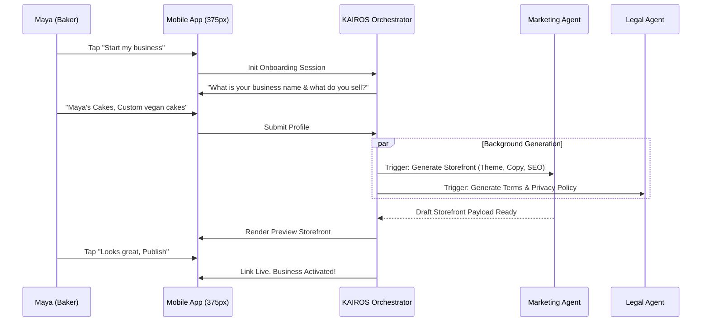

# Issue Brief: Business Journey Architecture - Zero to Live in 10 Minutes

## Title
Business Journey Architecture: Zero to Live in 10 Minutes

## Problem Statement
Small business owners (like Maya the Baker or Carlos the Handyman) experience overwhelming friction, "blank slate anxiety", and jargon-heavy setups when starting online. Competitor platforms force them through complex forms, DNS configurations, and manual theme setups, causing high drop-off rates. They need a guided, zero-jargon, mobile-first experience that takes them from an idea to a fully live, transacting business in under 10 minutes without touching a laptop.

## Research Report
Based on an analysis of Shopify, Wix, Squarespace, and GoDaddy, as well as SMB top pain points (Setup Complexity at 73%, Technical Jargon at 48%):
- **Competitor Gaps**: Shopify and Wix require 30-60 minutes for a basic setup. They use terms like "liquid templates", "CNAME", and "Shipping Zones" which alienate non-technical users.
- **User Behavior**: Users prefer editing an existing draft rather than creating from a blank canvas. They run their businesses almost entirely from their mobile phones.
- **OHC Opportunity**: Treat onboarding not as a form, but as a conversational interview where AI agents generate the entire business scaffold (storefront, default products, policies, SEO) in the background.

## Design Doc

### Architecture Diagram

### Mobile UX Flow (375px First)
1. **Acquisition (Landing Screen)**: A clean, premium Glassmorphism screen with a single CTA: "Go Live in 10 Minutes. Zero Tech Required."
2. **Onboarding (Conversational Wizard)**: SMS-style chat UI where an AI asks 3 simple questions (Name, Product Type, Goal). Native mobile keyboards are strictly enforced.
3. **Activation (Storefront Preview)**: The app presents a fully built storefront draft. The user can tap "Publish" or type "Make the colors more playful" for instant AI revision.
4. **Retention (Dashboard)**: Post-publish, the user is dropped into the Home Dashboard where the "Agent Actions Today" feed shows AI agents continuing to work (e.g., "Drafted your first Instagram post").
5. **Revenue (Upgrade CTA)**: Soft, plain-language prompts for upgrading (e.g., "Add a custom domain to look more professional - $9/mo") placed contextually when a user views their live link.

### AI Agent Integration Points
- **The Marketing Agent**: Automatically generates the website copy, selects appropriate color palettes based on the business type, and creates dummy products that the user can later edit.
- **The Legal Agent**: Instantly drafts standard Terms of Service and Privacy Policies based on the user's jurisdiction and product type.

### Key Design Decisions
- **Conversational Setup**: Replaces traditional long-form inputs to reduce cognitive load and form-fatigue.
- **Generation over Configuration**: Provide a 100% complete draft storefront for the user to tweak, eliminating blank slate paralysis.
- **Mobile-First Exclusivity**: The entire onboarding flow must be easily completable with one hand on a 375px screen (e.g., while waiting in line for coffee).

## Implementation Prompt
Implement the end-to-end "Zero to Live" onboarding flow. Add a state machine in `src/server/orchestration/` (KAIROS) to handle the conversational setup and parallel trigger the Marketing and Legal agents to generate the storefront payload. Develop the mobile Flutter UI (strictly 375px-first) consisting of the chat-style onboarding wizard and the generated preview screen. The final output must be a live business URL. Write E2E tests validating that a new user can successfully complete the wizard, generate a storefront, and view the live page.

## Priority
P0

## Estimated Scope
Large
