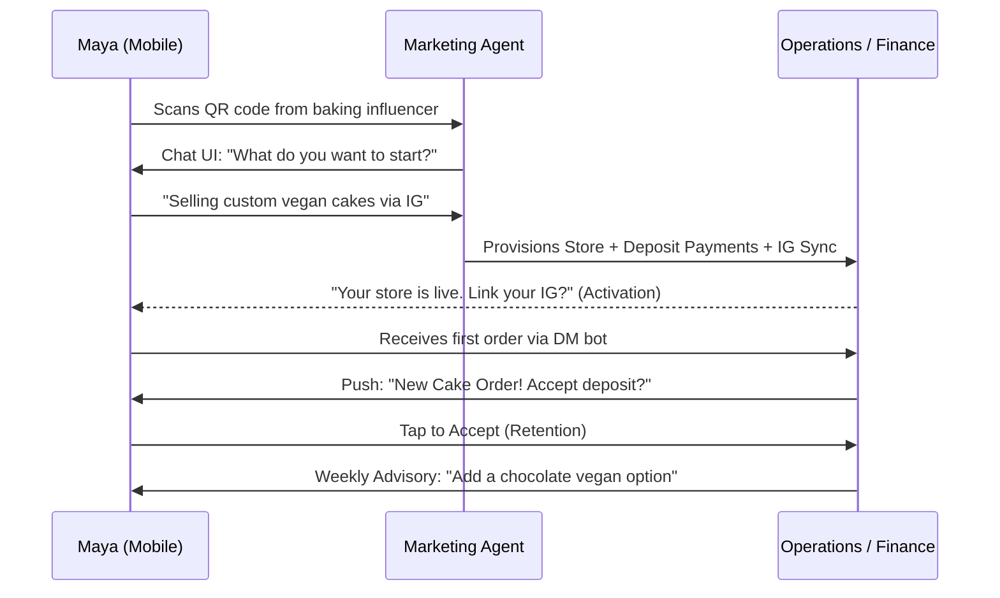
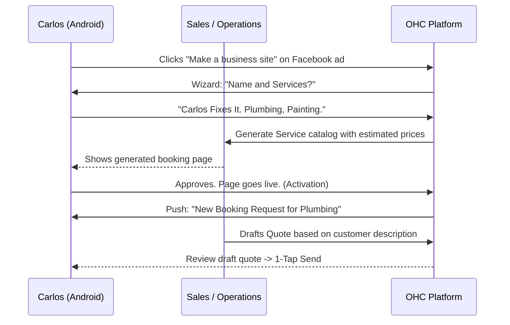
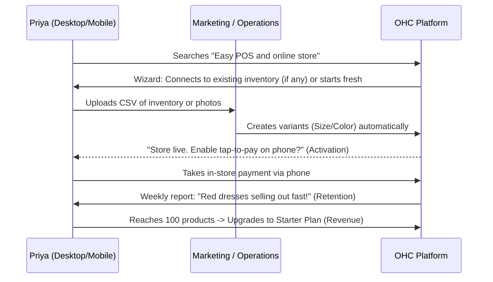
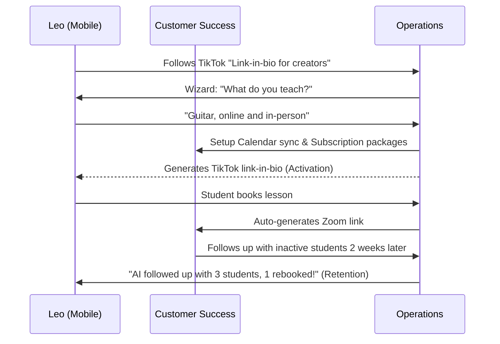
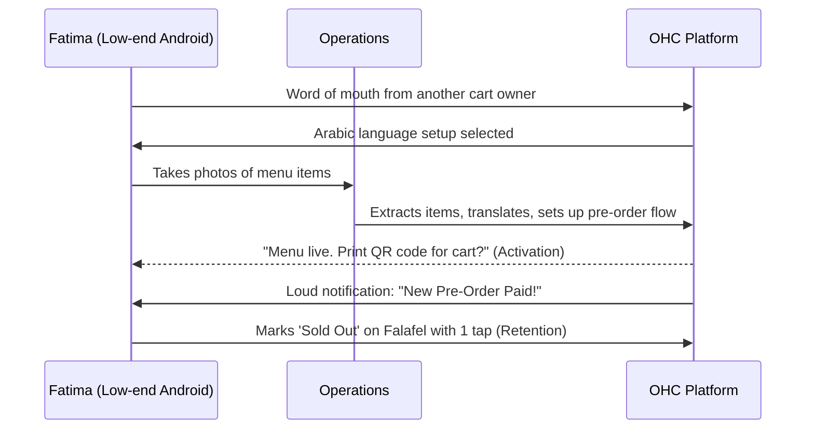

# Issue Brief: Business Journey Architecture

## Title
Business Journey Architecture: End-to-End User Journeys and AI Orchestration

## Problem Statement
The OneHumanCorp (OHC) platform promises a sub-10-minute "idea to live business" setup for absolute non-technical users. However, without a rigorously mapped, end-to-end journey for specific business personas (e.g., baker, handyman, tutor), the platform risks introducing friction, technical jargon, or unguided dead-ends. We must design a unified architectural flow that clearly maps Acquisition, Onboarding, Activation, Retention, Revenue, and Referral across all core personas to ensure the UI and AI agents seamlessly guide the user to success.

## Research Report
### Goal
To map the complete user journey for the primary OHC personas, identifying how AI agents interact with the user at each stage to remove friction.

### Findings & Friction Point Analysis
- **Current Gaps:** General platforms (Shopify, Wix) often present a generic "store setup" that forces service providers (like a handyman or tutor) into an eCommerce mold.
- **Friction Points (Non-Technical User):**
  - **Onboarding:** Asking for "DNS Settings", "Payment Gateway API keys", or "Tax rates" causes immediate abandonment.
  - **Activation:** The "blank canvas" problem. Users don't know what copy to write or what images to use.
  - **Retention:** Lack of daily engagement. If they don't get an order, they stop logging in.
- **Competitor Landscape:**
  - *Shopify:* 30-60 min setup, heavily eCommerce biased. Complex theme customization.
  - *Wix:* 20-40 min setup. Confusing editor for non-designers.
  - *OHC Approach:* Sub-10 min setup. AI asks natural language questions ("What do you sell?") and builds the fully configured store, booking calendar, or portfolio instantly.

## Design Doc

### User Journey Stages
1.  **Acquisition:** How the user discovers OHC (e.g., TikTok, Instagram, word of mouth).
2.  **Onboarding:** The AI-guided wizard to capture the business essence in under 3 minutes.
3.  **Activation:** The "Aha!" moment—the business goes live, first product added, or first booking received (Day 1).
4.  **Retention:** Daily/Weekly engagement via push notifications and the Business Advisory Agent.
5.  **Revenue:** The trigger point to upgrade from Free to a paid tier (e.g., reaching the 10-product limit).
6.  **Referral:** The viral loop of sharing the platform.

### Persona Journey Maps (Mermaid.js)

#### 1. Maya (The Home Baker) - Physical Products (Custom Orders)

#### 2. Carlos (The Handyman) - Services & Bookings

#### 3. Priya (The Boutique Owner) - Omnichannel (In-Store + Online)

#### 4. Leo (The Music Tutor) - Subscriptions & Calendars

#### 5. Fatima (The Food Cart) - Pre-Orders (Multilingual)

### Key Design Decisions
1.  **Zero Technical Input:** DNS, SSL, DB schemas, and payment gateway routing are fully abstracted. Users only answer business-domain questions.
2.  **Immediate Value (Activation):** The platform generates a fully functional draft within minutes using LLMs.
3.  **Proactive AI Engagement:** AI agents don't wait to be asked; they draft quotes, send follow-ups, and summarize daily stats via push notifications to drive retention.

## Implementation Prompt
Design and implement the UI/UX flows and backend orchestration for the "Idea to Live" onboarding wizard, matching the user journeys outlined above. The frontend must be implemented in Flutter/Slint using the OHC Premium Design System (Glassmorphism, mobile-first 375px targets). The backend must support the conversational state machine where AI agents provision the required modules (calendar, store, POS) based on natural language inputs without exposing technical configuration. Ensure 100% E2E test coverage for each persona's onboarding flow.

## Priority
P0

## Estimated Scope
Large