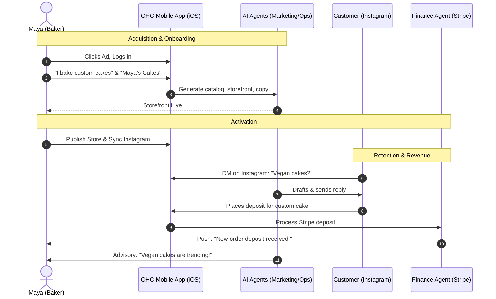
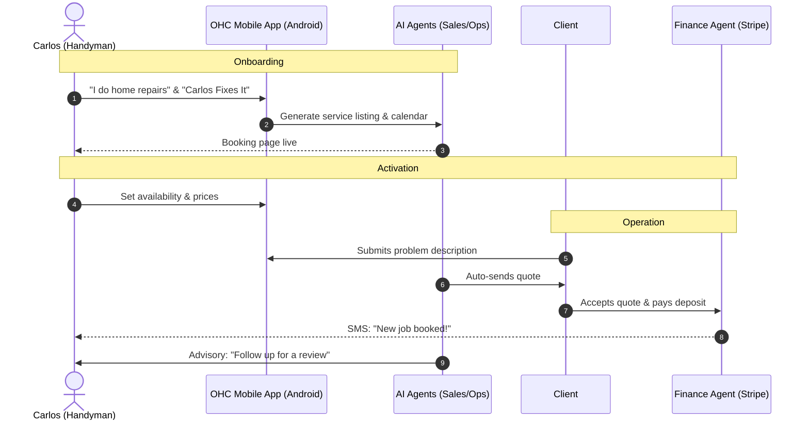
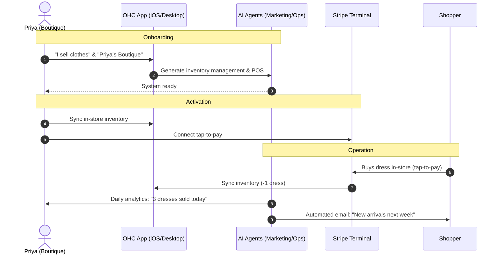
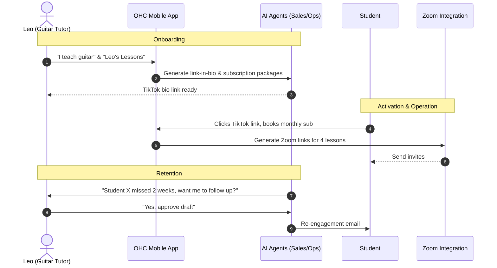
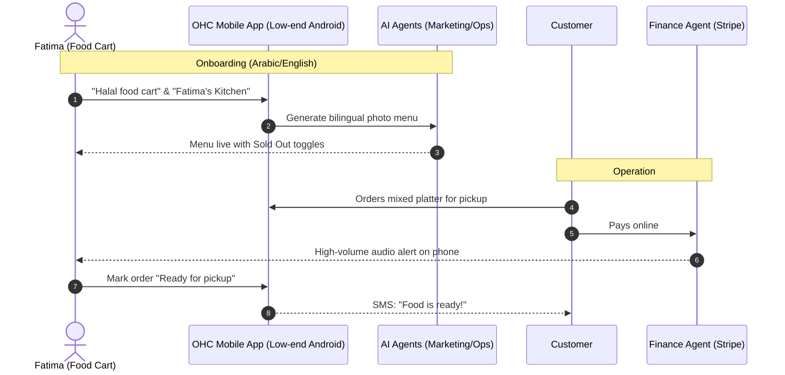

# [architecture] Optimize End-to-End Business Journey for Non-Technical Users

## Problem Statement
The current onboarding and lifecycle flow lacks a structured, end-to-end pathway tailored to specific non-technical personas. Without a persona-driven journey, users face friction during onboarding, delayed activation, and unclear paths to revenue and retention, risking abandonment before reaching the "10 minutes to live business" promise.

## Research Report
Competitive analysis of Shopify, Wix, and Squarespace shows they often overwhelm users with technical choices (hosting, DNS, complex templates) upfront.
- **Shopify:** 30-60 min setup, requires high intent, focuses heavily on e-commerce mechanics.
- **Wix/Squarespace:** 20-40 min setup, design-heavy, often requires desktop for initial setup.
- **OHC Opportunity:** By deferring complexity and leveraging AI agents to auto-generate the storefront and handle initial configuration, OHC can achieve a sub-10-minute time-to-value directly from a mobile device (375px viewport). The journey must focus on zero-jargon Acquisition, rapid Onboarding, immediate Activation (first product/payment), daily Retention loops, and clear Revenue upgrade triggers.

## Design Doc

### Mobile UX Flow & UI Wireframes (375px first)
1. **Landing/Acquisition (Mobile Safari/Chrome):**
   - Single clear CTA: "Start your business in 10 minutes."
   - Sign up via Google/Apple Single Sign-On (SSO).
2. **Onboarding (Wizard Flow):**
   - Screen 1: "What do you do?" (Text input: "I bake custom cakes").
   - Screen 2: "What is your business name?" (Input: "Maya's Cakes").
   - Screen 3: "Generating your business..." (AI loading animation).
3. **Activation (First Action):**
   - AI presents a pre-filled catalog or booking system based on persona. User taps "Publish".
   - Setup Stripe Connect for payouts with 1-tap.
4. **Retention (Daily Dashboard):**
   - Daily push notifications: "You have a new inquiry!"
   - Dashboard shows plain-language weekly summaries from the Business Advisory Agent.

### Architecture Diagrams for Each Persona

#### 1. Maya — The Home Baker (Physical Products)

#### 2. Carlos — The Freelance Handyman (Services & Bookings)

#### 3. Priya — The Boutique Owner (Retail & Omni-channel)

#### 4. Leo — The Music Tutor (Digital Subscriptions)

#### 5. Fatima — The Food Cart Operator (Food & Beverage Pre-orders)

### AI Agent Integration Points
- **Marketing Agent:** Auto-generates initial store copy and catalog based on user's simple text input.
- **Finance Agent:** Guides user through simplified Stripe onboarding and prompts for tier upgrades.
- **Business Advisory Agent:** Drives retention by sending weekly plain-language health reports.

### Key Design Decisions
- **Defer Complexity:** DNS, custom domains, and advanced settings are hidden until the user reaches the "Revenue" phase (e.g., upgrading to Starter).
- **Mobile-First Onboarding:** The entire wizard uses large native inputs, avoiding complex drag-and-drop until the user is comfortable.
- **Optimistic Generation:** The AI generates the entire business skeleton from just two inputs, rather than asking the user to build from scratch.

## Implementation Prompt
**To Implementer:**
Implement the mobile-first (375px) onboarding wizard and dashboard skeleton for the Business Journey. Ensure the user can complete the signup flow using just two inputs ("What do you do?", "Business name") and reach a generated dashboard. Do not prescribe database schemas. Focus on the UI flow, Riverpod state transitions, and integration with the KAIROS Orchestrator to mock the AI generation step. E2E tests must cover the complete flow from landing to the generated dashboard.

## Priority
P0

## Estimated Scope
Large
