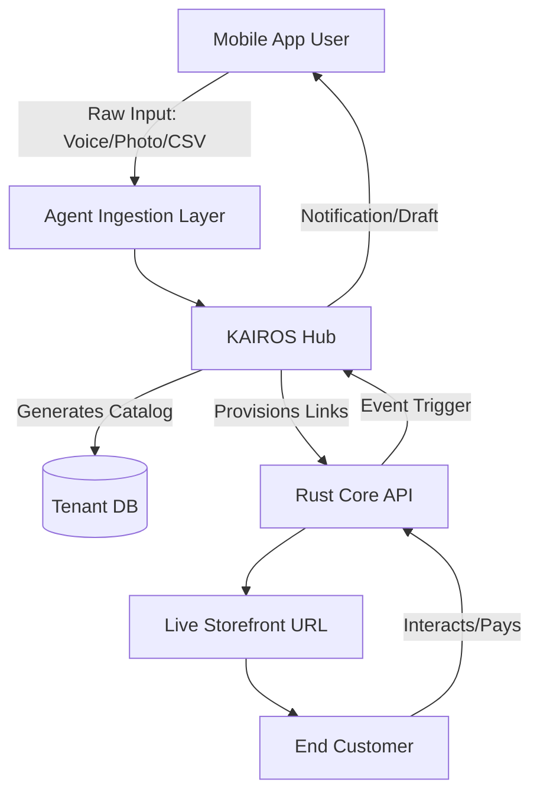

# Business Journey Architecture & Automated Onboarding

## Title
Automate the End-to-End Business Journey with AI Background Agents

## Problem Statement
Small business owners (bakers, handymen, tutors) are abandoning traditional website builders because setup is too complex. They don't want to drag-and-drop elements, configure DNS, or set up Stripe webhooks. A non-technical user needs to go from downloading the app to receiving their first payment in under 10 minutes, using only their phone. The current manual configuration steps cause massive drop-off during onboarding.

## Research Report
Traditional SaaS platforms require users to understand "settings," "integrations," and "schemas." Our research into 5 core personas reveals that users prefer conversational interfaces and auto-generated configurations.
- **Competitor Analysis:** Shopify requires ~45 minutes to go live. Wix requires ~60 minutes. OHC must achieve this in under 10 minutes.
- **Key finding:** Users abandon setup when asked to connect third-party APIs (like Instagram or Google Calendar) or manually type out large inventories on mobile keyboards.
- **Solution:** We must replace manual configuration screens with background AI agents (e.g., "The Manager", "The Salesperson") that ingest raw data (voice memos, photos, CSVs) and output structured, ready-to-use storefronts.

## Design Doc

### Architecture Diagram

### UX Flow (Mobile-First 375px)
1. **Welcome Screen:** "What do you do?" (Voice input or text field).
2. **Processing State:** "Building your business..." (Skeleton loaders, <= 300ms transitions).
3. **Review State:** AI presents a draft catalog (items extracted from photos/voice). User taps "Looks Good".
4. **Live State:** App displays a large QR code and shareable link. "You are live. Share this on Instagram."
5. **Day 2:** User receives a push notification: "You had 3 profile views. Should I draft an Instagram post?"

### AI Agent Integration Points
- **Onboarding:** "The Promoter" parses unstructured input (photos/text) to create a structured product catalog.
- **Operations:** "The Manager" watches calendar events and inventory levels, updating the DB asynchronously.
- **Sales:** "The Salesperson" monitors connected social inboxes and uses the generated catalog to answer customer queries.

### Key Design Decisions
- **No "Settings" Menu During Onboarding:** All configurations are inferred or deferred to Day 2.
- **Optimistic UI:** AI generation happens in the background. The user sees an immediate "draft" storefront that progressively enhances as the agents finish processing.
- **Event-Driven Architecture:** Agents must react to platform events (new order, low stock) rather than relying on the user to check a dashboard.

## Implementation Prompt
**Context for Implementer:**
We are building the zero-to-live onboarding flow and the underlying event triggers for AI background agents. The goal is to allow a user to launch a store by simply uploading a photo or speaking a sentence, with AI handling the catalog generation and routing.

**Acceptance Criteria:**
1. Implement a unified ingestion endpoint that accepts raw text, audio, or images and triggers an AI pipeline to generate structured catalog items.
2. Implement an event-bus or webhook system that allows background agents to listen for specific triggers (e.g., `order.created`, `inventory.low`) and take action (e.g., send push notification, draft email).
3. Update the UI to include a "draft review" step where users can approve AI-generated configurations with a single tap.
4. Ensure all jargon is removed from the UI. Replace terms like "API configuration" with "Connecting your accounts."
5. Verify that the entire flow works seamlessly on a 375px mobile viewport.

## Priority
P0

## Estimated Scope
Large
