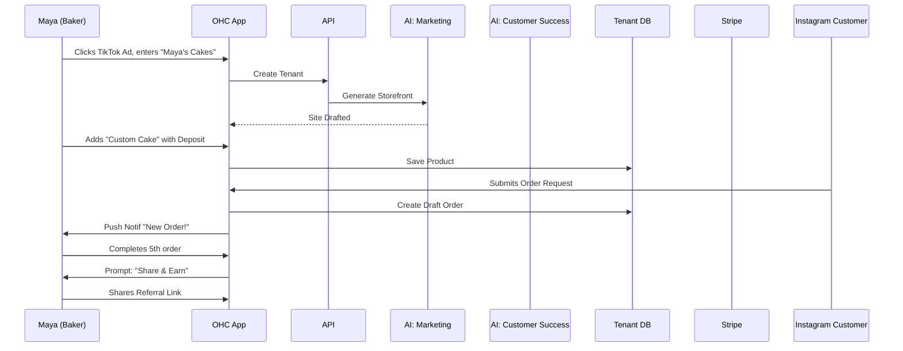
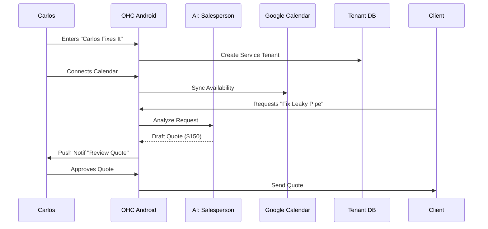
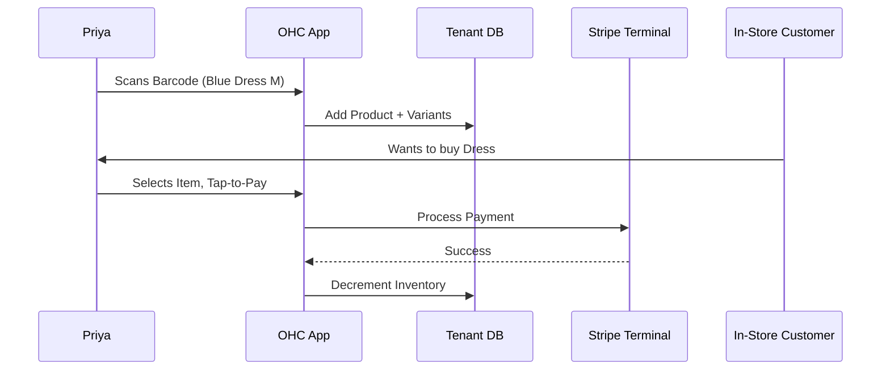
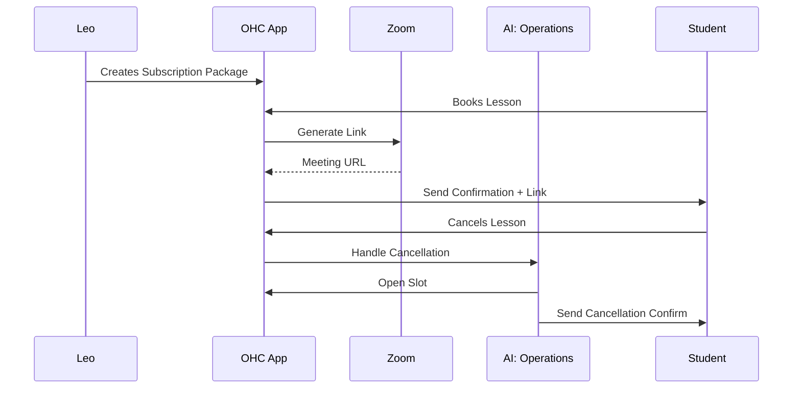
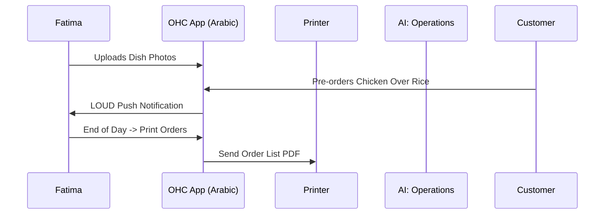

### Title
Architectural Blueprint: End-to-End Business Journey for Non-Technical SMB Owners

### Problem Statement
Small business owners (SMBs) across various domains (bakers, handymen, boutique owners, tutors, food cart operators) face immense friction when digitizing their operations. Existing platforms (Shopify, Wix, Squarespace) require significant time (30-60 minutes) and technical context to set up. These owners, represented by personas like Maya (baker) and Carlos (handyman), require a solution that demands zero technical knowledge, operates flawlessly on mobile devices (375px baseline), and seamlessly integrates AI to invisibly handle complex tasks like website creation, SEO, customer communication, and financial reporting. They need to go from idea to a live, functional business in under 10 minutes. The current lack of a unified, friction-free journey leads to high abandonment rates during onboarding and limits the growth potential of these micro-businesses.

### Research Report
**Competitive Landscape:**
*   **Shopify:** Powerful, but targets semi-technical users. Onboarding is complex (30-60 mins), requiring the setup of payment gateways, shipping zones, and tax settings before a launch is viable. Mobile management is secondary to desktop.
*   **Wix/Squarespace:** Focuses heavily on the visual builder, which can be overwhelming for non-designers. E-commerce features are often bolted on rather than integrated naturally into a specific business type's workflow.
*   **GoDaddy:** Faster onboarding but limited customization and poor integrated AI support beyond basic chatbots.

**OHC Differentiation:**
OHC's core advantage lies in its "invisible AI" and strict mobile-first paradigm. By categorizing the onboarding and operational experience strictly by "Business Type Matrix" (Physical, Digital, Services, Food, Subscriptions, Portfolios), the system can pre-configure 90% of the required architecture (e.g., automatically enabling the "Pre-order/pickup" flow for Food & Beverage, or "Deposit payments" for Services). The integration of AI departments (Operations, Marketing, Sales, Customer Success, Finance, Legal, Advisory) right from the Acquisition phase ensures that the business owner is supported rather than burdened by technology.

**Persona Pain Points Addressed:**
*   **Maya (Baker):** Requires custom orders with deposits. Needs automated DM replies.
*   **Carlos (Handyman):** Needs service listings, booking calendars, and AI-generated quotes.
*   **Priya (Boutique):** Requires inventory sync and mobile analytics.
*   **Leo (Tutor):** Needs subscription packages and automated Zoom links.
*   **Fatima (Food Cart):** Needs a simple, multi-lingual interface for pre-orders on a slow connection.

### Design Doc

**Key Architectural Decisions:**
1.  **AI-Driven Onboarding Wizard:** The onboarding flow collects only the most critical information (Business Name, Category, Primary Goal). The "Marketing & Advertising" AI department immediately generates a functional storefront based on these inputs.
2.  **Progressive Enhancement of Operations:** Complex features (e.g., setting up subscription billing or advanced SEO) are deferred to the "Activation" and "Retention" phases. The "Business Advisory" agent nudges the user to complete these tasks when appropriate.
3.  **Mobile-First State Management:** All onboarding forms and management interfaces are designed for 375px viewports using native mobile inputs (e.g., numeric keypads for pricing). Changes are optimistically updated in the UI with a reliable retry queue to handle poor network conditions (crucial for users like Fatima).

**Friction Points & Abandonment Risks:**
*   **Connecting Payment Gateways (Stripe):** Often requires SSN or Employer ID, which non-technical users might not have handy. **Mitigation:** Allow a "simulated" payment state for launch, only enforcing verification when real payouts begin.
*   **Image Uploads & Formatting:** Users often upload overly large or poorly framed images. **Mitigation:** Automatic WebP compression and AI cropping/enhancement.
*   **Setting Up Business Rules (Shipping, Taxes, Availability):** Often requires complex matrices. **Mitigation:** Pre-fill based on the business category and local defaults; adjust via simple natural language interface (e.g., "I only deliver within 10 miles").
*   **Initial Overwhelm:** Displaying too many tools at once. **Mitigation:** Progressive disclosure of AI Departments (e.g., hide Legal & Compliance until a customer actually checks out).

### Persona Journeys

#### 1. Maya (The Home Baker - 28)
*   **Acquisition:** Discovers OHC via a TikTok ad showing "Turn Instagram DMs into orders in 5 mins." Clicks the CTA.
*   **Onboarding:** Enters "Maya's Cakes", selects "Food/Baked Goods". AI Marketing Agent builds a storefront.
*   **Activation:** Adds one product ("Custom Birthday Cake") and enables the "Deposit Required" toggle.
*   **Retention:** Re-engages when she receives a push notification: "New Custom Order Request!".
*   **Revenue:** After 10 free products, the Advisory Agent suggests upgrading to the Starter Tier ($9/mo) to unlock the custom domain (`mayascakes.com`).
*   **Referral:** After her 5th successful order, the App prompts her to "Share OHC and get a month free". She shares the link to her baking WhatsApp group.

#### 2. Carlos (The Freelance Handyman - 42)
*   **Acquisition:** Hears about OHC from another contractor. Searches "OneHumanCorp" on Google and downloads the Android app.
*   **Onboarding:** Enters "Carlos Fixes It", selects "Services/Repairs".
*   **Activation:** Connects his Google Calendar. Adds "General Plumbing" and "Drywall Patch" services.
*   **Retention:** Receives a quote request. The AI Salesperson drafts a quote based on the customer's description, which Carlos approves with one tap.
*   **Revenue:** Upgrades to Pro ($29/mo) to get unlimited AI quotes and contract generation (Legal Agent).
*   **Referral:** Uses the OHC Referral Portal to generate a flyer with a QR code, which he gives to his plumber friend.

#### 3. Priya (The Boutique Owner - 35)
*   **Acquisition:** Sees an organic Instagram post highlighting OHC's inventory sync.
*   **Onboarding:** Enters "Priya's Threads", selects "Physical/Clothing".
*   **Activation:** Uses the app's barcode scanner to quickly add 5 items with size/color variants.
*   **Retention:** Uses the Stripe Terminal feature via her iPhone to take an in-person payment. The inventory auto-decrements.
*   **Revenue:** Upgrades to Starter ($9/mo) specifically to utilize the "Daily Analytics" dashboard.
*   **Referral:** Mentions OHC during a local business owner meetup, sharing her link via AirDrop.

#### 4. Leo (The Music Tutor - 22)
*   **Acquisition:** Follows a link-in-bio of another creator using OHC.
*   **Onboarding:** Enters "Leo's Guitar Lounge", selects "Services/Tutoring".
*   **Activation:** Sets up a "4-Lesson Package" subscription and links his Zoom account.
*   **Retention:** A student cancels. The AI Operations Agent automatically opens up that time slot and emails waitlisted students.
*   **Revenue:** Upgrades to Pro ($29/mo) to handle his growing volume of students and unlimited AI follow-ups.
*   **Referral:** Puts his OHC referral link permanently in his TikTok bio.

#### 5. Fatima (The Food Cart Operator - 50)
*   **Acquisition:** A younger family member sets it up for her.
*   **Onboarding:** Switches language to Arabic. Enters "Fatima's Halal", selects "Food/Pre-Order".
*   **Activation:** Uploads photos of her top 3 dishes.
*   **Retention:** Relies on the loud custom push notification sound "New Pre-Order!" and uses the "Print Daily Orders" feature.
*   **Revenue:** Stays on the Free tier initially, as she processes under 100 items. Upgrades to Starter later for the custom domain.
*   **Referral:** Tells neighboring food carts about the app, helping them set it up using her referral link.

### Implementation Prompt
**Objective:** Implement the frontend flow and backend APIs for the streamlined 4-step Onboarding Wizard, specifically tailored to handle the 6 primary business categories (Physical, Digital, Services, Food, Subscriptions, Portfolios).

**Critical User Journey (CUJ):**
A non-technical user installs the app. They click "Start My Business", enter their business name, and select their category. The app presents a loading screen while the AI generates a baseline configuration. The user is then prompted to add a single product, connect a payment method (simulated for now), and their business is marked as "Live". The dashboard then displays the new product and a "Share your store" link.

**Acceptance Criteria:**
*   The UI must be strictly mobile-first (verified on a 375px width).
*   The onboarding API must successfully create a new tenant record in PostgreSQL with row-level security enabled.
*   The backend must correctly categorize the business and apply the relevant default feature flags.
*   The flow must be fully covered by an E2E Playwright test simulating the entire process from the home page to a successful "Live" dashboard state, without mocking network requests.
*   All forms must utilize appropriate native mobile keyboards (e.g., numeric for price inputs).

### Priority
P0 (Critical)

### Estimated Scope
Large