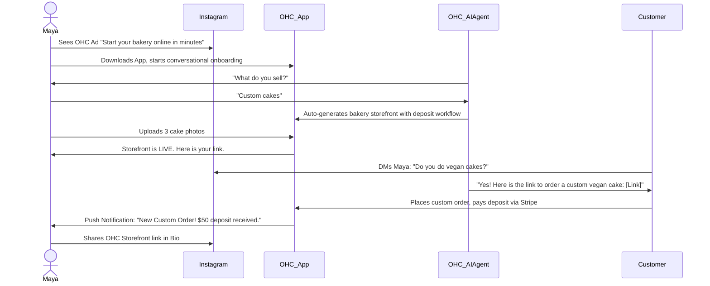
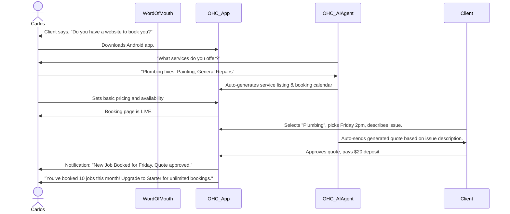
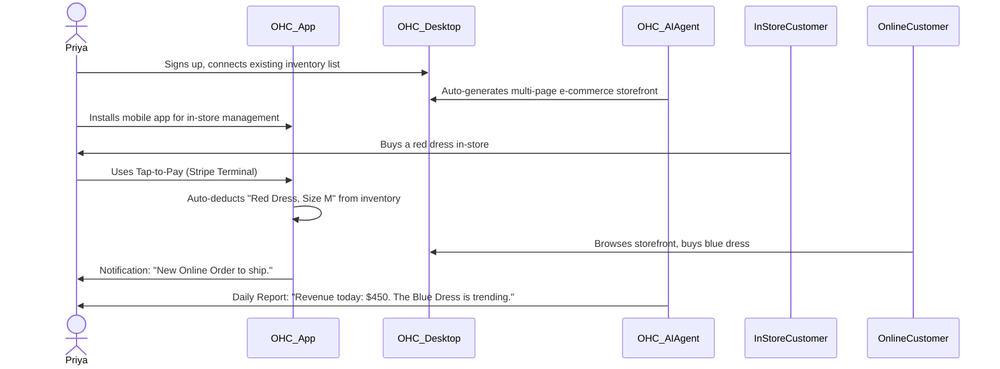
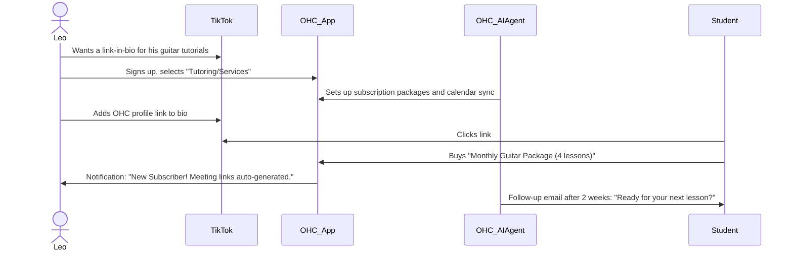
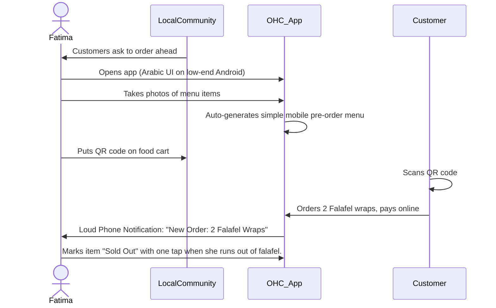

# [Architecture] Business Journey Definition & Blueprint

## Problem Statement

Small business owners—bakers, handymen, boutique owners, tutors, and food cart operators—are not technical experts. Yet, existing platforms like Shopify, Wix, and Squarespace force them into steep learning curves, requiring hours to set up complex configurations, understand confusing terminology, and learn web design.

For the everyday entrepreneur, the current onboarding and operation process is overwhelming. They don't just want a "website," they need an end-to-end operational hub—a system that gets them from idea to a fully functioning, customer-ready business in minutes. They need a journey that seamlessly handles acquisition, frictionless onboarding, quick activation, persistent retention mechanisms, clear revenue paths, and organic referral loops. This journey must adapt perfectly to their unique business type while abstracting away all underlying complexity through AI agents.

## Research Report

Our analysis evaluated the standard journeys across major competitors and identified significant friction points for non-technical users.

### Competitor Analysis
*   **Shopify:** Excellent for scaling e-commerce but overwhelming initial setup. The onboarding wizard is long, and the "activation" moment (getting the first sale) takes days or weeks due to the complexity of setting up shipping, taxes, and themes. Heavy reliance on desktop for meaningful management.
*   **Wix/Squarespace:** Website builders first, business tools second. Users spend hours dragging and dropping elements instead of running their business. Not inherently mobile-first for management.
*   **GoDaddy:** Simple setup but limited functionality. Often traps users in a basic tier with a confusing upgrade path when they need actual business features (like advanced booking or inventory).

### Core Findings
1.  **Time to Value (TTV):** The single biggest predictor of success is how quickly the user experiences their first "win" (e.g., publishing the site, receiving a test order). Our target is < 10 minutes.
2.  **Mobile-First is Mandatory:** Many of our target personas (Maya, Carlos, Fatima) do not own a laptop or prefer not to use one for business tasks. The entire lifecycle must be manageable via a smartphone.
3.  **Context Switching:** Users hate jumping between an app for their website, another for payments (Stripe), another for booking (Calendly), and another for messaging (Instagram). The journey must unify these under the "OneHumanCorp" umbrella.
4.  **AI as an Invisible Guide:** Users don't want to configure an AI; they want the AI to proactively do the work. The onboarding process should feel like an interview with a helpful assistant, not a form-filling exercise.

### Friction Points
1.  **Blank Canvas Paralysis:** Asking users to "choose a theme" or "add a section" causes anxiety. Users need a fully generated, working template based on their business type immediately.
2.  **Complex Terminology:** Words like "DNS", "SEO", "Variants", and "SKUs" confuse non-technical users. The interface must use plain language (e.g., "Get found on Google", "Sizes and Colors").
3.  **Fragmented Tools:** Having to set up Stripe independently, link a domain manually, and configure email servers creates massive drop-off during onboarding.

### User Personas & The OHC Differentiator
The OneHumanCorp (OHC) platform must perfectly accommodate:
*   **Maya (The Home Baker):** Mobile-only, needs deposits, custom orders, and automated DM replies.
*   **Carlos (The Freelance Handyman):** Android user, needs service listings, booking, quotes, and a customer inbox.
*   **Priya (The Boutique Owner):** Needs mobile and desktop access, online/in-store inventory sync, and POS payments.
*   **Leo (The Music Tutor):** Needs subscription packages, calendar sync, automated Zoom links, and a link-in-bio.
*   **Fatima (The Food Cart Operator):** Needs a simple photo menu, pre-orders, and phone notifications, working on low-end hardware and multiple languages.

## Design Doc

The Business Journey Architecture defines the standard progression a user takes through the OHC platform.

### Key Journey Stages

1.  **Acquisition:** How the user discovers OHC (Organic search, social media, word of mouth, "Powered by OHC" badges on existing storefronts).
2.  **Onboarding:** The initial 10-minute flow to set up the business. Powered by a conversational AI interface.
    *   *Minimum Inputs:* Business Name, Category, Basic Contact Info.
    *   *Deferred Inputs:* Advanced branding, complex tax info, domain connection.
3.  **Activation:** The moment the business is "live" and ready to accept customers.
    *   *Success Metric:* First product added, first payment received, storefront published.
4.  **Retention:** Daily engagement drivers.
    *   *Hooks:* Push notifications for new orders, daily AI summaries, simple inbox management.
5.  **Revenue:** The upgrade path.
    *   *Triggers:* Reaching limits on products/AI actions, needing a custom domain. The transition from Free to Starter must feel like a logical step due to business growth.
6.  **Referral:** The viral loop.
    *   *Mechanisms:* Easy sharing of the storefront link, referral programs for bringing other businesses to OHC.

### Architecture Diagrams (Mermaid.js)

#### 1. Maya (The Home Baker) Journey

#### 2. Carlos (The Freelance Handyman) Journey

#### 3. Priya (The Boutique Owner) Journey

#### 4. Leo (The Music Tutor) Journey

#### 5. Fatima (The Food Cart Operator) Journey

### UI Wireframes or Screen Flow Description
1.  **Onboarding Chat Interface (375px width):** A full-screen chat interface. The AI (represented by an animated, friendly avatar) asks one question at a time. Quick-reply chips (e.g., "Retail", "Services", "Food") are positioned above the mobile keyboard. The background features a subtle glassmorphism blur.
2.  **The "Magic Moment" Screen:** After the final onboarding question, a loading screen with micro-animations showing the AI "building" the store (icons of pages, calendars, and products snapping into place).
3.  **The Mobile Dashboard (375px width):** The primary hub. A clean, tabbed interface (Home, Inbox, Orders/Bookings, Settings). The Home tab features "The Advisor" widget at the top with plain-language insights (e.g., "You have 3 new messages today.").

### AI Agent Integration Points
1.  **Marketing & Advertising Agent:** Triggered during onboarding to dynamically generate the site layout, color palette, and initial copywriting based on the user's business category and name.
2.  **Customer Success Agent:** Integrated into the shared Inbox tab. When a customer messages (via site widget or Instagram DM), the agent drafts a suggested reply visible only to the owner, who can approve or edit it.
3.  **Business Advisory Agent:** Runs a nightly batch process evaluating the day's sales and interactions to generate the plain-language daily/weekly summary widget on the dashboard.

### Key Design Decisions and Why
1.  **Conversational Onboarding over Forms:** *Why?* Forms feel like work and cause drop-off. A conversational interface feels like hiring an assistant, aligning with the "AI Does the Work" core value.
2.  **No "Draft" Mode for Initial Store:** *Why?* The store is published instantly, even with placeholder images. This forces the "Activation" moment faster. Users can always edit it, but the hurdle of "Publishing" is removed.
3.  **Unified Inbox:** *Why?* Small business owners lose track of communications scattered across platforms. Bringing SMS, email, and social DMs into one inbox, assisted by the Customer Success agent, drastically reduces response time and cognitive load.

## Implementation Prompt

**Role:** Product Engineering Swarm
**Task:** Implement the unified "First 10 Minutes" Onboarding and Activation flow based on the Business Journey Architecture.
**Goal:** Create a frictionless, mobile-first onboarding experience that allows a user to go from downloading the app to having a live, published business entity with their first product/service configured.

**Acceptance Criteria:**
1.  **Conversational Onboarding:** The initial setup must simulate a brief chat/interview with an AI assistant rather than a static form.
2.  **Dynamic Template Generation:** Based on the user's business category (e.g., Bakery, Handyman, Food Cart), the system must automatically provision the correct initial UI state (e.g., physical product catalog vs. service booking calendar).
3.  **Mobile-First Constraints:** The entire flow must be completely functional and visually perfect on a 375px width screen. Touch targets must be >= 44x44px. Native mobile keyboards must be triggered appropriately (e.g., numeric for price).
4.  **Deferred Complexity:** The flow must ONLY ask for the absolute minimum information required to go live. Advanced settings (domain, detailed taxes) must be relegated to a post-activation checklist.
5.  **Activation Celebration:** Upon completing the required steps and publishing, the user must receive a clear visual confirmation (celebratory UI) and their live link.

**Note:** Do not implement specific database schemas or API contracts. Focus on implementing the end-to-end frontend flow and integrating with the existing backend orchestration layers to trigger the necessary AI agents.

## Priority
P0 - Critical Path

## Estimated Scope
Large

