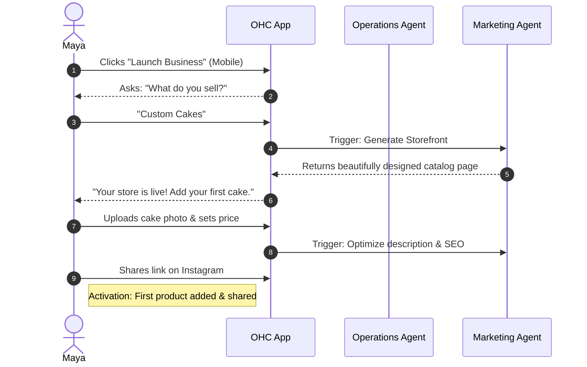
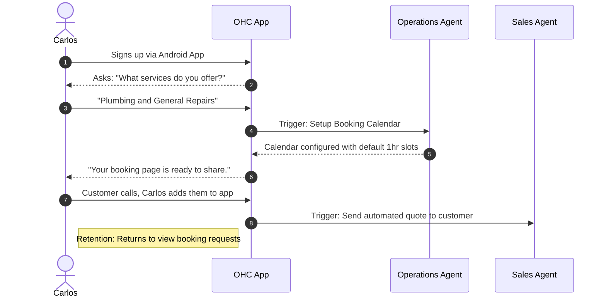
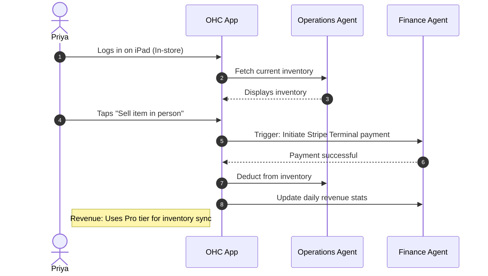
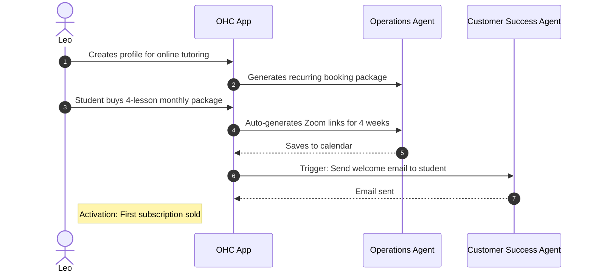
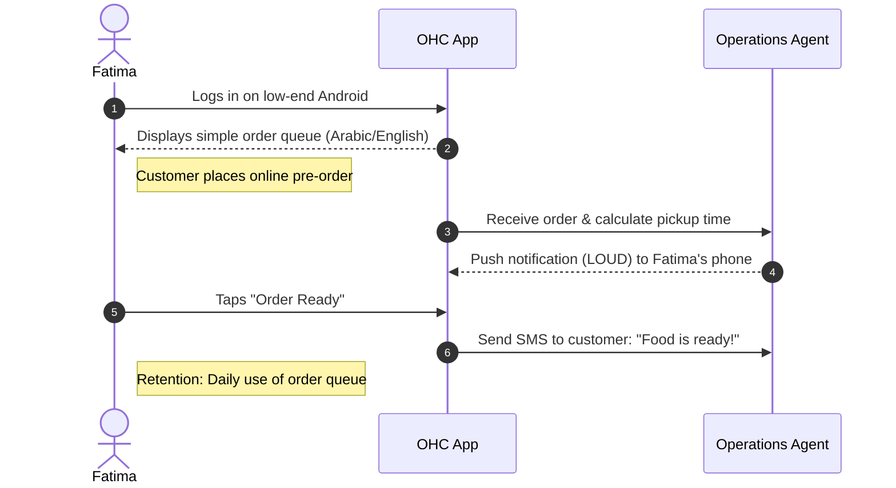

# Business Journey Architecture

## Title
[architecture] Implement End-to-End Business Journey Lifecycle and Agentic Onboarding

## Problem Statement
Small business owners (our core personas like Maya the Baker, Carlos the Handyman, Priya the Boutique Owner, Leo the Music Tutor, and Fatima the Food Cart Operator) are overwhelmed by the complexity of launching and growing their business. Traditional platforms like Shopify, Wix, and Squarespace require them to learn multiple systems (web design, inventory, CRM, booking) from day one. This leads to high abandonment rates during onboarding. The core problem is that non-technical users are forced to think like system administrators rather than business owners. They need a guided, magical experience where AI handles the heavy lifting, allowing them to go from an idea to a live business in under 10 minutes from their mobile phones.

## Research Report

### Competitive Analysis
| Feature | OHC | Shopify | Wix | Squarespace | GoDaddy |
|---|---|---|---|---|---|
| **Setup Time** | < 10 min | 30-60 min | 20-40 min | 30-60 min | 20-40 min |
| **Technical Knowledge** | Zero | Low | Low | Low | Low |
| **AI Agents (Invisible)** | Yes, built-in | Sidekick (chat only) | Wix AI | Limited | Airo (limited) |
| **Mobile-First Management** | Yes | Partial | Partial | No | No |
| **Unified Business Stack** | All-in-one | Store only | All (complex) | Portfolio + store | Basic |

### Lifecycle Stages
1. **Acquisition**: Users typically discover OHC via Instagram/TikTok ads showcasing how easily similar businesses are run on mobile, or via organic search (e.g., "easy booking system for handyman"). CTA is "Launch your business in 5 minutes".
2. **Onboarding**: A highly opinionated, chat-like wizard. Asks for business name, type, and primary goal (e.g., "take bookings" or "sell physical goods"). Defers complex configuration (taxes, custom domains) to later.
3. **Activation**: The "Aha!" moment. A live, shareable storefront or booking link is generated immediately. The user adds their first product or service, and the AI agent instantly optimizes its description.
4. **Retention**: The user returns daily due to proactive push notifications ("You have a new custom cake request!", "Weekly business health summary").
5. **Revenue**: Free tier users convert to paid tiers (Starter/Pro) when they hit limits (e.g., needing custom domains or more AI actions/month). Upgrades are suggested contextually, not forced upfront.
6. **Referral**: Organic viral loops embedded in the consumer-facing storefronts (e.g., "Powered by OneHumanCorp" in email footers or booking confirmation pages).

## Design Doc

### Key Design Decisions
1. **Deferred Configuration**: We do not block onboarding with payment gateway setup or domain configuration. The user gets a functional link (e.g., `maya-cakes.ohc.app`) immediately.
2. **Mobile-First (375px) Constraint**: The entire onboarding and management flow must work flawlessly on a phone. Desktop is an additive experience.
3. **Conversational Agentic Onboarding**: Instead of a massive form, the onboarding is a fluid, AI-driven conversation or step-by-step wizard.
4. **Proactive Insights**: The Business Advisory agent pushes insights rather than requiring the user to pull reports.

### UI Wireframes & Screen Flow (375px Mobile First)
1. **Landing / Acquisition**: Clean hero image. "What do you want to build today?" input field.
2. **Onboarding Chat**:
   - AI: "Hi! I'm your new digital team. What's your business name?"
   - User types "Maya's Cakes".
   - AI: "Great! What do you sell?" -> Selects "Physical Goods & Custom Orders".
3. **The "Aha!" Screen**: Confetti animation. "Your business is live at maya-cakes.ohc.app. Let's add your first item."
4. **Dashboard (Day 1)**: Action-oriented cards. "Upload a photo of your best cake", "Connect Stripe to get paid", "View your live site". No overwhelming menus.

### AI Agent Integration Points
- **Marketing Agent (The Promoter)**: Auto-generates the initial website layout and copy based on the business type during onboarding.
- **Customer Success Agent (The Ambassador)**: Greets the user, explains the platform in simple terms, and drafts the first welcome email for their mailing list.
- **Business Advisory Agent (The Advisor)**: Monitors onboarding progress. If a user stalls at adding a product, it sends a gentle push notification suggesting a popular product template.

### Sequence Diagrams (Mermaid.js)

#### 1. Maya (The Baker) - Physical Products & Custom Orders

#### 2. Carlos (The Handyman) - Services & Bookings

#### 3. Priya (The Boutique Owner) - Online + In-Person

#### 4. Leo (The Music Tutor) - Subscriptions & Virtual Bookings

#### 5. Fatima (The Food Cart) - Pre-Orders & Pickup

### Friction Points Identified
- **Payment Setup**: Requiring KYC/Stripe Connect details immediately will cause abandonment. *Solution*: Defer until the first payout or use a streamlined onboarding flow.
- **Asset Creation**: Users might not have professional photos (e.g., Fatima's menu). *Solution*: Allow text-only menus initially, or provide stock imagery/AI image generation.
- **Complex Navigation**: Desktop-style sidebars on mobile confuse users. *Solution*: Use a bottom tab bar and action-oriented home feed on mobile.

## Implementation Prompt
**For Implementer Agent:**
Implement the end-to-end "Day One" onboarding flow for the mobile application (Flutter).
- Create a guided, conversational wizard that captures the user's business name and primary business type.
- Do NOT require payment setup or custom domain configuration in this flow.
- Upon completion, land the user on a simplified dashboard screen (375px mobile-first layout) that displays their live public URL and a primary CTA to "Add your first product/service".
- The UI must adhere to the OHC Premium Token library (Glassmorphism, Outfit/Inter typography).
- Ensure the state is managed properly (Riverpod) and the transition from wizard to dashboard feels magical (use micro-animations).
- **Acceptance Criteria**: A new user can launch the app, complete the wizard in under 3 screens, and view their dashboard with a functional public link.

## Priority
P0

## Estimated Scope
Large
