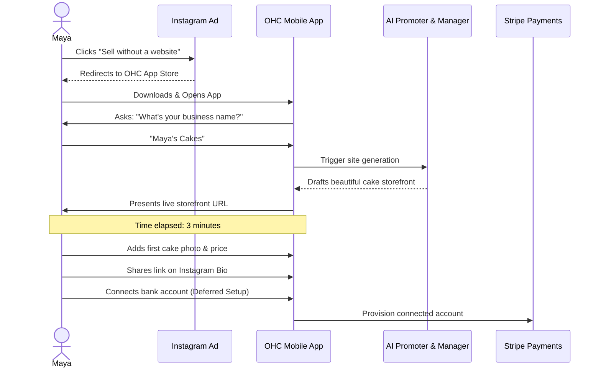
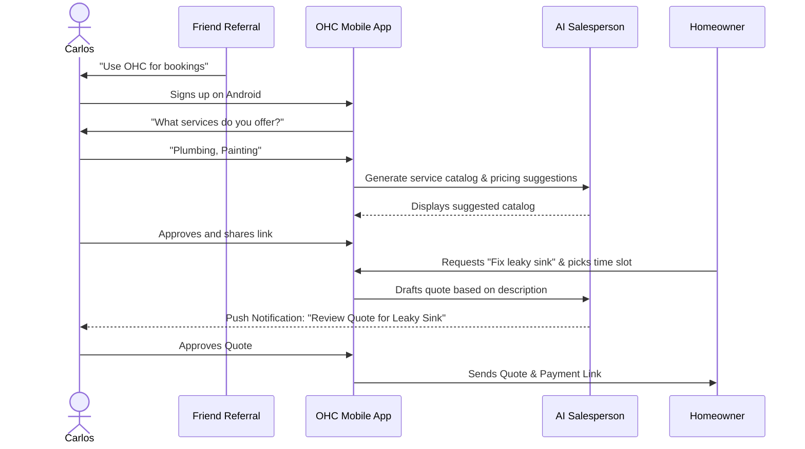
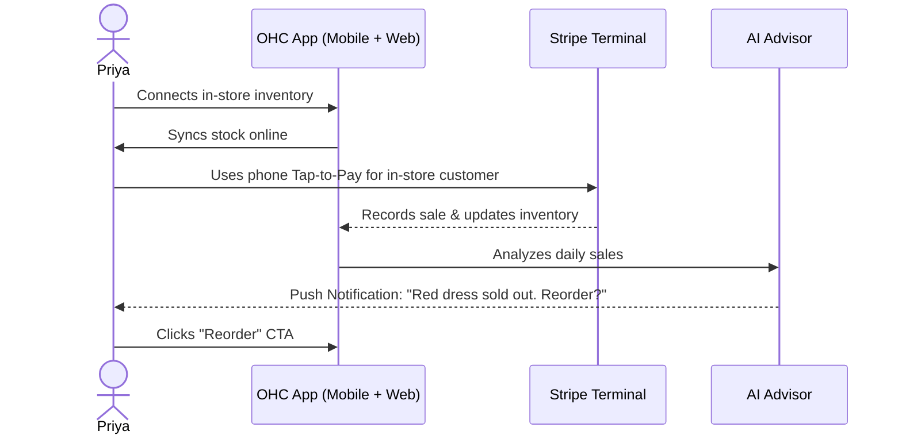
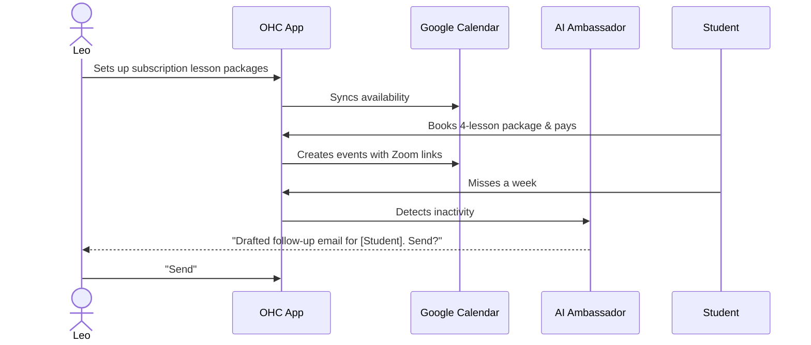
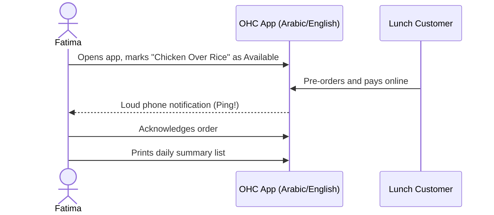

# Title: Business Journey Architecture - End-to-End Persona Flow Mapping

## Problem Statement

Small business owners—whether they are home bakers, freelance handymen, boutique owners, music tutors, or food cart operators—frequently abandon software platforms during the setup phase due to overwhelming complexity, jargon, and friction. To achieve the OneHumanCorp (OHC) promise of going from idea to live business in under 10 minutes from a phone, we need a radically simple, AI-assisted business journey. We currently lack a comprehensive architectural mapping of the end-to-end user journey (Acquisition, Onboarding, Activation, Retention, Revenue, Referral) tailored for our core non-technical personas. Without this, engineering efforts risk building disconnected features rather than a cohesive, seamless journey.

## Research Report

### Findings
Through our analysis of target personas (Maya, Carlos, Priya, Leo, Fatima) and competitive benchmarking (Shopify, Wix, Squarespace, GoDaddy), we identified several critical friction points where non-technical users drop off:
1. **The "Blank Canvas" Problem**: Asking users to build a website from scratch or configure complex settings paralyzes them. Competitors like Shopify take 30-60 minutes to set up; Wix and Squarespace take 20-40 minutes.
2. **Platform Fragmentation**: Users are forced to patch together multiple tools (e.g., website builder + separate booking tool + separate payment gateway).
3. **Mobile Unfriendliness**: Many platforms offer a "mobile app," but core setup and complex configuration (like inventory or store design) still require a desktop browser.
4. **Jargon**: Terms like "DNS," "Payment Gateway," "SEO," and "SKUs" alienate non-technical founders.

### Competitive Analysis
- **Shopify**: Excellent for e-commerce but intimidating for service-based businesses or solopreneurs. Requires significant time investment and basic technical/business literacy.
- **Wix/Squarespace**: Good design builders, but setting up a full business logic stack (bookings, payments, inventory) is cumbersome and not truly mobile-first.
- **GoDaddy**: Fast setup but rigid, basic, and lacks deep AI integration or seamless mobile management.

**OHC's Opportunity**: Be the ONLY platform that is genuinely mobile-first (start to finish), relies entirely on AI agents to do the heavy lifting (invisible setup), and supports any business type in under 10 minutes without jargon.

## Design Doc

### Business Journey Mapping

#### 1. Acquisition
- **Maya (Baker)**: Discovers OHC via an Instagram Ad highlighting "Sell cakes on Insta without a website." Landing Page CTA: "Start selling in 2 minutes."
- **Carlos (Handyman)**: Word of mouth from another contractor. Landing Page CTA: "Get booked and paid online, easily."

#### 2. Onboarding (Step-by-step Wizard)
The flow must be conversational and AI-driven. No complex forms. Minimum inputs: Name, Business Type, What do you sell? (AI generates the rest). Deferred: Bank details, domain setup.

#### 3. Activation
- **Day 1**: First product added, live URL shared.
- **Week 1**: First order or booking received.
- **Month 1**: Regular usage of the AI "Advisor" for business health insights.

#### 4. Retention
- **Carlos**: Brought back daily by push notifications for new service requests and AI-drafted quotes ready for his approval.
- **Fatima**: Checks the app daily for her printable pre-order pickup list.

#### 5. Revenue
- **Maya**: Upgrades from Free → Starter when she exceeds 10 products or needs a custom domain. The CTA is presented naturally when she tries to add her 11th cake design, phrased as "Expand your bakery for $9/mo."

#### 6. Referral
- **Priya**: Shares OHC with a boutique-owner friend through a built-in "Invite a Founder" viral loop button on her dashboard, rewarding both with a month of Pro tier.

### Architecture Diagrams (Mermaid.js)

#### Maya's Journey (The Home Baker)

#### Carlos's Journey (The Freelance Handyman)

#### Priya's Journey (The Boutique Owner)

#### Leo's Journey (The Music Tutor)

#### Fatima's Journey (The Food Cart Operator)

### Key Design Decisions & Why
- **Deferred Complexity**: Users only provide Name and Business Type initially. AI fills the blanks. Payment details are only required *after* they see value (e.g., when trying to publish).
- **Mobile-First In-App Actions**: Approvals, edits, and reads are optimized for 375px screens. Large data entry is minimized.
- **AI as Co-Pilot**: Push notifications aren't just alerts ("You have a message"); they are actionable AI drafts ("Customer asked X. Reply with Y?").

## Implementation Prompt

**Objective**: Implement the end-to-end user journey flows for new business onboarding and activation, ensuring 100% mobile parity and seamless AI agent integration.

**Critical User Journey (CUJ)**:
1. User opens the application for the first time.
2. User is greeted by a conversational onboarding UI (no complex forms).
3. User enters their business name and primary offering (e.g., "Handyman").
4. AI Manager agent generates a base storefront, service catalog, and initial settings in the background.
5. User is presented with a live, shareable URL within 3 minutes of opening the app.
6. User completes deferred onboarding (connecting Stripe/bank details) via a mobile-optimized settings wizard only when they are ready to receive their first payment.

**Acceptance Criteria**:
- The flow must run flawlessly on a 375px viewport (mobile).
- The "Blank Canvas" is completely eliminated; the AI must populate initial state based on the provided business type.
- The UI must utilize the OHC Premium Token library (Glassmorphism, Outfit/Inter typography).
- Ensure telemetry events are fired for each onboarding step to monitor drop-off rates.
- E2E test coverage must simulate a complete, unauthenticated user onboarding through to the generation of the live storefront URL.

## Priority
P0 (Critical) - Foundational to user acquisition and the core OHC promise.

## Estimated Scope
Large

