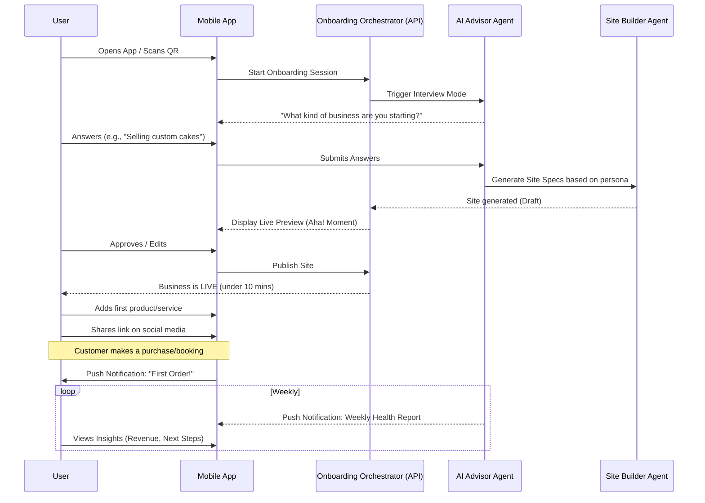
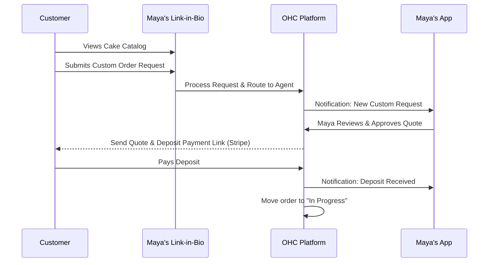
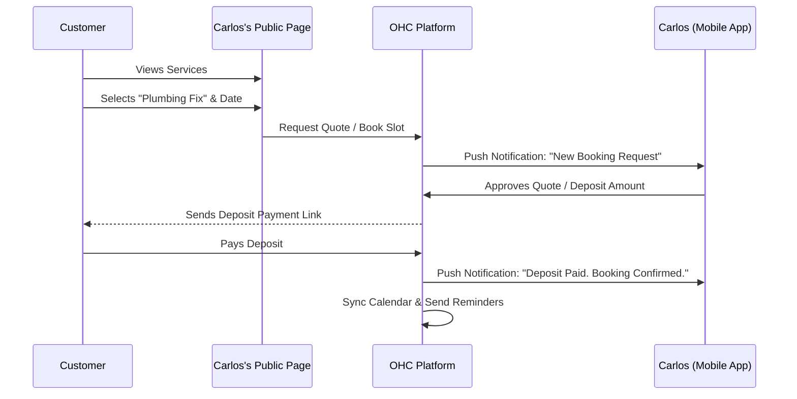
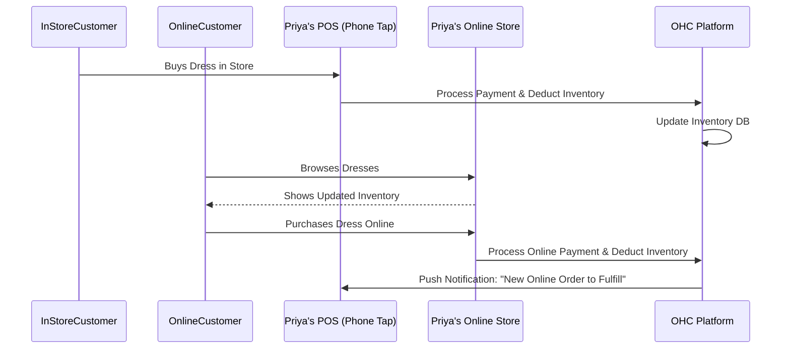
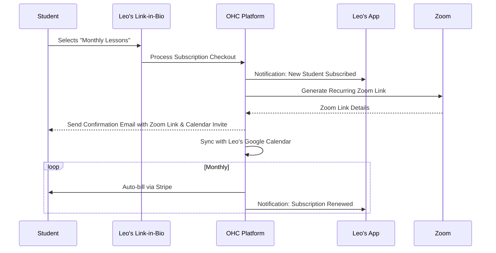
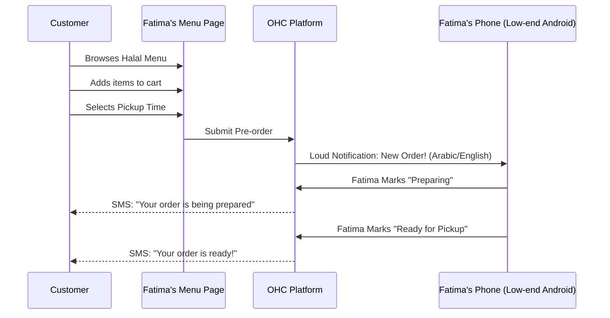

# Title
Business Journey Architecture

# Problem Statement
The process of starting and running a small business is intimidating for non-technical users. Traditional platforms (like Shopify or Wix) offer tools but still require significant manual configuration, technical jargon, and an understanding of e-commerce mechanics. Our target users (e.g., Maya the baker, Carlos the handyman, Priya the boutique owner) need an experience that feels less like building a website and more like answering simple questions to magically instantiate a business. The problem is designing a comprehensive, end-to-end journey that guarantees a user goes from "idea" to "live business" in under 10 minutes, entirely on a mobile phone, with AI handling the complexity seamlessly.

# Research Report
Competitive analysis highlights significant drop-off rates during the onboarding phases of existing platforms due to complex configuration screens (e.g., setting up shipping zones, configuring tax rates, designing layouts).

**Persona Journeys Analyzed:**
- **Maya (Baker, Custom Orders):** Discovers via Instagram. Needs a quick link-in-bio storefront. Friction: Complex product variants and deposit rules.
- **Carlos (Handyman, Services):** Needs a booking system with upfront quotes. Friction: Existing tools separate the booking calendar from the quote generation.
- **Priya (Boutique, Omnichannel):** Requires syncing physical and digital inventory. Friction: POS and online store are often disparate systems.
- **Leo (Music Tutor, Subscriptions):** Relies heavily on social media and recurring billing. Friction: Setting up subscriptions and auto-generating meeting links is technical.
- **Fatima (Food Cart, Pre-orders):** Needs a simple, multi-lingual, fast pre-order system. Friction: App performance on low-end devices; language barriers.

**Key Findings:**
1. **Onboarding must be conversational, not form-based.** The AI Advisor should interview the user to determine their business type and configure the platform accordingly.
2. **Immediate Value Delivery.** The "Aha!" moment (e.g., seeing a live, generated storefront) must happen within the first 3 minutes.
3. **Progressive Disclosure.** Advanced features (like tax configuration or SEO tweaks) should be hidden initially and managed by AI until the user explicitly wants to adjust them.
4. **Mobile First is Non-Negotiable.** All journey steps must be designed for a 375px screen without horizontal scrolling.

# Design Doc

## Architecture Diagrams

**Overall Business Journey Flow:**

**Persona-Specific Flow: Maya (Baker, Custom Orders)**

**Persona-Specific Flow: Carlos (Handyman, Services)**

**Persona-Specific Flow: Priya (Boutique, Omnichannel)**

**Persona-Specific Flow: Leo (Music Tutor, Subscriptions)**

**Persona-Specific Flow: Fatima (Food Cart, Pre-orders)**

## UI Wireframes / Screen Flow Description (375px First)

1. **Acquisition Landing:** A clean, single-button screen: "Start your business in 10 minutes. What's your idea?"
2. **Conversational Onboarding (The Interview):** Chat-style interface where the AI asks 3-4 key questions (Name, Type of business, Primary goal). Large tap targets for suggested answers.
3. **The Reveal (Activation):** A loading skeleton that gracefully transitions into a fully populated, beautiful storefront preview. A prominent "Go Live" button.
4. **Daily Dashboard (Retention):** A minimalist feed showing key metrics (Today's Sales, Upcoming Bookings) and AI Agent activities (e.g., "The Promoter posted to Instagram").
5. **Growth Center (Revenue/Referral):** Clear CTAs for upgrading tiers ("Unlock custom domains") and a referral share button ("Give $10, Get $10").

## Key Design Decisions

- **Conversational Onboarding:** Replaces traditional multi-step forms to reduce cognitive load and drop-off rates.
- **AI-Driven Configuration:** Platform settings (taxes, shipping, calendar rules) are inferred from the conversational onboarding and set to sane defaults by the AI, requiring zero technical input from the user.
- **Unified Activity Feed:** The dashboard acts as a single pane of glass, merging system notifications, agent actions, and business metrics into a consumable, social-media-style feed.
- **Optimistic UI:** All interactions on the mobile app use optimistic updates to feel instantaneous, even on slow connections.

# Implementation Prompt

Develop the end-to-end Onboarding and Activation flow for the Mobile App (Flutter) and Backend (Go).
1. Implement a conversational UI in Flutter starting at the home screen to capture the user's business idea and persona.
2. Create an Orchestrator service in the Go backend that receives the conversational inputs and uses the AI Advisor Agent to generate the initial business configuration (storefront draft, basic products/services).
3. Ensure the Flutter app displays the generated storefront preview within 3 minutes of starting the flow.
4. Provide an E2E test covering the complete journey: from launching the app, answering the onboarding questions, viewing the generated site preview, and clicking "Go Live" to activate the business. The test must verify the final UI state shows the live business dashboard.
5. All UI must adhere to the 375px mobile-first constraint and use the premium glassmorphism design tokens.

# Priority
P0

# Estimated Scope
Large

